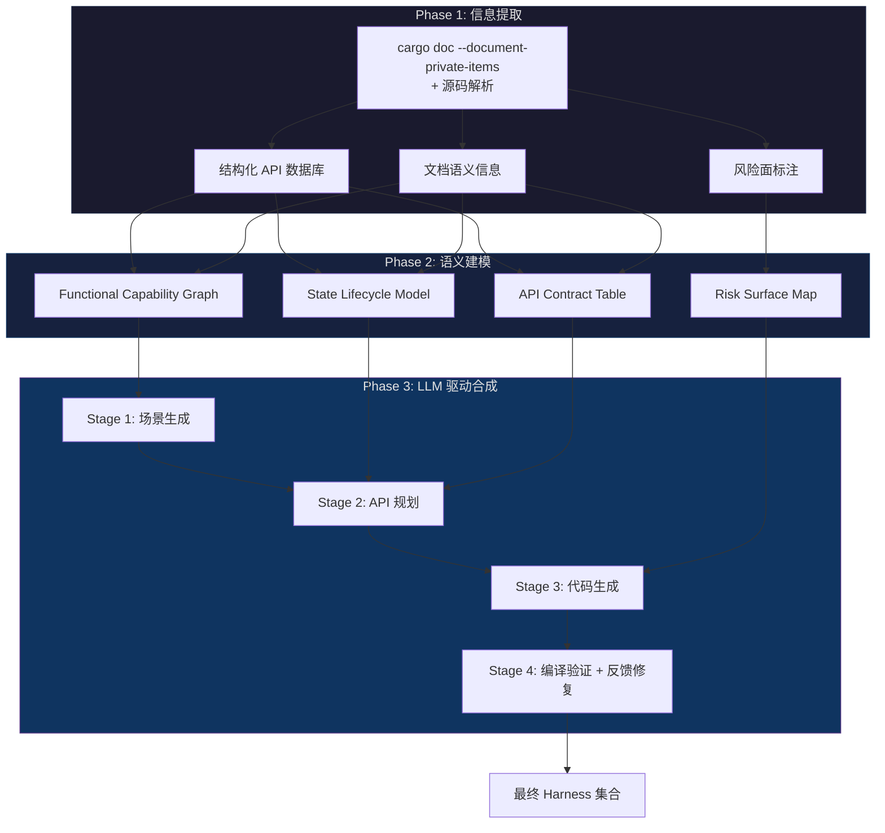
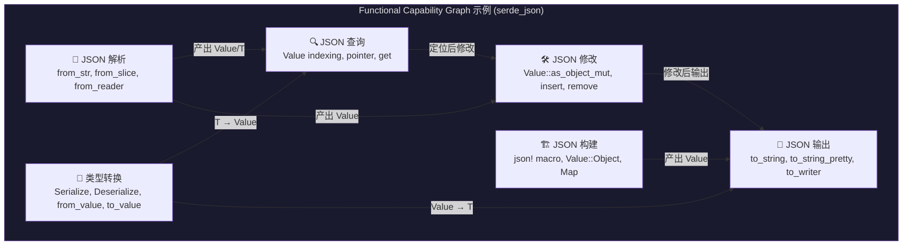
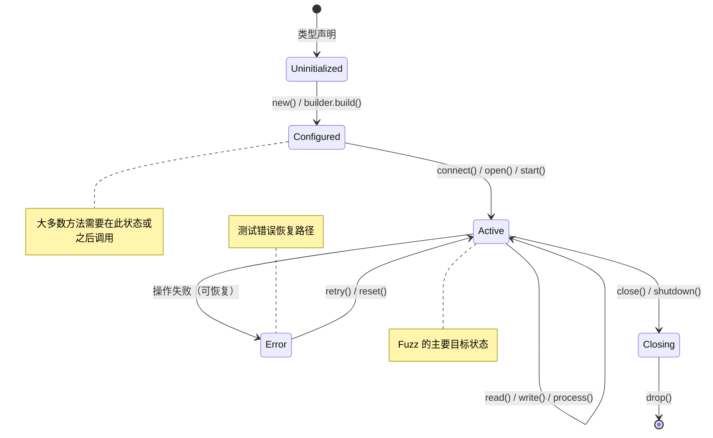
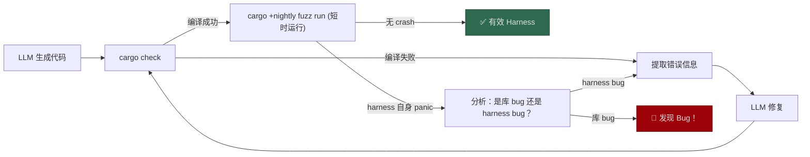

# Scenario-Driven Semantic Harness Synthesis Agent (S³-Harness)

> 面向 Rust 库的语义感知 Fuzz Harness 自动合成系统设计方案

## 1. 问题本质分析

现有 harness 合成工作的核心缺陷不是"不能调用 API"，而是**缺乏使用意图（usage intent）**。

| 维度 | 现有方法（语法驱动） | 本方案（语义驱动） |
|------|----------------------|---------------------|
| 出发点 | API 签名的类型匹配 | "我要用这个库完成什么任务" |
| API 选择 | 返回值→参数的类型链 | 围绕一个功能场景的 API 子集 |
| 状态构造 | 随机/默认值填充 | 满足前置条件的有意义状态 |
| 错误处理 | `unwrap()` 一切 | 区分"应处理的错误"和"不应发生的错误" |
| 维护者认可度 | ❌ "我们不会这样用" | ✅ "这确实是一个合理的使用场景" |

**学术创新点预览：**
1. **Functional Capability Graph (FCG)** — 对库进行功能级建模，而非 API 级
2. **State Lifecycle Model (SLM)** — 对核心类型建模完整的状态生命周期
3. **Contract-Guided Generation** — 从文档中提取 API 契约，指导生成满足前置条件的代码
4. **Scenario-Driven Synthesis** — 从高层使用场景出发，自顶向下合成 harness

---

## 2. 整体架构（Pipeline）



---

## 3. Phase 1：信息提取 — 从 `cargo doc` 及源码中获取什么

### 3.1 提取手段

不要只依赖 `cargo doc` 生成的 HTML。应该**多源并用**：

| 提取源 | 工具/方法 | 获取内容 |
|--------|-----------|----------|
| `cargo doc --document-private-items` | 解析生成的 JSON（`--output-format json`，nightly 特性） | 完整 API 结构化数据 |
| `rustdoc JSON output` | `RUSTDOCFLAGS="-Z unstable-options --output-format json" cargo +nightly doc` | 机器可读的完整 API 描述 |
| `syn` / `ra_ap_syntax` crate | 源码 AST 解析 | unsafe 块、panic 调用、assert 条件 |
| `cargo expand` | 宏展开后的源码 | 宏生成的隐藏 API |
| `Cargo.toml` | 直接解析 | feature flags、依赖关系 |

> [!IMPORTANT]
> **优先使用 `rustdoc JSON`**（Nightly 的 `--output-format json`），它是目前最结构化的 API 元数据源。其输出包含 item ID、类型签名、泛型约束、trait impl、文档文本等完整信息。如果 Nightly 不可用，可以 fallback 到解析 HTML 或使用 `syn` 解析源码。

### 3.2 需要提取的信息清单

#### A. API 结构信息（骨架）

```
对每个 public item，提取：
├── 模块路径 (e.g., crate::parser::Config)
├── Item 类型 (struct / enum / trait / fn / type alias / const / macro)
├── 签名
│   ├── 泛型参数 + trait bounds
│   ├── 参数列表（名称 + 类型）
│   ├── 返回类型
│   └── lifetime 注解
├── 方法接收器类型 (&self / &mut self / self / Pin<&mut Self>)
├── 可见性 (pub / pub(crate) / ...)
└── 所属 impl 块（inherent impl / trait impl）
```

#### B. 类型系统信息（状态空间）

```
对每个 public struct/enum，提取：
├── 字段信息
│   ├── 字段名 + 类型
│   ├── 是否为 Option<T>（标记可选状态）
│   ├── 是否为 Vec/HashMap 等集合（标记可能为空）
│   └── 是否为 private（标记外部不可直接构造）
├── 构造方式
│   ├── new() / default() / builder pattern / from/into
│   ├── 是否有 #[non_exhaustive]（外部不可穷举构造）
│   └── 关联函数中返回 Self 的所有函数
├── 实现的关键 trait
│   ├── Drop（有析构逻辑 → 资源管理类型）
│   ├── Clone / Copy（值语义 vs 引用语义）
│   ├── Send / Sync（线程安全性）
│   ├── Default（可默认构造）
│   ├── Iterator（可迭代）
│   ├── Read / Write / AsyncRead / AsyncWrite（IO 类型）
│   ├── Serialize / Deserialize（序列化）
│   ├── From<T> / TryFrom<T>（类型转换路径）
│   └── Display / Debug（可打印）
└── 泛型约束（约束了使用方式）
```

#### C. 文档语义信息（人类知识）

这是**最关键**的差异化信息源——现有工作几乎不提取文档语义：

```
对每个文档注释，提取：
├── 模块级文档
│   └── 功能描述、设计哲学、典型使用场景
├── 类型级文档
│   └── "这个类型代表什么"、"它的核心职责"
├── 函数级文档
│   ├── 功能描述（自然语言）
│   ├── # Arguments 节 → 参数语义
│   ├── # Returns 节 → 返回值语义
│   ├── # Errors 节 → 错误条件 **[关键：API 契约]**
│   ├── # Panics 节 → panic 触发条件 **[关键：前置条件]**
│   ├── # Safety 节 → unsafe 调用的安全条件 **[关键：安全契约]**
│   └── # Examples 节 → 人类使用模式 **[关键：黄金样例]**
└── 内联注释中的 TODO/FIXME/HACK（潜在缺陷区域）
```

> [!TIP]
> `# Examples` 节中的代码是**最有价值的信息**——它们就是库作者认为的"正确使用方式"。应该提取所有 example 代码，作为后续 LLM 生成的 few-shot 参考。

#### D. 风险面信息（Fuzz 目标区域）

```
扫描源码，标注以下风险点：
├── unsafe 函数签名 → 需要满足 safety 文档中的前置条件
├── unsafe 块
│   ├── 原始指针操作 (*const T / *mut T 解引用)
│   ├── FFI 调用 (extern "C" fn)
│   ├── transmute / 类型擦除
│   ├── union 字段访问
│   └── 内联汇编
├── panic 源
│   ├── 显式 panic!() / unreachable!() / todo!()
│   ├── unwrap() / expect() 调用
│   ├── 数组索引（非 .get()）
│   ├── 整数除法（可能除以零）
│   └── slice::from_raw_parts 等
├── 潜在 UB 点
│   ├── 未初始化内存 (MaybeUninit)
│   ├── 引用别名违规
│   └── 数据竞争可能性（!Send/!Sync 但跨线程使用）
└── 外部输入处理
    ├── 解析函数 (parse / from_str / from_bytes)
    ├── 反序列化函数
    └── 文件/网络 IO 处理
```

### 3.3 输出数据格式

将所有提取信息组织为一个**结构化的 JSON 知识库**：

```json
{
  "crate_name": "example_lib",
  "crate_doc": "A library for parsing and manipulating FOO format files...",
  "modules": [
    {
      "path": "example_lib::parser",
      "doc": "Parsing utilities for FOO format...",
      "items": [...]
    }
  ],
  "types": [
    {
      "id": "type_001",
      "path": "example_lib::parser::Parser",
      "kind": "struct",
      "doc": "A streaming parser for FOO format",
      "fields": [...],
      "constructors": ["new(input: &[u8]) -> Self", "with_config(config: Config) -> Self"],
      "methods": [...],
      "traits_impl": ["Iterator", "Drop"],
      "lifecycle": "construct → configure → parse → iterate_results → drop"
    }
  ],
  "functions": [
    {
      "id": "fn_001",
      "path": "example_lib::parser::Parser::parse",
      "signature": "pub fn parse(&mut self) -> Result<Ast, ParseError>",
      "doc": "Parse the input into an AST",
      "preconditions": ["Input must be valid UTF-8"],
      "panics": ["If the parser has already been consumed"],
      "errors": ["ParseError::InvalidSyntax if ..."],
      "examples": ["let mut parser = Parser::new(b\"...\"); let ast = parser.parse()?;"],
      "risk_markers": ["contains_unwrap", "index_access"]
    }
  ],
  "risk_surface": {
    "unsafe_functions": [...],
    "ffi_boundaries": [...],
    "panic_points": [...],
    "ub_risks": [...]
  },
  "doc_examples": [
    {
      "source": "Parser::parse",
      "code": "let mut parser = Parser::new(input);\nlet result = parser.parse().unwrap();",
      "demonstrates": ["construction", "parsing", "error_handling"]
    }
  ]
}
```

---

## 4. Phase 2：语义建模 — 如何处理提取的信息

> [!IMPORTANT]
> 这一阶段是本方案的**核心学术贡献**。不是简单地建 API 依赖图，而是构建三个语义模型，让 LLM 能像人一样"理解"这个库。

### 4.1 Functional Capability Graph (FCG) — 功能能力图

**核心思想**：人使用库时想的不是"我要调用函数 A、B、C"，而是"我要用这个库**解析**一个文件、**转换**数据、**输出**结果"。



**构建方法**：

1. **模块聚类**：将同一模块下的 API 按功能聚类（模块本身就是库作者的功能分组）
2. **文档驱动命名**：用模块文档和类型文档的第一句话作为能力节点的名称
3. **类型流分析**：分析类型 A 的方法返回类型 B → A 的能力连接到 B 的能力
4. **trait 关联**：实现了同一 trait 的类型提供同一类能力

**输出格式**：

```json
{
  "capabilities": [
    {
      "id": "cap_parse",
      "name": "JSON 文本解析",
      "description": "将 JSON 格式的字符串/字节流/Reader 解析为结构化数据",
      "entry_apis": ["serde_json::from_str", "serde_json::from_slice", "serde_json::from_reader"],
      "input_types": ["&str", "&[u8]", "impl Read"],
      "output_types": ["Value", "T: Deserialize"],
      "connects_to": ["cap_query", "cap_modify", "cap_convert"]
    }
  ],
  "capability_chains": [
    ["cap_parse", "cap_query", "cap_modify", "cap_serialize"],
    ["cap_build", "cap_serialize"]
  ]
}
```

### 4.2 State Lifecycle Model (SLM) — 状态生命周期模型

**核心思想**：对库中的核心类型，建模其完整的生命周期状态机。这解决了"拿未初始化的 struct 去调用方法"的问题。



**构建方法**：

```
对每个核心类型 T：
1. 识别构造阶段：
   - 哪些函数返回 T？(new, default, from, builder.build)
   - 构造需要什么参数？参数的合法范围？

2. 识别状态转换方法：
   - 接收 &mut self 的方法 → 可能改变状态
   - 返回 Result 的方法 → 有失败状态转换
   - 消耗 self 的方法 → 终态转换

3. 识别状态前置条件：
   - # Panics 文档 → "在 X 状态下调用会 panic" → X 是禁止前置状态
   - 方法名语义 → connect() 暗示需要已 configure
   - 字段检查 → 方法内部 assert!(!self.closed) → closed=true 是禁止状态

4. 识别析构：
   - 是否实现 Drop → 有资源清理逻辑
   - 析构顺序要求
```

**输出格式**：

```json
{
  "type": "TcpConnection",
  "lifecycle": {
    "states": ["Uninitialized", "Configured", "Connected", "Closed"],
    "transitions": [
      {"from": "Uninitialized", "to": "Configured", "via": "TcpConnection::new(addr)", "precondition": "addr is valid"},
      {"from": "Configured", "to": "Connected", "via": ".connect()", "precondition": null},
      {"from": "Connected", "to": "Connected", "via": ".send(data)", "precondition": "data.len() > 0"},
      {"from": "Connected", "to": "Closed", "via": ".close()", "precondition": null},
      {"from": "*", "to": "Dropped", "via": "drop()", "precondition": null}
    ],
    "fuzzable_states": ["Connected"],
    "forbidden_transitions": [
      {"from": "Closed", "via": ".send()", "reason": "panics: connection already closed"}
    ]
  }
}
```

### 4.3 API Contract Table — API 契约表

**核心思想**：将分散在文档各处的隐式契约显式化、结构化。

```
对每个 public 函数/方法，提取契约：

┌─────────────────────────────────────────────────────────────────┐
│ API: HashMap::get(&self, key: &K) -> Option<&V>                │
├──────────────┬──────────────────────────────────────────────────┤
│ 前置条件      │ K: Eq + Hash（编译时保证）                        │
│ 后置条件      │ 返回 Some(&v) 如果 key 存在，否则 None             │
│ 不变量       │ self 不被修改（&self 保证）                        │
│ Panic 条件   │ 无                                               │
│ 错误条件     │ 无（通过 Option 表达）                              │
│ Safety       │ N/A（safe 函数）                                  │
│ 副作用       │ 无                                                │
└──────────────┴──────────────────────────────────────────────────┘

┌─────────────────────────────────────────────────────────────────┐
│ API: Vec::swap_remove(&mut self, index: usize) -> T            │
├──────────────┬──────────────────────────────────────────────────┤
│ 前置条件      │ index < self.len()                               │
│ 后置条件      │ 返回原 index 位置的元素，最后一个元素移到 index 位置  │
│ Panic 条件   │ index >= self.len() 时 panic                      │
│ Safety       │ N/A                                              │
│ Fuzzing指导  │ index 应 fuzzing：有效范围内 + 边界值 + 越界值       │
└──────────────┴──────────────────────────────────────────────────┘
```

**提取方法**：

```
1. 从 # Panics 文档 → panic 条件 → 反转为前置条件
2. 从 # Errors 文档 → 错误条件 → 可恢复的失败路径
3. 从 # Safety 文档 → safety 条件 → unsafe 调用的硬性前置条件
4. 从返回类型推导：
   - Result<T, E> → 有可恢复错误
   - Option<T> → 可能无结果（不应 unwrap）
   - ! (never type) → 函数不返回（发散）
5. 从参数类型推导：
   - NonZeroUsize → 不接受 0
   - &Path → 可能涉及文件系统
   - &[u8] → 可能解析二进制数据（好的 fuzz 入口）
```

### 4.4 Risk Surface Map — 风险面地图

将 Phase 1 提取的风险信息与 API 契约关联，生成 fuzz 优先级排序：

```json
{
  "high_priority_targets": [
    {
      "api": "Parser::parse_untrusted",
      "risk_level": "HIGH",
      "reasons": [
        "接受 &[u8] 外部输入",
        "内部有 3 处 unsafe 块",
        "解析逻辑复杂（300+ 行）",
        "# Safety 文档不完整"
      ],
      "recommended_fuzz_strategy": "用 arbitrary 生成 &[u8] 输入，在 Connected 状态下调用"
    }
  ]
}
```

---

## 5. Phase 3：LLM 驱动的 Harness 合成 — 四阶段提示链

### 5.1 整体策略：Scenario-Driven Multi-Stage Prompting

**不是一次性让 LLM 生成代码**，而是分四个阶段，逐步从抽象到具体：

```
场景构思 → API 规划 → 代码生成 → 编译修复
(What)     (Which)    (How)      (Fix)
```

### 5.2 Stage 1：场景生成（What — 我想用这个库做什么）

**输入给 LLM 的信息**：
- Crate 级文档摘要（库的功能定位）
- FCG（功能能力图）
- 所有 doc examples 的自然语言摘要
- Feature flag 列表

**Prompt 模板**：

```markdown
你是一位经验丰富的 Rust 程序员。

以下是一个 Rust 库的概述：
- 库名：{crate_name}
- 功能描述：{crate_doc_summary}
- 核心能力：
{fcg_capabilities_formatted}

- 库作者提供的使用示例摘要：
{doc_examples_summary}

请为这个库生成 {N} 个**真实的、有意义的使用场景**。

要求：
1. 每个场景描述一个程序员可能遇到的具体任务
2. 场景应覆盖库的不同功能能力（参考上述能力图）
3. 场景应包含多个 API 的组合使用，而非单一 API 调用
4. 特别关注以下高风险区域（这些是 fuzzing 的重点目标）：
{risk_surface_summary}
5. 场景描述格式：
   - 场景名称
   - 自然语言描述（1-2句话说明程序员想完成什么）
   - 涉及的功能能力（引用能力图中的能力 ID）
   - Fuzz 变异点（哪些输入可以被 fuzzer 控制）
```

**输出示例**：

```json
{
  "scenarios": [
    {
      "name": "解析并修改 JSON 配置文件",
      "description": "程序员从一个外部文件读取 JSON 配置，查询特定的嵌套字段，修改字段值，然后序列化回字符串。这是配置管理工具的典型场景。",
      "capabilities": ["cap_parse", "cap_query", "cap_modify", "cap_serialize"],
      "fuzz_points": ["输入的 JSON 字符串（可为任意字节）", "查询的字段路径"],
      "risk_focus": "解析器处理畸形 JSON 时的健壮性"
    }
  ]
}
```

### 5.3 Stage 2：API 规划（Which — 需要用哪些 API，以什么顺序）

**输入给 LLM 的信息**：
- Stage 1 生成的场景描述
- 该场景涉及的所有 API 签名 + 文档
- 涉及类型的 SLM（状态生命周期模型）
- 涉及 API 的契约表

**Prompt 模板**：

```markdown
你是一位经验丰富的 Rust 程序员，正在为以下场景编写代码。

## 场景
{scenario_description}

## 可用的 API（含签名、文档、契约）
{relevant_apis_with_contracts}

## 核心类型的状态生命周期
{relevant_slm}

请规划 API 调用序列。

要求：
1. 列出需要使用的 API，按调用顺序排列
2. 对每个 API 调用，说明：
   - 此时核心类型处于什么状态（参考生命周期模型）
   - 需要满足的前置条件
   - 如何构造合法的参数
   - 如何处理返回值（特别是 Result 和 Option）
3. 标注哪些参数应该由 fuzzer 提供（作为变异输入）
4. 标注哪些地方需要错误处理（不能 unwrap 的地方）
5. 确保整个调用序列遵循类型的状态生命周期，不违反前置条件 

## 禁止的模式
- 不要对可能为 None 的 Option 调用 unwrap()
- 不要使用 Default::default() 构造有必填字段的类型
- 不要在对象已被消耗后再次使用
- 不要忽略 Result 错误，除非文档明确表示不会失败
```

### 5.4 Stage 3：代码生成（How — 编写 harness 代码）

**输入给 LLM 的信息**：
- Stage 2 的 API 调用计划
- Stage 1 的场景信息
- 相关的 doc examples（作为代码风格参考）
- 风险面标注
- Fuzzing 框架模板（libfuzzer / AFL / cargo-fuzz）

**Prompt 模板**：

```markdown
你是一位精通 Rust 和 Fuzzing 的安全研究员。

## 任务
基于以下 API 调用计划，编写一个完整的 fuzz harness。

## 场景：{scenario_name}
{scenario_description}

## API 调用计划
{api_plan_from_stage2}

## 参考代码（来自库文档示例）
{doc_examples}

## Harness 模板
```rust
#![no_main]
use libfuzzer_sys::fuzz_target;
use arbitrary::Arbitrary;

// 定义有结构的 Fuzz 输入（不要用原始字节）
#[derive(Arbitrary, Debug)]
struct FuzzInput {
    // 根据场景定义有意义的输入字段
}

fuzz_target!(|input: FuzzInput| {
    // 1. 输入校验（过滤明显无效的输入，提高 fuzz 效率）
    // 2. 构造初始状态（满足前置条件的有意义状态）
    // 3. 执行场景中的 API 调用序列
    // 4. 对 Result 使用 match 或 if let，不要 unwrap
    // 5. 多利用库的特性能力（traits、泛型等）
});
```

## 约束
1. 使用 `arbitrary` crate 的 `Arbitrary` derive 构造结构化输入，不要用原始 `&[u8]`
2. 对于 fuzzer 不控制的参数，使用文档推荐的或合理的固定值
3. 对 Result/Option 使用 match，遇到 Err/None 时 return（不测试错误路径时）或分支处理（想测试错误处理时）
4. 不要使用 catch_unwind 来掩盖 panic
5. 添加注释说明每一步的意图
6. 如果需要调用 unsafe 函数，必须满足其 # Safety 文档中的所有条件
```

### 5.5 Stage 4：编译验证 + 反馈修复循环



**编译修复 Prompt**：

```markdown
以下 Rust fuzz harness 编译失败。

## 代码
{harness_code}

## 编译错误
{compiler_errors}

## 上下文
- 目标库版本：{crate_version}
- 可用的 API 签名（确保类型正确）：{api_signatures}

请修复代码。只修改导致编译错误的部分，不要改变 harness 的测试逻辑和场景意图。
```

**循环控制**：最多 5 轮修复。如果 5 轮后仍无法编译，标记为"需要人工检查"并记录原因。

---

## 6. 实现架构建议

### 6.1 系统组件

```
s3-harness/
├── crate_analyzer/           # Phase 1: 信息提取
│   ├── rustdoc_json.rs       # 解析 rustdoc JSON 输出
│   ├── source_scanner.rs     # AST 扫描（unsafe/panic/FFI）
│   ├── doc_parser.rs         # 文档语义解析（提取 Panics/Safety/Examples 等节）
│   └── knowledge_base.rs     # 输出统一的 JSON 知识库
│
├── semantic_modeler/         # Phase 2: 语义建模
│   ├── capability_graph.rs   # 构建 FCG
│   ├── lifecycle_model.rs    # 构建 SLM
│   ├── contract_extractor.rs # 构建 API 契约表
│   └── risk_mapper.rs        # 构建风险面地图
│
├── harness_synthesizer/      # Phase 3: LLM 驱动合成
│   ├── scenario_generator.rs # Stage 1
│   ├── api_planner.rs        # Stage 2
│   ├── code_generator.rs     # Stage 3
│   ├── compiler_fixer.rs     # Stage 4
│   └── prompt_templates/     # Prompt 模板
│       ├── scenario.md
│       ├── api_plan.md
│       ├── codegen.md
│       └── fix.md
│
├── llm_client/               # LLM 交互层
│   ├── openai.rs
│   ├── anthropic.rs
│   └── context_manager.rs    # 管理 Token 预算和上下文窗口
│
└── orchestrator/             # 流水线编排
    ├── pipeline.rs           # 完整流水线
    └── config.rs             # 配置管理
```

### 6.2 关键设计决策

#### Token 预算管理

LLM 的上下文窗口是有限的（即使是 128K 的模型）。一个大型 crate 的完整 API 信息可能远超 Token 上限。

**策略：分层压缩 + 按需加载**

```
Level 0（最精简）：Crate 名称 + 一句话描述 + 功能能力列表
Level 1（模块级）：各模块的功能描述 + 核心类型名称
Level 2（类型级）：类型签名 + 方法列表 + 生命周期模型
Level 3（方法级）：完整签名 + 文档 + 契约 + 示例代码

Stage 1 用 Level 0-1（场景生成不需要方法细节）
Stage 2 用 Level 2-3（只加载场景涉及的类型和方法）
Stage 3 用 Level 3 + 示例代码（只加载被选中的 API 的详细信息）
```

#### 关于 API 契约的半自动提取

文档中的 Panics/Safety/Errors 节是半结构化的自然语言。可以用以下策略处理：

```
1. 规则匹配（优先）：
   - "Panics if {condition}" → precondition = NOT {condition}
   - "Returns Err(...) if {condition}" → error_case = {condition}
   - "# Safety\n\n{text}" → safety_requirement = {text}

2. LLM 辅助提取（兜底）：
   对于复杂的自然语言描述，用一个单独的 LLM 调用来结构化提取契约
   
3. 类型系统推导（补充）：
   - fn(&self) → 不修改状态（无状态转换副作用）
   - fn(self) → 消耗所有权（之后不可用）
   - fn() -> Result<T,E> → 有可恢复失败路径
```

---

## 7. 学术创新点总结

| 创新点 | 对比现有工作 | 关键贡献 |
|--------|-------------|---------|
| **Functional Capability Graph** | 现有工作用 API 依赖图（类型匹配） | 从"能调用什么"提升到"能做什么"，场景驱动而非 API 驱动 |
| **State Lifecycle Model** | 现有工作不建模对象状态 | 避免在非法状态调用方法，消除"不可能的使用模式" |
| **Contract-Guided Generation** | 现有工作忽略文档语义 | 首次系统性地从 Rust 文档提取 API 契约并用于指导代码生成 |
| **Multi-Stage Prompting Chain** | 现有工作一次性生成或用简单的 CoT | 模拟人类从需求→设计→编码的思维过程，每个阶段有针对性的信息输入 |
| **Structured Fuzz Input via Arbitrary** | 现有工作多用原始 `&[u8]` | 生成结构化的输入类型，提高 fuzz 效率和 mutation 语义 |
| **Risk-Prioritized Targeting** | 现有工作随机选择 API 组合 | 优先对高风险区域（unsafe/FFI/复杂解析）生成 harness |

**可以提炼的论文 Contribution**：

> 1. 我们提出了 **Scenario-Driven Harness Synthesis**，一种从高层使用场景出发、自顶向下合成语义有效的 fuzz harness 的范式，区别于现有的从 API 签名出发的自底向上方法。
> 2. 我们设计了 **Functional Capability Graph** 和 **State Lifecycle Model** 两种新的程序分析抽象，分别刻画库的功能空间和类型的状态空间，为 LLM 提供了结构化的库理解信息。
> 3. 我们实现了 **Contract-Guided Code Generation**，通过从文档中系统提取 API 契约（前置条件、panic 条件、safety 要求），确保生成的代码不违反 API 使用规范。
> 4. 实验表明，与现有方法相比，我们生成的 harness 在语义有效性（maintainer acceptance rate）和 bug 发现能力上均有显著提升。

---

## 8. 可能的挑战与应对

| 挑战 | 应对策略 |
|------|---------|
| 文档不全或缺失 | 对文档缺失的 API，使用源码 AST 分析作为补充；对关键缺失信息（如 panic 条件），用 LLM 推测 + 编译测试验证 |
| LLM 的 Rust 代码生成准确率不够高 | 多轮编译反馈修复；Stage 2 的 API 规划阶段降低 Stage 3 的生成难度；提供 doc examples 作为 few-shot |
| 大型 crate 信息量超过 LLM Token 限制 | 分层压缩 + 按需加载策略（见 6.2）；每个场景只加载相关 API 的信息 |
| 状态生命周期建模的准确性 | 结合文档 + 类型签名 + 编译器反馈进行迭代验证；不需要完美，只需要比"无模型"好 |
| 如何评估 harness 的"语义有效性" | 设计人工评估 protocol：让库维护者对生成的 harness 评分（maintainer study）；同时设计自动化代理指标（编译通过率、代码覆盖率、与 doc example 的相似度） |

---

## 9. 评估方案建议

### 9.1 评估指标

```
1. 编译通过率 (Compilation Rate)
   - 生成的 harness 中能通过 cargo check 的比例

2. 语义有效率 (Semantic Validity Rate)
   - 不产生"harness 自身 bug"（如 panic 在 harness 代码中而非库代码中）的比例
   - 可通过短时 fuzz 运行 + 分析 crash 位置来自动判断

3. 开发者接受率 (Developer Acceptance Rate) 
   - 核心指标：让库维护者评估"这个使用场景是否合理"
   - 对标现有方法的开发者拒绝问题

4. Bug 发现能力 (Bug-Finding Capability)
   - 在目标库中发现的 unique crash / bug 数量
   - 代码覆盖率（line / branch / function coverage）
   - 与现有 harness 生成工具（如 FUDGE、RULF）对比

5. 效率指标
   - Harness 生成时间
   - LLM Token 消耗
   - 从生成到发现第一个 bug 的时间 (Time-to-First-Bug)
```

### 9.2 Benchmark 选择

```
推荐使用以下类型的 crate 做评估：
- 解析器类：serde_json, toml, csv, image, nom
- 加密类：ring, rustls, ed25519-dalek
- 网络类：hyper, reqwest (部分), url
- 数据结构类：hashbrown, indexmap, petgraph
- 编码类：base64, hex, flate2, brotli

选择标准：
1. 已有已知 CVE 或已修复 bug → 可验证是否能复现
2. 文档质量各异 → 测试对文档缺失的鲁棒性
3. API 复杂度各异 → 从简单到复杂评估扩展性
```
