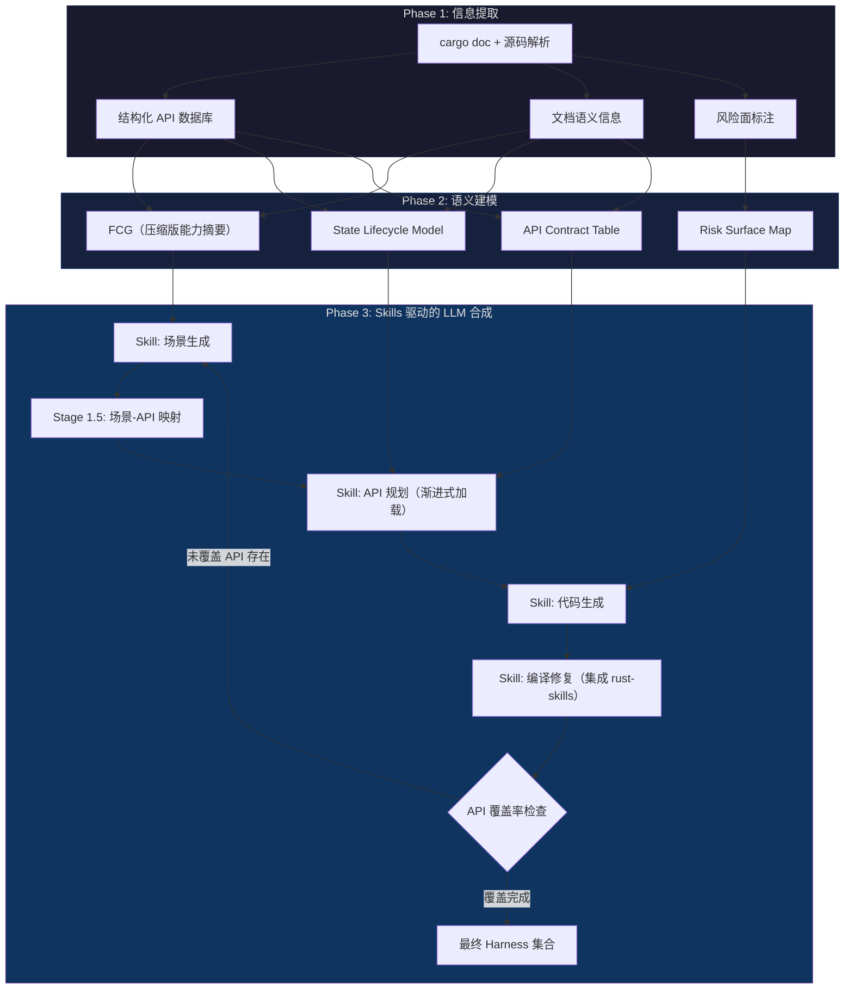
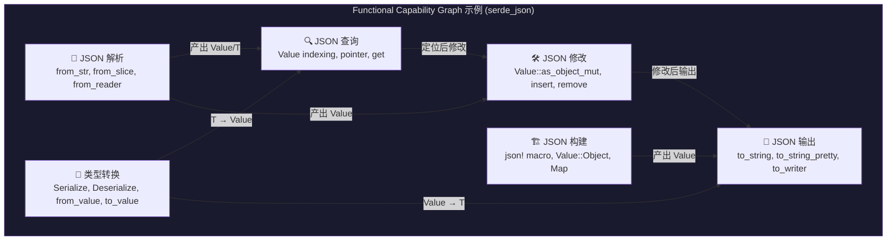
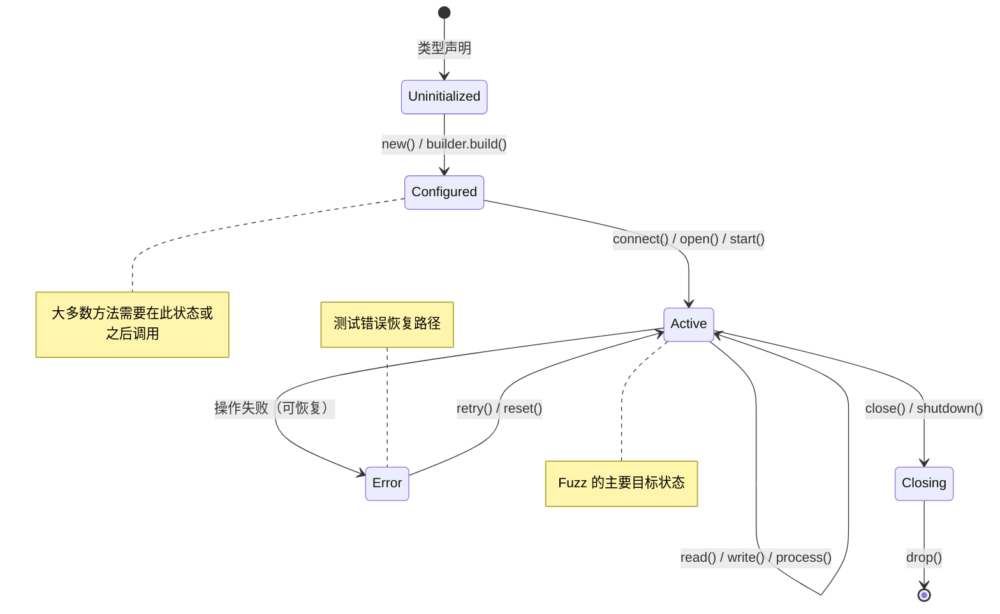
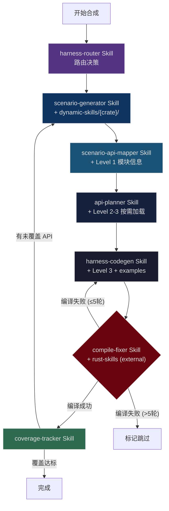
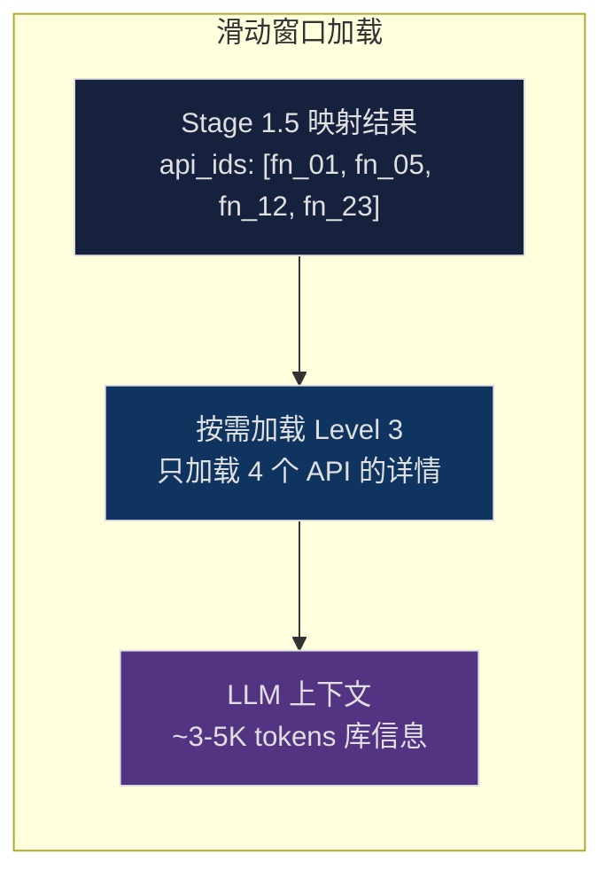
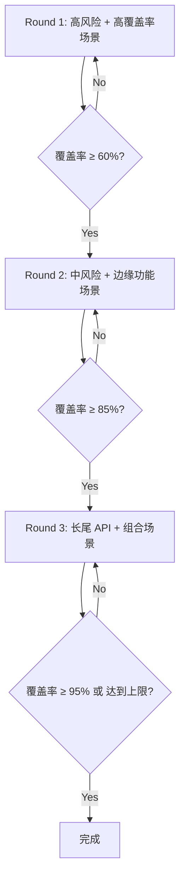
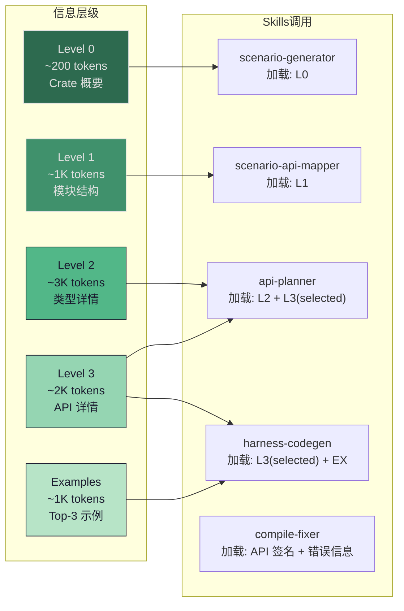
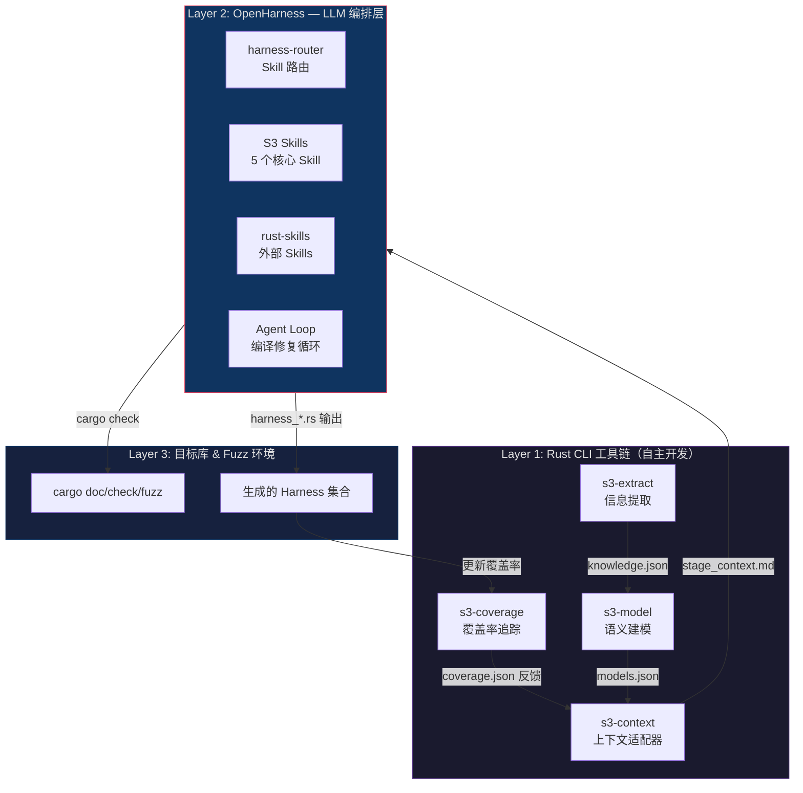
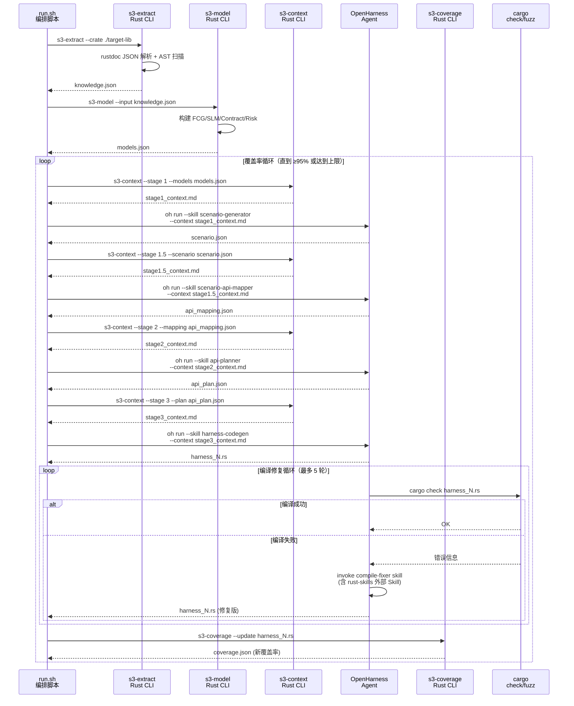

# Scenario-Driven Semantic Harness Synthesis Agent (S³-Harness)

> 面向 Rust 库的语义感知 Fuzz Harness 自动合成系统设计方案（v2 — 融合 Skills 架构）

## 1. 问题本质分析

现有 harness 合成工作的核心缺陷不是"不能调用 API"，而是**缺乏使用意图（usage intent）**。

| 维度 | 现有方法（语法驱动） | 本方案（语义驱动） |
|------|----------------------|---------------------|
| 出发点 | API 签名的类型匹配 | "我要用这个库完成什么任务" |
| API 选择 | 返回值→参数的类型链 | 围绕一个功能场景的 API 子集 |
| 状态构造 | 随机/默认值填充 | 满足前置条件的有意义状态 |
| 错误处理 | `unwrap()` 一切 | 区分"应处理的错误"和"不应发生的错误" |
| 维护者认可度 | ❌ "我们不会这样用" | ✅ "这确实是一个合理的使用场景" |

**学术创新点预览：**
1. **Functional Capability Graph (FCG)** — 对库进行功能级建模，而非 API 级
2. **State Lifecycle Model (SLM)** — 对核心类型建模完整的状态生命周期
3. **Contract-Guided Generation** — 从文档中提取 API 契约，指导生成满足前置条件的代码
4. **Scenario-Driven Synthesis** — 从高层使用场景出发，自顶向下合成 harness
5. **Skills-Based Prompt Architecture** — 借鉴 [rust-skills](https://github.com/actionbook/rust-skills) 的分层认知框架，将提示模板模块化为可组合、可扩展的 Skills

---

## 2. 整体架构（Pipeline）



> [!IMPORTANT]
> **v2 关键变化**：
> 1. Pipeline 引入**覆盖率反馈环路**：场景迭代生成直到覆盖所有目标 API
> 2. FCG 以**压缩摘要**形式输入 LLM，不再是完整图结构
> 3. 新增 **Stage 1.5：场景-API 映射**，显式关联场景与具体 API
> 4. 所有 Prompt 模板重构为 **Skills 架构**，模块化、可扩展、可组合
> 5. Stage 4 编译修复集成 **rust-skills** 现有能力

---

## 3. Phase 1：信息提取 — 从 `cargo doc` 及源码中获取什么

### 3.1 提取手段

不要只依赖 `cargo doc` 生成的 HTML。应该**多源并用**：

| 提取源 | 工具/方法 | 获取内容 |
|--------|-----------|----------|
| `cargo doc --document-private-items` | 解析生成的 JSON（`--output-format json`，nightly 特性） | 完整 API 结构化数据 |
| `rustdoc JSON output` | `RUSTDOCFLAGS="-Z unstable-options --output-format json" cargo +nightly doc` | 机器可读的完整 API 描述 |
| `syn` / `ra_ap_syntax` crate | 源码 AST 解析 | unsafe 块、panic 调用、assert 条件 |
| `cargo expand` | 宏展开后的源码 | 宏生成的隐藏 API |
| `Cargo.toml` | 直接解析 | feature flags、依赖关系 |

> [!IMPORTANT]
> **优先使用 `rustdoc JSON`**（Nightly 的 `--output-format json`），它是目前最结构化的 API 元数据源。其输出包含 item ID、类型签名、泛型约束、trait impl、文档文本等完整信息。如果 Nightly 不可用，可以 fallback 到解析 HTML 或使用 `syn` 解析源码。

### 3.2 需要提取的信息清单

#### A. 函数与方法信息（API 骨架 + 归属关系）

```
对每个 public 函数/方法，提取：
├── 基本信息
│   ├── 模块路径 (e.g., crate::parser::Config)
│   ├── Item 类型 (free fn / associated fn / method / trait method)
│   └── 可见性 (pub / pub(crate) / pub(super))
│
├── 归属关系（Method Hierarchy）
│   ├── 所属类型（挂载在哪个 struct/enum 的 impl 块下）
│   ├── 是 inherent impl 还是 trait impl
│   │   └── 如果是 trait impl：实现的是哪个 trait？是否覆盖了默认方法？
│   ├── 是静态方法（Associated Function，无 self）还是实例方法（有 self）
│   │   └── 静态方法中返回 Self 的 → 标记为构造器（Constructor）
│   └── 是否为 trait 的 required method 还是 provided method（有默认实现）
│
├── 完整签名
│   ├── 函数修饰符：async / unsafe / const / extern "C"
│   ├── 泛型参数 + trait bounds
│   ├── where 子句（完整保留，不能丢弃）
│   ├── 参数列表
│   │   ├── 参数名 + 类型
│   │   ├── 是否为 mut 参数
│   │   ├── 是否为 impl Trait 参数（语法糖，需展开为泛型约束）
│   │   └── 是否为 dyn Trait 参数（trait object）
│   ├── 方法接收器类型
│   │   ├── &self / &mut self / self / Pin<&mut Self>
│   │   └── self 的消耗语义标记（self → 调用后对象不可再用）
│   ├── 返回类型
│   │   ├── 具体类型
│   │   ├── 是否为 impl Trait 返回类型
│   │   ├── 是否为 Result<T, E>（提取具体的 E 类型 → 决定错误处理方式）
│   │   ├── 是否为 Option<T>（标记不可盲目 unwrap）
│   │   └── 是否为 ! (never type)（函数发散，不返回）
│   └── Lifetime 注解
│       ├── 不仅提取有 <'a>，还要提取参数与返回值的生命周期绑定关系
│       └── 例：fn get<'a>(&'a self) -> &'a str → 返回值不能比 self 存活更久
│
└── 关键 Attributes
    ├── #[must_use] → 忽略返回值意味着未完成业务流
    ├── #[deprecated] → Fuzzing 废弃接口意义不大，降低优先级
    ├── #[inline] / #[cold] → 性能提示（影响覆盖率分析）
    └── #[cfg(...)] → 条件编译，标记仅在特定 feature 下可用
```

#### B. Trait 信息（接口契约）

```
对每个 public trait，提取：
├── 基本信息
│   ├── Trait 路径 (e.g., crate::io::Parseable)
│   ├── 是否为 unsafe trait（实现者有额外安全义务）
│   ├── 超 Trait 约束 (supertrait bounds，如 trait Foo: Send + Clone)
│   └── 泛型参数 + where 子句
│
├── 关联项（Associated Items）
│   ├── 关联类型（Associated Types）
│   │   ├── type Output;
│   │   ├── 类型约束 (type Output: Display + Debug;)
│   │   └── LLM 必须知道关联类型才能正确书写泛型约束和实现
│   ├── 关联常量（Associated Constants）
│   │   └── const MAX_SIZE: usize; → 有些配置通过 Trait 常量传递
│   └── 关联函数/方法
│       ├── Required Methods（无默认实现，实现者必须提供）
│       │   └── LLM Mock 一个 Trait 时，这些是强制要求手写的
│       ├── Provided Methods（有默认实现，可选覆盖）
│       │   └── 标记默认实现的存在，LLM 可以选择不实现
│       └── 每个方法的完整签名（同 A 节的签名规范）
│
├── 已知实现者（Known Implementors）
│   ├── 库内哪些类型实现了此 Trait
│   └── 标准库中的常见实现者（如果适用）
│
└── 文档
    ├── Trait 级文档（说明此接口的语义契约）
    └── 每个方法的文档（同 E 节文档提取规范）
```

#### C. 类型系统信息（状态空间 + 内存布局）

```
对每个 public struct，提取：
├── 结构体种类
│   ├── 普通结构体 (named fields)
│   ├── 元组结构体 (tuple struct)
│   └── 单元结构体 (unit struct)
│
├── 字段信息
│   ├── 字段名 + 类型
│   ├── 字段可见性（pub / pub(crate) / pub(super) / private）
│   │   └── 若所有字段均为 private → 外部不可直接构造，必须通过构造器
│   ├── 是否为 Option<T>（标记可选状态）
│   ├── 是否为 Vec/HashMap 等集合（标记可能为空）
│   └── 序列化相关属性
│       ├── #[serde(default)] → 反序列化时有默认值
│       ├── #[serde(skip)] → 不参与序列化
│       └── #[serde(rename = "...")] → 字段映射
│
├── 内存布局标签（Representation）
│   ├── #[repr(C)] → C 兼容布局，可安全进行 FFI 指针转换
│   ├── #[repr(transparent)] → 与内部类型布局一致，可安全 transmute
│   ├── #[repr(packed)] → 紧凑布局，对齐限制，取引用可能 UB
│   └── #[repr(align(N))] → 对齐要求
│
├── 构造约束
│   ├── #[non_exhaustive] → 外部不可穷举构造（即使字段全 pub）
│   ├── 构造器列表（返回 Self 的关联函数）
│   ├── Builder 模式检测（是否有对应的 XxxBuilder 类型）
│   └── Default 实现 → 可通过 Default::default() 构造
│
├── 实现的关键 Trait（同前，此处不再重复）
│
└── 泛型约束（约束了使用方式）

────────────────────────────────────────

对每个 public enum，提取：
├── Enum 级信息
│   ├── #[non_exhaustive] → 外部匹配必须有 _ 通配分支
│   ├── #[repr(u8/u16/C/...)] → 判别值的内存表示
│   └── 泛型参数
│
├── 变体信息（Variants）— 每个变体单独提取：
│   ├── 变体名称
│   ├── 变体类型
│   │   ├── 单元变体 (Unit: e.g., Option::None)
│   │   ├── 元组变体 (Tuple: e.g., Option::Some(T)，提取内部类型列表)
│   │   └── 结构体变体 (Struct: e.g., Error::Io { source: io::Error }，提取字段)
│   └── 变体的文档注释
│
├── 模式匹配指导
│   └── LLM 必须知道所有变体的确切形态才能正确构造和 match
│
└── 实现的关键 Trait
```

#### D. impl 块分类与关联项

```
对每个 impl 块，提取：
├── impl 类型
│   ├── Inherent impl（impl MyType { ... }）
│   └── Trait impl（impl TraitName for MyType { ... }）
│       ├── 实现的 Trait 名称
│       └── 是否为条件实现（impl<T: Clone> ... for Vec<T>）
│
├── 关联项
│   ├── 关联类型定义（type Output = ...;）
│   ├── 关联常量定义（const MAX: usize = 1024;）
│   └── 方法列表（引用 A 节详细规范）
│
└── 方法分类
    ├── 构造器（返回 Self 的关联函数，无 self 参数）
    ├── 访问器（&self，只读查询）
    ├── 修改器（&mut self，状态变更）
    ├── 消耗器（self，消耗所有权，终态操作）
    └── 转换器（self → 返回其他类型，如 into_inner()）
```

#### E. 文档语义信息（人类知识 + API 契约）

这是**最关键**的差异化信息源——现有工作几乎不提取文档语义：

```
对每个文档注释，提取：
├── 模块级文档
│   └── 功能描述、设计哲学、典型使用场景
├── 类型级文档
│   └── "这个类型代表什么"、"它的核心职责"
├── 函数级文档
│   ├── 功能描述（自然语言）
│   ├── # Arguments 节 → 参数语义（不只是类型，还有含义和合法范围）
│   ├── # Returns 节 → 返回值语义
│   ├── # Errors 节 → 错误条件 **[关键：API 契约]**
│   │   └── 提取具体的错误类型和触发条件，用于决定 match 分支
│   ├── # Panics 节 → panic 触发条件 **[关键：前置条件]**
│   │   └── 极其重要！区分 Bug 和 Expected Behavior 的依据
│   │       例：文档说明传 0 会 panic → 生成的 harness 应避免或故意测试
│   ├── # Safety 节 → unsafe 调用的安全条件 **[关键：安全契约]**
│   │   └── LLM 调用 unsafe fn 前必须满足此处的所有条件
│   └── # Examples 节 → 人类使用模式 **[关键：黄金样例]**
└── 内联注释中的 TODO/FIXME/HACK（潜在缺陷区域）
```

> [!TIP]
> **关于 Doc Examples 的选择性加载**（回应 review：不要一次性加载所有 examples）
>
> Doc examples 是最有价值的信息源，但**不能全部塞给 LLM**。采用以下策略：
> 1. **索引而不加载**：提取阶段只建立 examples 索引（来源 API、涉及类型、演示能力标签）
> 2. **按需检索**：Stage 2/3 时，根据当前场景涉及的 API，仅加载相关的 examples
> 3. **相关度评分**：`score = 涉及的当前场景API数 / example总API数`，取 top-K
> 4. **去重合并**：多个 example 演示相同模式时，只保留最完整的一个

#### F. 安全与属性标记（Fuzzing 的生命线）

> [!WARNING]
> LLM 如果不知道 API 的隐式契约，就会写出导致 False Positive（误报）的 Harness。以下标记信息是区分真 Bug 和 Expected Behavior 的依据。

```
对每个 public item，提取安全与属性标记：
├── Safety 标记
│   ├── 函数签名中是否有 unsafe fn
│   ├── Trait 是否为 unsafe trait
│   ├── impl 块是否为 unsafe impl
│   └── 函数体中包含的 unsafe 块数量和位置
│
├── 关键 Attributes
│   ├── #[must_use] → 忽略返回值通常意味着未完成完整业务流
│   ├── #[deprecated] / #[deprecated(since, note)] → 废弃接口，降低 fuzzing 优先级
│   ├── #[non_exhaustive] → 影响外部构造和匹配（struct/enum 均适用）
│   ├── #[cfg(feature = "...")] → 条件编译，标记 feature gate
│   └── #[doc(hidden)] → 隐藏 API，通常不应被外部使用
│
├── 返回值特征（影响错误处理策略）
│   ├── Result<T, E> → 提取具体的 E 类型
│   │   └── LLM 需要知道 E 是什么才能决定 match 分支或 map_err
│   ├── Option<T> → 标记绝不可盲目 unwrap
│   ├── #[must_use] 的 Result/Option → 强制处理
│   └── 裸指针返回 (*const T / *mut T) → 高风险标记
│
└── 内存布局标签（FFI 与 transmute 深水区）
    ├── #[repr(C)] → C ABI 兼容，可安全 FFI 传递
    ├── #[repr(transparent)] → 与内部类型布局一致，可安全 transmute
    ├── #[repr(packed)] → 紧凑布局，取未对齐字段引用会 UB
    └── #[repr(align(N))] → 对齐要求
```

#### G. 依赖边界与路径信息

```
├── 生命周期绑定关系（Lifetime Bindings）
│   ├── 不仅提取签名中存在 <'a>，还要提取参数与返回值之间的映射
│   ├── 例：fn get<'a>(&'a self) -> &'a str
│   │   └── 语义：返回值不能比 self 活得更久
│   ├── 例：fn iter<'a>(&'a self) -> Iter<'a, T>
│   │   └── 语义：迭代器的生命周期绑定到容器
│   └── 这对防止 LLM 写出编译不通过的 use-after-free 代码至关重要
│
├── Re-exports（重导出）
│   ├── pub use crate::internal::Type;
│   ├── pub use other_crate::Something;
│   └── LLM 必须使用重导出的公共路径，而非深层私有路径
│       例：应 use serde_json::Value; 而非 use serde_json::value::Value;
│
├── Type Aliases（类型别名）
│   ├── pub type Result<T> = std::result::Result<T, MyError>;
│   └── LLM 需要知道别名展开后的实际类型
│
└── Feature Gates（特性门控）
    ├── 哪些 API 仅在特定 feature 下可用
    ├── feature 之间的依赖关系
    └── 默认启用的 features
```

#### H. 风险面信息（Fuzz 目标区域）

```
扫描源码，标注以下风险点：
├── unsafe 函数签名 → 需要满足 safety 文档中的前置条件
├── unsafe 块
│   ├── 原始指针操作 (*const T / *mut T 解引用)
│   ├── FFI 调用 (extern "C" fn)
│   ├── transmute / 类型擦除
│   ├── union 字段访问
│   └── 内联汇编
├── panic 源
│   ├── 显式 panic!() / unreachable!() / todo!()
│   ├── unwrap() / expect() 调用
│   ├── 数组索引（非 .get()）
│   ├── 整数除法（可能除以零）
│   └── slice::from_raw_parts 等
├── 潜在 UB 点
│   ├── 未初始化内存 (MaybeUninit)
│   ├── 引用别名违规
│   ├── 数据竞争可能性（!Send/!Sync 但跨线程使用）
│   └── #[repr(packed)] 字段取引用
└── 外部输入处理
    ├── 解析函数 (parse / from_str / from_bytes)
    ├── 反序列化函数
    └── 文件/网络 IO 处理
```

### 3.3 输出数据格式 — 多层级知识库

将所有提取信息组织为一个**分层结构的 JSON 知识库**，支持按需加载不同精度的信息：

```json
{
  "crate_name": "example_lib",
  "crate_doc": "A library for parsing and manipulating FOO format files...",

  "level_0_summary": {
    "one_line": "FOO 格式文件的解析与操作库",
    "capabilities": ["解析", "查询", "修改", "序列化"],
    "key_types": ["Parser", "Document", "Node"],
    "api_count": 47,
    "risk_summary": "3 unsafe fn, 5 FFI calls, 12 panic points"
  },

  "level_1_modules": [
    {
      "path": "example_lib::parser",
      "doc_summary": "FOO 格式的流式解析器",
      "types": ["Parser", "ParserConfig", "ParseError"],
      "api_count": 12
    }
  ],

  "level_2_types": [
    {
      "id": "type_001",
      "path": "example_lib::parser::Parser",
      "kind": "struct",
      "doc": "A streaming parser for FOO format",
      "constructors": ["new(input: &[u8]) -> Self"],
      "method_names": ["parse", "reset", "set_config"],
      "traits_impl": ["Iterator", "Drop"],
      "lifecycle_summary": "construct → configure → parse → iterate → drop"
    }
  ],

  "level_3_apis": [
    {
      "id": "fn_001",
      "path": "example_lib::parser::Parser::parse",
      "signature": "pub fn parse(&mut self) -> Result<Ast, ParseError>",
      "doc_full": "Parse the input into an AST...",
      "contract": {
        "preconditions": ["Input must be valid UTF-8"],
        "panics": ["If the parser has already been consumed"],
        "errors": ["ParseError::InvalidSyntax if ..."],
        "safety": null
      },
      "risk_markers": ["contains_unwrap", "index_access"],
      "related_examples_ids": ["ex_001", "ex_003"]
    }
  ],

  "examples_index": [
    {
      "id": "ex_001",
      "source_api": "Parser::parse",
      "involved_apis": ["Parser::new", "Parser::parse", "Ast::root"],
      "capability_tags": ["parsing", "tree_traversal"],
      "code": "let mut parser = Parser::new(input);\nlet ast = parser.parse()?;\nlet root = ast.root();"
    }
  ],

  "risk_surface": {
    "unsafe_functions": [...],
    "ffi_boundaries": [...],
    "panic_points": [...],
    "ub_risks": [...]
  },
  
  "api_coverage_tracker": {
    "total_public_apis": 47,
    "covered_apis": [],
    "uncovered_apis": ["fn_001", "fn_002", "..."]
  }
}
```

> [!IMPORTANT]
> **分层设计的意义**：
> - **Level 0**：~200 tokens，用于 Stage 1 场景生成（LLM 只需知道库能做什么）
> - **Level 1**：~500-1K tokens，用于 Stage 1.5 场景-API 映射（需要模块结构）
> - **Level 2**：~2-5K tokens/场景，用于 Stage 2 API 规划（只加载场景相关类型）
> - **Level 3**：~1-3K tokens/API，用于 Stage 3 代码生成（只加载被选中的 API 详情）
>
> 这样，即使库有 200+ API，单次 LLM 调用也只需处理 5-15K tokens 的库信息。

---

## 4. Phase 2：语义建模 — 如何处理提取的信息

> [!IMPORTANT]
> 这一阶段是本方案的**核心学术贡献**。不是简单地建 API 依赖图，而是构建三个语义模型，让 LLM 能像人一样"理解"这个库。

### 4.1 Functional Capability Graph (FCG) — 功能能力图

**核心思想**：人使用库时想的不是"我要调用函数 A、B、C"，而是"我要用这个库**解析**一个文件、**转换**数据、**输出**结果"。



**构建方法**：

1. **模块聚类**：将同一模块下的 API 按功能聚类（模块本身就是库作者的功能分组）
2. **文档驱动命名**：用模块文档和类型文档的第一句话作为能力节点的名称
3. **类型流分析**：分析类型 A 的方法返回类型 B → A 的能力连接到 B 的能力
4. **trait 关联**：实现了同一 trait 的类型提供同一类能力

#### FCG 的渐进式加载（解决 LLM 上下文溢出）

> [!TIP]
> **FCG 不以图结构直接输入 LLM**。采用**渐进式引导加载**：先给 LLM 压缩摘要，LLM 判断需要深入了解哪些能力，再按需加载对应能力的完整 API 列表。

**渐进式加载策略（两轮交互）**：

```
第 1 轮：LLM 接收压缩摘要（~200 tokens）
──────────────────────────────────────
"本库提供 6 项核心能力：
  1. JSON解析（3个入口API）
  2. JSON构建（3个API）
  3. 类型转换（4个API）
  4. JSON输出（3个API）
  5. JSON查询（3个API）
  6. JSON修改（3个API）
 典型能力链：解析→查询→修改→输出"

LLM 输出："我想构思一个涉及 解析+查询+修改 的场景，
          请提供这三个能力的详细 API 列表。"

第 2 轮：系统按需加载被选中能力的完整信息（~500-800 tokens）
──────────────────────────────────────
"能力 1 - JSON解析 的详细 API：
  - from_str<T>(s: &str) -> Result<T, Error>
  - from_slice<T>(v: &[u8]) -> Result<T, Error>
  - from_reader<T>(rdr: impl Read) -> Result<T, Error>
  连接到能力：→查询, →修改, →类型转换

 能力 5 - JSON查询...（同上格式）
 能力 6 - JSON修改...（同上格式）"

LLM 输出：完整的场景描述 + 涉及的具体 API
```

> [!NOTE]
> **渐进式 vs 静态压缩的对比**：
> | 维度 | 静态压缩（v1） | 渐进式引导（v2） |
> |------|---------------|------------------|
> | Token 消耗 | ~200 固定 | ~200 首轮 + ~500 按需 |
> | LLM 调用次数 | 1 次 | 2 次（多一轮交互） |
> | 信息精度 | 只有能力名称 | 包含 LLM 选中能力的完整 API 签名 |
> | 场景质量 | 可能因信息不足而泛化 | LLM 能基于具体 API 构思更精准的场景 |
> | 适用场景 | 小型库（≤30 API） | 中大型库（30+ API） |
>
> **推荐策略**：小型库直接静态压缩（省一次 LLM 调用），中大型库使用渐进式引导。

**实现**：

```rust
fn compress_fcg_summary(fcg: &CapabilityGraph) -> String {
    // 第 1 轮：只生成能力名称和 API 数量
    let mut summary = format!("本库提供 {} 项核心能力：\n", fcg.capabilities.len());
    for (i, cap) in fcg.capabilities.iter().enumerate() {
        summary += &format!("{}. {}（{}个API）\n", i+1, cap.name, cap.apis.len());
    }
    summary += "\n典型能力链：\n";
    for chain in &fcg.capability_chains[..min(3, fcg.capability_chains.len())] {
        summary += &format!("  {}\n", chain.iter().map(|c| &c.name).join(" → "));
    }
    summary
}

fn expand_capabilities(fcg: &CapabilityGraph, selected_ids: &[CapId]) -> String {
    // 第 2 轮：展开 LLM 选中的能力节点的完整 API 列表
    let mut detail = String::new();
    for id in selected_ids {
        let cap = &fcg.capabilities[id];
        detail += &format!("\n能力: {}\n", cap.name);
        detail += &format!("描述: {}\n", cap.description);
        detail += "API 列表：\n";
        for api in &cap.apis {
            detail += &format!("  - {}\n", api.signature);
        }
        detail += &format!("连接到能力：{}\n",
            cap.connects_to.iter().map(|c| &c.name).join(", "));
    }
    detail
}
```

### 4.2 State Lifecycle Model (SLM) — 状态生命周期模型

**核心思想**：对库中的核心类型，建模其完整的生命周期状态机。这解决了"拿未初始化的 struct 去调用方法"的问题。



**构建方法**：

```
对每个核心类型 T：
1. 识别构造阶段：
   - 哪些函数返回 T？(new, default, from, builder.build)
   - 构造需要什么参数？参数的合法范围？

2. 识别状态转换方法：
   - 接收 &mut self 的方法 → 可能改变状态
   - 返回 Result 的方法 → 有失败状态转换
   - 消耗 self 的方法 → 终态转换

3. 识别状态前置条件：
   - # Panics 文档 → "在 X 状态下调用会 panic" → X 是禁止前置状态
   - 方法名语义 → connect() 暗示需要已 configure
   - 字段检查 → 方法内部 assert!(!self.closed) → closed=true 是禁止状态

4. 识别析构：
   - 是否实现 Drop → 有资源清理逻辑
   - 析构顺序要求
```

**输出格式**：

```json
{
  "type": "TcpConnection",
  "lifecycle": {
    "states": ["Uninitialized", "Configured", "Connected", "Closed"],
    "transitions": [
      {"from": "Uninitialized", "to": "Configured", "via": "TcpConnection::new(addr)", "precondition": "addr is valid"},
      {"from": "Configured", "to": "Connected", "via": ".connect()", "precondition": null},
      {"from": "Connected", "to": "Connected", "via": ".send(data)", "precondition": "data.len() > 0"},
      {"from": "Connected", "to": "Closed", "via": ".close()", "precondition": null},
      {"from": "*", "to": "Dropped", "via": "drop()", "precondition": null}
    ],
    "fuzzable_states": ["Connected"],
    "forbidden_transitions": [
      {"from": "Closed", "via": ".send()", "reason": "panics: connection already closed"}
    ]
  }
}
```

### 4.3 API Contract Table — API 契约表

**核心思想**：将分散在文档各处的隐式契约显式化、结构化。

```
对每个 public 函数/方法，提取契约：

┌─────────────────────────────────────────────────────────────────┐
│ API: HashMap::get(&self, key: &K) -> Option<&V>                │
├──────────────┬──────────────────────────────────────────────────┤
│ 前置条件      │ K: Eq + Hash（编译时保证）                        │
│ 后置条件      │ 返回 Some(&v) 如果 key 存在，否则 None             │
│ 不变量       │ self 不被修改（&self 保证）                        │
│ Panic 条件   │ 无                                               │
│ 错误条件     │ 无（通过 Option 表达）                              │
│ Safety       │ N/A（safe 函数）                                  │
│ 副作用       │ 无                                                │
└──────────────┴──────────────────────────────────────────────────┘
```

**提取方法**：

```
1. 从 # Panics 文档 → panic 条件 → 反转为前置条件
2. 从 # Errors 文档 → 错误条件 → 可恢复的失败路径
3. 从 # Safety 文档 → safety 条件 → unsafe 调用的硬性前置条件
4. 从返回类型推导：
   - Result<T, E> → 有可恢复错误
   - Option<T> → 可能无结果（不应 unwrap）
   - ! (never type) → 函数不返回（发散）
5. 从参数类型推导：
   - NonZeroUsize → 不接受 0
   - &Path → 可能涉及文件系统
   - &[u8] → 可能解析二进制数据（好的 fuzz 入口）
```

### 4.4 Risk Surface Map — 风险面地图

将 Phase 1 提取的风险信息与 API 契约关联，生成 fuzz 优先级排序：

```json
{
  "high_priority_targets": [
    {
      "api": "Parser::parse_untrusted",
      "risk_level": "HIGH",
      "reasons": [
        "接受 &[u8] 外部输入",
        "内部有 3 处 unsafe 块",
        "解析逻辑复杂（300+ 行）",
        "# Safety 文档不完整"
      ],
      "recommended_fuzz_strategy": "用 arbitrary 生成 &[u8] 输入，在 Connected 状态下调用"
    }
  ]
}
```

---

## 5. Phase 3：Skills 驱动的 LLM Harness 合成

### 5.1 Skills 架构总览

> [!IMPORTANT]
> **核心设计变更**：所有 Prompt 模板重构为模块化的 **Skills**，借鉴 [rust-skills](https://github.com/actionbook/rust-skills) 的分层认知框架。每个 Skill 是一个独立的认知单元，有自己的触发条件、输入规范、推理指引和输出格式。

```
s3-harness-skills/
│
├── skills/                           # 核心 Skills
│   ├── harness-router/               # 入口路由 Skill（类似 rust-router）
│   │   └── SKILL.md
│   │
│   ├── scenario-generator/           # Stage 1: 场景生成 Skill
│   │   ├── SKILL.md
│   │   └── references/
│   │       └── scenario-patterns.md  # 常见场景模式库
│   │
│   ├── scenario-api-mapper/          # Stage 1.5: 场景-API 映射 Skill
│   │   ├── SKILL.md
│   │   └── references/
│   │       └── mapping-rules.md
│   │
│   ├── api-planner/                  # Stage 2: API 规划 Skill
│   │   ├── SKILL.md
│   │   └── references/
│   │       ├── rust-idioms.md        # Rust 惯用模式
│   │       └── anti-patterns.md      # 禁止模式
│   │
│   ├── harness-codegen/              # Stage 3: 代码生成 Skill
│   │   ├── SKILL.md
│   │   └── references/
│   │       ├── harness-template.md   # Harness 模板
│   │       └── fuzz-framework.md     # Fuzz 框架规范
│   │
│   ├── compile-fixer/                # Stage 4: 编译修复 Skill
│   │   ├── SKILL.md
│   │   └── references/
│   │       └── common-fixes.md       # 常见编译错误修复模式
│   │
│   ├── coverage-tracker/             # API 覆盖率追踪 Skill
│   │   └── SKILL.md
│   │
│   └── shared-references/            # 跨 Skill 共享规则
│       ├── rust-safety-rules.md      # Rust 安全规则（所有 Skill 共享）
│       └── harness-quality.md        # Harness 质量标准
│
├── external-skills/                  # 集成的外部 Skills
│   ├── rust-skills/                  # 来自 actionbook/rust-skills
│   │   ├── m01-ownership/            # 所有权分析
│   │   ├── m06-error-handling/       # 错误处理指导
│   │   ├── unsafe-checker/           # Unsafe 审查
│   │   └── m15-anti-pattern/         # 反模式检测
│   └── ...
│
└── dynamic-skills/                   # 动态生成的库专属 Skills
    └── {crate_name}/                 # 针对当前目标库生成
        ├── SKILL.md                  # 该库的语义概要
        └── references/
            ├── capability-summary.md # FCG 压缩摘要
            └── lifecycle-models.md   # SLM 模型
```

### 5.2 Skills 工作流程



### 5.3 各 Skill 详细设计

#### Skill 1: `scenario-generator` — 场景生成

```yaml
---
name: scenario-generator
description: "CRITICAL: Use for generating realistic usage scenarios for a Rust crate. 
  Triggers on: harness generation, scenario planning, usage pattern design"
---
```

```markdown
# Scenario Generator Skill

> Stage 1: 场景构思 (What — 我想用这个库做什么)

## Core Question
**作为一个真实的 Rust 程序员，我会用这个库来完成什么样的任务？**

## Input Specification (信息加载级别: Level 0)
- Crate 名称 + 一句话功能描述
- 功能能力摘要（压缩版 FCG，~200 tokens）
- Risk surface 摘要（一句话）
- 已覆盖的 API 列表（用于避免重复场景）
- 未覆盖的 API 列表（用于引导新场景覆盖它们）

## Reasoning Framework
1. 阅读库的功能能力摘要，理解"这个库能做什么"
2. 从能力链中选择一条或多条，构思一个真实的使用任务
3. 确保场景覆盖至少 1 个未覆盖的 API（参考未覆盖列表）
4. 考虑风险面：场景是否自然地涉及 unsafe/解析/FFI 操作

## Output Format
场景描述 JSON（含名称、自然语言描述、涉及能力 ID、fuzz 变异点）

## Anti-Patterns（禁止的场景类型）
- ❌ 单一 API 调用（太简单，不像真实使用）
- ❌ 随机 API 组合（没有功能目标）
- ❌ 重复已覆盖 API 的场景（浪费资源）

## Related Skills
→ scenario-api-mapper（下一步：将场景映射到具体 API）
→ coverage-tracker（检查覆盖进度）
```

**输入示例**（注意只有压缩信息，不是完整 FCG）：

```
库名：serde_json
功能：Rust 的 JSON 序列化/反序列化库

能力摘要：本库提供 6 项核心能力：
  1. JSON 解析（from_str, from_slice, from_reader）
  2. JSON 构建（json! macro, Value 构造）
  3. 类型转换（Serialize/Deserialize trait）
  4. JSON 输出（to_string, to_writer）
  5. JSON 查询（Value 索引, pointer）
  6. JSON 修改（insert, remove）
  典型能力链：解析→查询→修改→输出

风险摘要：2 unsafe fn, 0 FFI, 5 panic points（主要在索引越界）

已覆盖 API：[from_str, to_string]
未覆盖 API：[from_reader, from_value, to_value, Value::pointer, ...]
```

---

#### Skill 1.5: `scenario-api-mapper` — 场景-API 映射

> [!IMPORTANT]
> **这是 v2 新增的关键步骤**（回应 review："前面是不是要将场景与 API 关联起来"）。在 Stage 1 生成场景后，显式地将场景映射到具体的 API 集合，为 Stage 2 的按需加载提供依据。

```yaml
---
name: scenario-api-mapper
description: "CRITICAL: Use for mapping scenarios to specific APIs.
  Triggers on: scenario-api mapping, API selection, capability resolution"
---
```

```markdown
# Scenario-API Mapper Skill

> Stage 1.5: 场景-API 映射 (Which Module, Which Type — 涉及哪些模块和类型)

## Core Question
**这个场景需要涉及哪些模块、类型和 API？**

## Input Specification (信息加载级别: Level 1)
- Stage 1 生成的场景描述
- Level 1 模块信息（各模块功能 + 类型列表，~500-1K tokens）
- 未覆盖 API 列表

## Reasoning Framework
1. 根据场景描述，识别涉及的功能模块
2. 在每个模块中，选择完成任务需要的核心类型
3. 为每个核心类型，列出需要使用的方法（构造/操作/销毁）
4. 确保至少包含未覆盖 API 中的 1-3 个
5. 标注每个 API 在场景中的角色（入口/核心操作/辅助/清理）

## Output Format
```json
{
  "scenario": "...",
  "api_mapping": [
    {
      "api_id": "fn_001",
      "api_path": "serde_json::from_reader",
      "role": "entry",
      "reason": "从 Reader 解析 JSON，这是场景的入口操作"
    },
    {
      "api_id": "fn_012",
      "api_path": "Value::pointer",
      "role": "core",
      "reason": "使用 JSON Pointer 查询嵌套字段"
    }
  ],
  "types_needed": ["Value", "Map<String, Value>"],
  "newly_covered_apis": ["from_reader", "Value::pointer"]
}
```

## Trace Down ↓
→ api-planner（下一步：为映射的 API 规划调用序列）

## Key Rule
**映射时只需要 Level 1 信息**（模块+类型名），不需要 API 的完整签名。
完整签名在 Stage 2 才按需加载。
```

---

#### Skill 2: `api-planner` — API 规划（渐进式加载）

```yaml
---
name: api-planner
description: "CRITICAL: Use for planning API call sequences with state lifecycle awareness.
  Triggers on: API planning, call sequence, state transition"
---
```

```markdown
# API Planner Skill

> Stage 2: API 规划 (Which — 需要用哪些 API，以什么顺序)

## Core Question
**按照这个场景，API 应该以什么顺序调用？每步的状态是什么？**

## Input Specification (信息加载级别: Level 2-3，按需加载)
- Stage 1.5 的场景-API 映射结果
- 仅映射中涉及的类型的 Level 2 信息（签名 + 方法列表 + SLM）
- 仅映射中涉及的 API 的 Level 3 信息（完整签名 + 契约）
- 涉及类型的 SLM（状态生命周期模型）

## Reasoning Framework (遵循 Trace Up/Down 模式)

### Trace Up ↑ (从 API 签名回溯到设计意图)
对每个 API：
1. 接收器类型告诉我什么？(&self = 只读, &mut self = 状态变更, self = 消耗)
2. 返回类型告诉我什么？(Result = 可能失败, Option = 可能无值)
3. 契约告诉我什么？(Panics = 前置条件, Errors = 可恢复)

### Trace Down ↓ (从设计意图到调用顺序)
1. 哪些 API 是构造器？→ 必须首先调用
2. SLM 模型中，状态转换的合法路径是什么？
3. 哪些前置条件必须满足？如何满足？
4. 哪些参数由 fuzzer 提供？哪些用固定值？

## Output Format
有序的 API 调用计划，每步包含：状态、前置条件、参数来源、返回值处理

## Anti-Patterns（读取 references/anti-patterns.md）
**IMPORTANT: Before planning, read `./references/anti-patterns.md`**

- ❌ 对可能为 None 的 Option 调用 unwrap()
- ❌ 使用 Default::default() 构造有必填字段的类型
- ❌ 在对象已被 self 消耗后再次使用
- ❌ 忽略 Result 错误，除非文档明确表示不会失败
- ❌ 在 Drop 之后访问对象
- ❌ 违反 SLM 中标注的 forbidden_transitions

## Related Skills
→ scenario-api-mapper（上一步提供的映射）
→ harness-codegen（下一步：基于此计划生成代码）
→ external: m01-ownership（所有权分析）
→ external: m06-error-handling（错误处理指导）
```

**渐进式 API 加载机制**：



> [!TIP]
> **渐进式加载的关键设计**（回应 review："这里可不可以设计为和 skills 一样的渐进式加载"）
> 
> 每轮场景迭代只加载该场景涉及的 API 详情（通过 Stage 1.5 映射确定）。
> 随着场景不断变化，不同的 API 被"滑动窗口"式地加载。
> Coverage Tracker 确保最终所有 API 都被至少一个场景覆盖。

---

#### Skill 3: `harness-codegen` — 代码生成

```yaml
---
name: harness-codegen
description: "CRITICAL: Use for generating fuzz harness Rust code.
  Triggers on: harness code, fuzz target, code generation"
---
```

```markdown
# Harness Code Generator Skill

> Stage 3: 代码生成 (How — 编写 harness 代码)

## Core Question
**如何将 API 调用计划转化为一个语义正确、可编译、高效的 fuzz harness？**

## Input Specification (信息加载级别: Level 3 + Examples)
- Stage 2 的 API 调用计划
- 仅被选中 API 的 Level 3 详情（完整签名 + 契约）
- 相关的 doc examples（仅与当前 API 相关的，通过 examples_index 检索，top-3）
- 风险面标注（仅当前 API 涉及的 unsafe/panic 信息）

**IMPORTANT: Before generating code, read `./references/harness-template.md`**
**IMPORTANT: Before generating code, read `./references/fuzz-framework.md`**
**IMPORTANT: Always read `../shared-references/rust-safety-rules.md`**

## Harness Template (from references/harness-template.md)
```rust
#![no_main]
use libfuzzer_sys::fuzz_target;
use arbitrary::Arbitrary;

// 定义有结构的 Fuzz 输入（不要用原始字节）
#[derive(Arbitrary, Debug)]
struct FuzzInput {
    // 根据场景定义有意义的输入字段
}

fuzz_target!(|input: FuzzInput| {
    // 1. 输入校验（过滤明显无效的输入，提高 fuzz 效率）
    // 2. 构造初始状态（满足前置条件的有意义状态）
    // 3. 执行场景中的 API 调用序列
    // 4. 对 Result 使用 match 或 if let，不要 unwrap
    // 5. 多利用库的特性能力（traits、泛型等）
});
```

## Generation Rules
1. 使用 `arbitrary` crate 的 `Arbitrary` derive 构造结构化输入，不要用原始 `&[u8]`
2. 对 fuzzer 不控制的参数使用文档推荐的或合理的固定值
3. 对 Result/Option 使用 match，遇到 Err/None 时 return 或分支处理
4. 不要使用 catch_unwind 来掩盖 panic
5. 添加注释说明每一步的意图
6. 如果需要调用 unsafe 函数，必须满足 # Safety 文档中的所有条件

## Doc Examples 参考
当 LLM 生成代码时，参考相关 doc examples 的代码风格和用法，但不要直接复制。
仅加载与当前场景相关的 top-3 examples。

## Related Skills
→ compile-fixer（下一步：编译验证和修复）
→ external: m06-error-handling（错误处理模式）
→ external: unsafe-checker（unsafe 代码审查）
```

---

#### Skill 4: `compile-fixer` — 编译修复（集成 rust-skills）

> [!IMPORTANT]
> **集成外部 rust-skills**（回应 review："这里的修复可以使用现有的 skills"）
> 
> Stage 4 的编译修复不再使用简单的 prompt 模板，而是**集成 [rust-skills](https://github.com/actionbook/rust-skills) 的相关 Skills**，利用其三层认知框架进行深度错误分析和修复。

```yaml
---
name: compile-fixer
description: "CRITICAL: Use for fixing compilation errors in generated harnesses.
  Triggers on: compilation error, cargo check failed, type mismatch, E0"
---
```

```markdown
# Compilation Fixer Skill

> Stage 4: 编译修复 (Fix — 集成 rust-skills 进行深度修复)

## Core Question
**这个编译错误的根本原因是什么？是类型问题、所有权问题、还是 API 使用错误？**

## Error Analysis Framework (借鉴 rust-skills 三层认知)

### Layer 1: 语言机制层 (HOW — 错误码说明了什么)
根据错误码路由到对应的 rust-skills Skill：
| 错误码模式 | 加载的 External Skill | 说明 |
|-----------|----------------------|------|
| E0382, E0505, E0507 | m01-ownership | 所有权/借用错误 |
| E0277 (Send/Sync) | m07-concurrency | 并发安全约束 |
| E0308, E0271 | m05-type-driven | 类型不匹配 |
| E0106, E0495 | m12-lifecycle | 生命周期错误 |
| 通用编译错误 | m15-anti-pattern | 反模式检测 |
| unsafe 相关 | unsafe-checker | Unsafe 审查 |

### Layer 2: 设计选择层 (WHAT — 应该如何修复)
- 是否需要改变所有权策略 (clone vs borrow vs Arc)?
- 是否需要改变错误处理方式 (unwrap → match)?
- 是否使用了错误的 API (应该用 try_from 而非 from)?

### Layer 3: 场景意图层 (WHY — 不能破坏场景语义)
- 修复不能改变 harness 的测试场景和意图
- 修复不能移除关键的 API 调用
- 修复应保持 fuzz 输入结构的合理性

## Input Specification
- 失败的 harness 代码
- 完整的编译错误信息（rustc 输出）
- 被测 API 的签名列表（确保类型正确）
- 当前所处的修复轮次 (1-5)

## Repair Strategy
```
轮次 1-2: 精确修复
  - 仅修改编译错误指向的具体行
  - 参照 API 签名修正类型
  - 添加缺失的 use 语句

轮次 3-4: 结构调整
  - 调整变量作用域和借用关系
  - 替换不合适的 API 为等价的正确 API
  - 修改 FuzzInput 结构体定义

轮次 5: 降级修复
  - 简化 harness 逻辑
  - 移除无法编译的可选分支
  - 保留核心 API 调用路径
```

## Loop Control
最多 5 轮。5 轮后仍失败 → 标记为"需要人工检查"并记录原因。

## Related Skills
→ external: m01-ownership（所有权修复）
→ external: m06-error-handling（错误处理修复）
→ external: unsafe-checker（unsafe 审查）
→ external: m15-anti-pattern（反模式检测）
→ coverage-tracker（编译成功后更新覆盖率）
```

---

#### Skill 5: `coverage-tracker` — API 覆盖率追踪与渐进式场景生成

> [!IMPORTANT]
> **渐进式 API 遍历机制**（回应 review："场景可以一直变化，对应设计的 API 也会进行变化，达到遍历库中所有 API 的目的"）

```yaml
---
name: coverage-tracker
description: "CRITICAL: Use for tracking API coverage and guiding scenario iteration.
  Triggers on: coverage check, API traversal, scenario iteration"
---
```

```markdown
# API Coverage Tracker Skill

> 覆盖率追踪与迭代控制

## Core Question
**当前的 harness 集合覆盖了多少 API？下一轮应该优先覆盖哪些？**

## Coverage Tracking Algorithm

```
输入：
  - total_apis: 库的所有 public API 集合
  - covered_apis: 已被至少一个成功 harness 使用的 API 集合
  - failed_apis: 尝试过但编译失败的 API 集合

计算：
  coverage_rate = |covered_apis| / |total_apis|
  uncovered_apis = total_apis - covered_apis - failed_apis
  
优先级排序 uncovered_apis：
  priority = risk_level * 3 + (1 if has_doc_examples else 0) * 2 + is_public_entry * 1
  
输出：
  - 当前覆盖率报告
  - 下一轮应优先覆盖的 top-K 未覆盖 API
  - 推荐的场景方向（基于未覆盖 API 所属的能力节点）
```

## Iteration Strategy



## Coverage Report Output
```json
{
  "total_apis": 47,
  "covered": 38,
  "failed": 3,
  "uncovered": 6,
  "coverage_rate": "80.9%",
  "next_priority": [
    {"api": "Parser::from_reader", "reason": "高风险，接受外部输入"},
    {"api": "Value::take", "reason": "消耗语义，容易误用"}
  ],
  "recommended_scenario_direction": "IO 流式解析场景（覆盖 from_reader + StreamDeserializer）"
}
```

## Termination Conditions
- 覆盖率 ≥ 95%
- 或 连续 3 轮未新增覆盖 API
- 或 总 harness 数达到预设上限 (默认 50)
```

---

### 5.4 Skill 间的信息传递与上下文控制



**每个 Skill 的 LLM 调用 Token 预算**：

| Skill | 库信息 | Skill 指令 | 上下文 | 输出 | 总计 |
|-------|--------|-----------|--------|------|------|
| scenario-generator | ~200 | ~500 | ~300 (已覆盖列表) | ~500 | ~1.5K |
| scenario-api-mapper | ~1K | ~400 | ~500 (场景描述) | ~500 | ~2.4K |
| api-planner | ~3-5K | ~800 | ~500 (场景+映射) | ~1K | ~5-7K |
| harness-codegen | ~2-3K | ~600 | ~1K (计划+examples) | ~2K | ~5-7K |
| compile-fixer | ~1K (签名) | ~600 | ~2K (代码+错误) | ~2K | ~5-6K |

> [!TIP]
> 单次 LLM 调用最多 ~7K tokens，远低于任何主流模型的上下文窗口限制。
> 即使是 8K 上下文的模型也能处理。

---

## 6. 实现架构

### 6.1 技术选型：Rust CLI + OpenHarness

> [!IMPORTANT]
> **核心决策**：Phase 1-2 使用自写 **Rust CLI** 工具链（信息提取与语义建模必须深度集成 Rust 工具链），Phase 3 使用 **[OpenHarness](https://open-harness.dev)** 作为 LLM 编排层（原生支持 Skills、Agent Loop、命令执行）。

**为什么不用 LangChain/LangGraph**：
1. 不原生支持 SKILL.md 认知协议，强行适配等于重写
2. Pipeline 本质是"顺序多阶段 + 编译修复循环"，不需要有向图引擎
3. Python 生态与 Rust 工具链（rustdoc/syn/cargo）存在跨语言调用开销
4. 过重框架对学术论文不利（reviewer 会质疑必要性）

**为什么不完全自写**：
1. Skills 加载/热更新、上下文压缩、多模型切换、命令执行沙箱——OpenHarness 已实现，自己写无学术价值
2. 与 rust-skills 生态直接兼容，无需适配层

**为什么选 OpenHarness**：
1. 原生支持 SKILL.md 加载与执行
2. 内置 Agent Loop（编译修复循环直接可用）
3. 内置命令执行（`cargo check`/`cargo fuzz` 直接调用）
4. 多模型支持（Anthropic/OpenAI/Ollama）
5. 轻量声明，论文中一句 "We built our agent on top of OpenHarness" 即可

### 6.2 分层系统架构



### 6.3 完整目录结构与组件说明

```
s3-harness/
│
│  ═══════════════════════════════════════════════════
│  Layer 1: Rust CLI 工具链（Cargo workspace）
│  ═══════════════════════════════════════════════════
│
├── Cargo.toml                        # Workspace 根配置
│
├── s3-extract/                       # Phase 1: 信息提取 CLI
│   ├── Cargo.toml                    # 依赖: serde, syn, cargo_metadata
│   └── src/
│       ├── main.rs                   # CLI 入口：s3-extract --crate <path>
│       ├── rustdoc_json.rs           # 解析 rustdoc JSON 输出
│       │                             #   - 提取所有 public items
│       │                             #   - 解析签名、泛型、trait bounds、where 子句
│       │                             #   - 提取 Method Hierarchy（归属关系）
│       │                             #   - 提取 Trait 关联项（associated types/consts）
│       │                             #   - 提取 Enum 变体结构
│       │                             #   - 提取 Re-exports 路径
│       ├── source_scanner.rs         # AST 扫描（使用 syn crate）
│       │                             #   - unsafe 块/函数标注
│       │                             #   - panic!() / unwrap() / 数组索引检测
│       │                             #   - FFI 边界（extern "C"）
│       │                             #   - #[repr(C/packed/transparent)] 检测
│       │                             #   - #[must_use] / #[deprecated] 检测
│       ├── doc_parser.rs             # 文档语义解析
│       │                             #   - 提取 # Panics / # Safety / # Errors / # Examples 节
│       │                             #   - 提取参数与返回值的 lifetime 绑定关系
│       │                             #   - 解析 feature gate 标注
│       ├── examples_indexer.rs       # 构建 examples 索引（不全量加载代码）
│       │                             #   - 为每个 example 生成 ID
│       │                             #   - 标记涉及的 API 和能力标签
│       │                             #   - 计算相关度评分公式参数
│       └── knowledge_base.rs         # 输出多层级 JSON 知识库
│                                     #   - 生成 Level 0/1/2/3 分层结构
│                                     #   - 输出 knowledge.json
│
├── s3-model/                         # Phase 2: 语义建模 CLI
│   ├── Cargo.toml
│   └── src/
│       ├── main.rs                   # CLI 入口：s3-model --input knowledge.json
│       ├── capability_graph.rs       # 构建 Functional Capability Graph
│       │                             #   - 模块聚类
│       │                             #   - 类型流分析
│       │                             #   - Trait 关联分析
│       ├── fcg_compressor.rs         # FCG → 压缩摘要文本
│       │                             #   - 生成 Level 0 能力摘要（~200 tokens）
│       │                             #   - 生成各能力节点的展开详情（渐进式加载用）
│       ├── lifecycle_model.rs        # 构建 State Lifecycle Model
│       │                             #   - 识别构造器/访问器/修改器/消耗器
│       │                             #   - 建模状态转换和禁止转换
│       ├── contract_extractor.rs     # 半自动提取 API 契约
│       │                             #   - 规则匹配: "Panics if" → precondition
│       │                             #   - 类型推导: fn(self) → 消耗语义
│       │                             #   - Result<T,E> 的 E 类型提取
│       ├── risk_mapper.rs            # 构建风险面地图 + 优先级排序
│       └── output.rs                 # 输出 models.json
│
├── s3-context/                       # 上下文适配器：桥接 Rust CLI ↔ OpenHarness
│   ├── Cargo.toml
│   └── src/
│       ├── main.rs                   # CLI 入口：s3-context --stage <N> --input ...
│       ├── context_builder.rs        # 分层上下文构建器（核心）
│       │                             #   - 根据 stage 选择 Level 0/1/2/3
│       │                             #   - 按场景-API 映射按需加载
│       │                             #   - 检索相关 doc examples（top-K）
│       ├── markdown_formatter.rs     # 将 JSON 上下文格式化为 Markdown
│       │                             #   - OpenHarness 读取 .md 文件作为 Skill 上下文
│       │                             #   - 不同 stage 生成不同格式的 context.md
│       └── examples_retriever.rs     # Examples 按需检索
│                                     #   - 相关度评分 + top-K 选择
│
├── s3-coverage/                      # API 覆盖率追踪
│   ├── Cargo.toml
│   └── src/
│       ├── main.rs                   # CLI 入口：s3-coverage --update/--report
│       ├── tracker.rs                # 覆盖率追踪逻辑
│       │                             #   - 维护 covered/uncovered/failed API 集合
│       │                             #   - 计算优先级排序
│       │                             #   - 生成下一轮推荐方向
│       └── report.rs                 # 生成覆盖率报告 JSON
│
│  ═══════════════════════════════════════════════════
│  Layer 2: OpenHarness Skills & 配置
│  ═══════════════════════════════════════════════════
│
├── oh.config.json                    # OpenHarness 配置文件
│
├── skills/                           # S3 核心 Skills（OpenHarness 原生加载）
│   ├── harness-router/               # 入口路由 Skill
│   │   └── SKILL.md
│   │
│   ├── scenario-generator/           # Stage 1: 场景生成
│   │   ├── SKILL.md
│   │   └── references/
│   │       └── scenario-patterns.md
│   │
│   ├── scenario-api-mapper/          # Stage 1.5: 场景-API 映射
│   │   ├── SKILL.md
│   │   └── references/
│   │       └── mapping-rules.md
│   │
│   ├── api-planner/                  # Stage 2: API 规划
│   │   ├── SKILL.md
│   │   └── references/
│   │       ├── rust-idioms.md
│   │       └── anti-patterns.md
│   │
│   ├── harness-codegen/              # Stage 3: 代码生成
│   │   ├── SKILL.md
│   │   └── references/
│   │       ├── harness-template.md
│   │       └── fuzz-framework.md
│   │
│   ├── compile-fixer/                # Stage 4: 编译修复
│   │   ├── SKILL.md
│   │   └── references/
│   │       └── common-fixes.md
│   │
│   ├── coverage-tracker/             # 覆盖率检查
│   │   └── SKILL.md
│   │
│   └── shared-references/            # 跨 Skill 共享
│       ├── rust-safety-rules.md
│       └── harness-quality.md
│
├── external-skills/                  # 外部 Skills（symlink 或 git submodule）
│   └── rust-skills -> ~/.local/share/rust-skills/skills/
│       ├── m01-ownership/
│       ├── m06-error-handling/
│       ├── m15-anti-pattern/
│       └── unsafe-checker/
│
│  ═══════════════════════════════════════════════════
│  Layer 3: 编排与输出
│  ═══════════════════════════════════════════════════
│
├── scripts/
│   ├── run.sh                        # 主编排脚本（完整 pipeline）
│   ├── extract.sh                    # Phase 1 独立运行
│   └── model.sh                      # Phase 2 独立运行
│
├── workspace/                        # 运行时工作目录（gitignore）
│   ├── knowledge.json                # Phase 1 输出
│   ├── models.json                   # Phase 2 输出
│   ├── coverage.json                 # 覆盖率追踪状态
│   ├── contexts/                     # 每个 stage 的动态上下文
│   │   ├── stage1_context.md
│   │   ├── stage1.5_context.md
│   │   ├── stage2_context.md
│   │   └── stage3_context.md
│   └── harnesses/                    # 生成的 fuzz 目标
│       ├── harness_001.rs
│       ├── harness_002.rs
│       └── ...
│
└── README.md
```

### 6.4 OpenHarness 配置与集成

#### OpenHarness 配置文件

```json
// oh.config.json
{
  "name": "s3-harness",
  "description": "Scenario-Driven Semantic Harness Synthesis Agent",
  
  "provider": {
    "default": "anthropic",
    "model": "claude-sonnet-4-20250514",
    "fallback": {
      "provider": "openai",
      "model": "gpt-4o"
    }
  },
  
  "skills": {
    "paths": [
      "./skills",
      "./external-skills/rust-skills"
    ],
    "entry_skill": "harness-router",
    "auto_load": ["shared-references"]
  },
  
  "context": {
    "files": [
      "./workspace/contexts/current_context.md"
    ],
    "max_tokens": 16000,
    "compression": "auto"
  },
  
  "tools": {
    "permissions": {
      "allow": [
        "Bash(cargo check *)",
        "Bash(cargo +nightly fuzz *)",
        "Bash(s3-context *)",
        "Bash(s3-coverage *)",
        "FileRead(./workspace/*)",
        "FileWrite(./workspace/harnesses/*)"
      ],
      "deny": [
        "Bash(rm -rf *)",
        "Bash(cargo publish *)"
      ]
    }
  },

  "agent_loop": {
    "max_iterations_per_harness": 5,
    "max_total_iterations": 50,
    "on_compile_error": "invoke compile-fixer skill"
  }
}
```

#### Rust CLI ↔ OpenHarness 数据流



#### `s3-context` 适配器详细设计

`s3-context` 是桥接 Rust 知识库与 OpenHarness Skill 输入的**核心适配组件**。它根据不同 stage 从 `knowledge.json` / `models.json` 中提取对应层级的信息，格式化为 OpenHarness 可读的 Markdown 上下文文件。

```rust
// s3-context/src/main.rs
use clap::Parser;

#[derive(Parser)]
struct Args {
    /// 当前 Stage: 1, 1.5, 2, 3, fix
    #[arg(long)]
    stage: String,
    
    /// knowledge.json 路径
    #[arg(long, default_value = "./workspace/knowledge.json")]
    knowledge: PathBuf,
    
    /// models.json 路径
    #[arg(long, default_value = "./workspace/models.json")]
    models: PathBuf,
    
    /// 上一 stage 的输出（scenario.json / api_mapping.json / api_plan.json）
    #[arg(long)]
    input: Option<PathBuf>,
    
    /// coverage.json 路径
    #[arg(long, default_value = "./workspace/coverage.json")]
    coverage: PathBuf,
    
    /// 输出的 context markdown 路径
    #[arg(long, default_value = "./workspace/contexts/current_context.md")]
    output: PathBuf,
}

fn main() {
    let args = Args::parse();
    let kb = KnowledgeBase::load(&args.knowledge);
    let models = SemanticModels::load(&args.models);
    let coverage = CoverageState::load(&args.coverage);
    
    let context_md = match args.stage.as_str() {
        "1" => {
            // Stage 1: Level 0 能力摘要 + 覆盖率状态
            format!(
                "# 场景生成上下文\n\n\
                 ## 库概要\n{}\n\n\
                 ## 功能能力摘要\n{}\n\n\
                 ## 未覆盖 API（优先关注）\n{}\n\n\
                 ## 风险面摘要\n{}\n",
                kb.level_0_summary(),
                models.fcg_compressed_summary(),  // ~200 tokens
                coverage.uncovered_api_names(),
                kb.risk_summary_oneliner()
            )
        }
        "1.5" => {
            // Stage 1.5: Level 1 模块信息 + 场景描述
            let scenario: Scenario = load_json(&args.input.unwrap());
            format!(
                "# 场景-API 映射上下文\n\n\
                 ## 当前场景\n{}\n\n\
                 ## 模块结构（Level 1）\n{}\n\n\
                 ## 未覆盖 API 列表\n{}\n",
                scenario.to_markdown(),
                kb.level_1_modules_markdown(),    // ~1K tokens
                coverage.uncovered_api_details()
            )
        }
        "2" => {
            // Stage 2: Level 2-3 按需加载（仅映射涉及的类型和API）
            let mapping: ApiMapping = load_json(&args.input.unwrap());
            let types = kb.level_2_types(&mapping.types_needed());
            let apis = kb.level_3_apis(&mapping.api_ids());
            let slm = models.lifecycle_models(&mapping.types_needed());
            format!(
                "# API 规划上下文\n\n\
                 ## 场景\n{}\n\n\
                 ## 涉及类型详情（Level 2）\n{}\n\n\
                 ## 涉及 API 签名与契约（Level 3）\n{}\n\n\
                 ## 类型状态生命周期模型\n{}\n",
                mapping.scenario_markdown(),
                types.to_markdown(),              // ~2-3K tokens
                apis.to_markdown(),               // ~1-2K tokens
                slm.to_markdown()
            )
        }
        "3" => {
            // Stage 3: Level 3 + 相关 examples
            let plan: ApiPlan = load_json(&args.input.unwrap());
            let apis = kb.level_3_apis(&plan.api_ids());
            let examples = kb.examples_index()
                .find_relevant(&plan.api_ids(), /*top_k=*/3);
            let risks = kb.risk_for_apis(&plan.api_ids());
            format!(
                "# 代码生成上下文\n\n\
                 ## API 调用计划\n{}\n\n\
                 ## API 详细签名与契约\n{}\n\n\
                 ## 参考代码（来自库文档示例，top-3）\n{}\n\n\
                 ## 风险标注\n{}\n",
                plan.to_markdown(),
                apis.to_markdown(),
                examples.to_markdown(),           // ~1K tokens
                risks.to_markdown()
            )
        }
        _ => panic!("Unknown stage: {}", args.stage),
    };
    
    std::fs::write(&args.output, context_md).unwrap();
}
```

### 6.5 外部 Skills 集成方式

#### rust-skills 集成

通过 **symlink + Skills paths** 直接集成，无需适配代码：

```bash
# 安装 rust-skills 到本地
git clone https://github.com/actionbook/rust-skills.git ~/.local/share/rust-skills

# 在项目中创建 symlink
ln -s ~/.local/share/rust-skills/skills ./external-skills/rust-skills

# OpenHarness 通过 oh.config.json 的 skills.paths 自动加载
```

`compile-fixer` Skill 在 SKILL.md 中引用外部 Skills：

```markdown
# compile-fixer SKILL.md（节选）

## Error Analysis — 根据错误码路由到 rust-skills

当编译错误包含以下模式时，加载对应的外部 Skill：

| 错误码 | 加载 Skill | 路径 |
|--------|-----------|------|
| E0382, E0505 | m01-ownership | external-skills/rust-skills/m01-ownership/ |
| E0277 (Send/Sync) | m07-concurrency | external-skills/rust-skills/m07-concurrency/ |
| E0308, E0271 | m05-type-driven | external-skills/rust-skills/m05-type-driven/ |
| unsafe 相关 | unsafe-checker | external-skills/rust-skills/unsafe-checker/ |

**IMPORTANT: 在修复前，先阅读对应 Skill 的 SKILL.md 获取认知框架。**
```

### 6.6 完整运行流程

```bash
#!/bin/bash
# scripts/run.sh — S3-Harness 主编排脚本

set -e

TARGET_CRATE="$1"  # 目标库路径
MAX_ROUNDS=50       # 最大场景轮数
COVERAGE_TARGET=95  # 目标覆盖率

echo "=== Phase 1: 信息提取 ==="
s3-extract --crate "$TARGET_CRATE" \
           --output ./workspace/knowledge.json

echo "=== Phase 2: 语义建模 ==="
s3-model --input ./workspace/knowledge.json \
         --output ./workspace/models.json

echo "=== Phase 3: Skills 驱动的 Harness 合成 ==="
s3-coverage --init --knowledge ./workspace/knowledge.json \
            --output ./workspace/coverage.json

ROUND=0
while true; do
    ROUND=$((ROUND + 1))
    echo "--- Round $ROUND ---"
    
    # 检查终止条件
    RATE=$(s3-coverage --report ./workspace/coverage.json --format rate)
    if [ "$RATE" -ge "$COVERAGE_TARGET" ] || [ "$ROUND" -gt "$MAX_ROUNDS" ]; then
        echo "覆盖率 $RATE% 达标或达到上限，终止"
        break
    fi
    
    # Stage 1: 场景生成
    s3-context --stage 1 --output ./workspace/contexts/current_context.md
    oh run --skill scenario-generator \
           --context ./workspace/contexts/current_context.md \
           --output ./workspace/scenario.json

    # Stage 1.5: 场景-API 映射
    s3-context --stage 1.5 --input ./workspace/scenario.json \
               --output ./workspace/contexts/current_context.md
    oh run --skill scenario-api-mapper \
           --context ./workspace/contexts/current_context.md \
           --output ./workspace/api_mapping.json

    # Stage 2: API 规划
    s3-context --stage 2 --input ./workspace/api_mapping.json \
               --output ./workspace/contexts/current_context.md
    oh run --skill api-planner \
           --context ./workspace/contexts/current_context.md \
           --output ./workspace/api_plan.json

    # Stage 3: 代码生成
    s3-context --stage 3 --input ./workspace/api_plan.json \
               --output ./workspace/contexts/current_context.md
    oh run --skill harness-codegen \
           --context ./workspace/contexts/current_context.md \
           --output ./workspace/harnesses/harness_$(printf "%03d" $ROUND).rs

    # Stage 4: 编译验证（OpenHarness agent loop 自动处理修复）
    oh run --skill compile-fixer \
           --target ./workspace/harnesses/harness_$(printf "%03d" $ROUND).rs \
           --max-retries 5

    # 更新覆盖率
    s3-coverage --update ./workspace/harnesses/harness_$(printf "%03d" $ROUND).rs \
                --state ./workspace/coverage.json
done

echo "=== 完成 ==="
s3-coverage --report ./workspace/coverage.json --format full
echo "生成的 harnesses 位于 ./workspace/harnesses/"
```

### 6.7 关键设计决策

#### Context Builder — 分层上下文构建器

`s3-context` CLI 内部实现了分层上下文构建逻辑。每个 Stage 加载的信息级别严格控制：

| Stage | Skill | 加载级别 | ~Token 预算 | 输入依赖 |
|-------|-------|---------|------------|---------|
| 1 | scenario-generator | Level 0 + 覆盖率 | ~500 | models.json |
| 1.5 | scenario-api-mapper | Level 1 | ~1.5K | scenario.json |
| 2 | api-planner | Level 2-3（按需） | ~5K | api_mapping.json |
| 3 | harness-codegen | Level 3 + examples | ~5K | api_plan.json |
| 4 | compile-fixer | API 签名 + 错误信息 | ~4K | harness + errors |

#### API 契约的半自动提取

在 `s3-model` 的 `contract_extractor.rs` 中实现：

```
1. 规则匹配（优先）：
   - "Panics if {condition}" → precondition = NOT {condition}
   - "Returns Err(...) if {condition}" → error_case = {condition}
   - "# Safety\n\n{text}" → safety_requirement = {text}

2. LLM 辅助提取（兜底）：
   对于复杂的自然语言描述，通过 OpenHarness 调用一个轻量 LLM 请求
   来结构化提取契约（独立于主 pipeline 的一次性预处理）
   
3. 类型系统推导（补充）：
   - fn(&self) → 不修改状态（无状态转换副作用）
   - fn(self) → 消耗所有权（之后不可用）
   - fn() -> Result<T,E> → 有可恢复失败路径
   - Result<T, E> 中提取具体 E 类型 → 决定错误处理策略
```

#### 数据格式约定

各组件间通过标准化 JSON 文件通信。关键文件格式：

```json
// workspace/scenario.json — Stage 1 输出
{
  "round": 3,
  "scenario": {
    "name": "流式解析大型 JSON 文件并统计字段",
    "description": "程序员需要处理超大 JSON 文件...",
    "target_capabilities": ["cap_parse", "cap_query"],
    "fuzz_points": ["输入 JSON 字节流", "查询路径"],
    "risk_focus": "解析器对畸形输入的健壮性"
  }
}
```

```json
// workspace/api_mapping.json — Stage 1.5 输出
{
  "scenario_name": "流式解析大型 JSON 文件并统计字段",
  "mapped_apis": [
    {"api_id": "fn_003", "path": "serde_json::from_reader", "role": "entry"},
    {"api_id": "fn_015", "path": "Value::pointer", "role": "core"}
  ],
  "types_needed": ["Value", "StreamDeserializer"],
  "newly_covered_apis": ["from_reader", "StreamDeserializer::new"]
}
```

```json
// workspace/coverage.json — 覆盖率追踪
{
  "total_apis": 47,
  "covered": ["fn_001", "fn_002", "fn_003"],
  "failed": ["fn_045"],
  "uncovered": ["fn_004", "fn_005", "..."],
  "coverage_rate": 6.4,
  "history": [
    {"round": 1, "harness": "harness_001.rs", "newly_covered": 2},
    {"round": 2, "harness": "harness_002.rs", "newly_covered": 3}
  ],
  "next_priority": [
    {"api_id": "fn_010", "reason": "高风险，包含 unsafe 块"}
  ]
}
```

---

## 7. 学术创新点总结

| 创新点 | 对比现有工作 | 关键贡献 |
|--------|-------------|---------|
| **Functional Capability Graph** | 现有工作用 API 依赖图（类型匹配） | 从"能调用什么"提升到"能做什么"，场景驱动而非 API 驱动 |
| **State Lifecycle Model** | 现有工作不建模对象状态 | 避免在非法状态调用方法，消除"不可能的使用模式" |
| **Contract-Guided Generation** | 现有工作忽略文档语义 | 首次系统性地从 Rust 文档提取 API 契约并用于指导代码生成 |
| **Skills-Based Prompt Architecture** | 现有工作用固定 prompt 模板 | 模块化、可组合、可扩展的认知框架，借鉴元认知设计 |
| **Progressive API Coverage** | 现有工作随机选择 API 组合 | 渐进式场景迭代确保系统性覆盖所有 API |
| **Multi-Level Context Loading** | 现有工作全量加载库信息 | 分层信息架构，按需加载，解决 Token 预算限制 |

**可以提炼的论文 Contribution**：

> 1. 我们提出了 **Scenario-Driven Harness Synthesis**，一种从高层使用场景出发、自顶向下合成语义有效的 fuzz harness 的范式，区别于现有的从 API 签名出发的自底向上方法。
> 2. 我们设计了 **Functional Capability Graph** 和 **State Lifecycle Model** 两种新的程序分析抽象，分别刻画库的功能空间和类型的状态空间，为 LLM 提供了结构化的库理解信息。
> 3. 我们实现了 **Contract-Guided Code Generation**，通过从文档中系统提取 API 契约（前置条件、panic 条件、safety 要求），确保生成的代码不违反 API 使用规范。
> 4. 我们提出了 **Skills-Based Prompt Architecture**，一种模块化、可扩展的 LLM 提示框架，结合分层上下文加载和渐进式 API 覆盖策略，实现了在有限 Token 预算下的系统性 API 测试。
> 5. 实验表明，与现有方法相比，我们生成的 harness 在语义有效性（maintainer acceptance rate）和 bug 发现能力上均有显著提升。

---

## 8. 可能的挑战与应对

| 挑战 | 应对策略 |
|------|---------|
| 文档不全或缺失 | 对文档缺失的 API，使用源码 AST 分析作为补充；对关键缺失信息（如 panic 条件），用 LLM 推测 + 编译测试验证 |
| LLM 的 Rust 代码生成准确率不够高 | 集成 rust-skills 进行多层认知修复；Stage 2 的 API 规划阶段降低 Stage 3 的生成难度；提供 doc examples 作为 few-shot |
| 大型 crate 信息量超过 LLM Token 限制 | **分层压缩 + 按需加载**（本方案核心设计）：FCG 压缩摘要、Stage 1.5 映射后才加载详情、examples 选择性加载 |
| 状态生命周期建模的准确性 | 结合文档 + 类型签名 + 编译器反馈进行迭代验证；不需要完美，只需要比"无模型"好 |
| 如何评估 harness 的"语义有效性" | 设计人工评估 protocol：让库维护者对生成的 harness 评分（maintainer study）；同时设计自动化代理指标 |
| Skills 架构的可维护性 | 借鉴 rust-skills 的扁平目录结构 + SKILL.md 标准格式 + 共享 references；支持热加载和动态 Skills |

---

## 9. 评估方案建议

### 9.1 评估指标

```
1. 编译通过率 (Compilation Rate)
   - 生成的 harness 中能通过 cargo check 的比例

2. 语义有效率 (Semantic Validity Rate)
   - 不产生"harness 自身 bug"的比例
   - 可通过短时 fuzz 运行 + 分析 crash 位置来自动判断

3. 开发者接受率 (Developer Acceptance Rate) 
   - 核心指标：让库维护者评估"这个使用场景是否合理"
   - 对标现有方法的开发者拒绝问题

4. API 覆盖率 (API Coverage Rate)
   - 最终 harness 集合覆盖了多少 public API
   - 对比基线方法的覆盖率

5. Bug 发现能力 (Bug-Finding Capability)
   - 在目标库中发现的 unique crash / bug 数量
   - 代码覆盖率（line / branch / function coverage）
   - 与现有 harness 生成工具（如 FUDGE、RULF）对比

6. 效率指标
   - Harness 生成时间
   - LLM Token 消耗
   - 从生成到发现第一个 bug 的时间 (Time-to-First-Bug)
```

### 9.2 Benchmark 选择

```
推荐使用以下类型的 crate 做评估：
- 解析器类：serde_json, toml, csv, image, nom
- 加密类：ring, rustls, ed25519-dalek
- 网络类：hyper, reqwest (部分), url
- 数据结构类：hashbrown, indexmap, petgraph
- 编码类：base64, hex, flate2, brotli

选择标准：
1. 已有已知 CVE 或已修复 bug → 可验证是否能复现
2. 文档质量各异 → 测试对文档缺失的鲁棒性
3. API 复杂度各异 → 从简单到复杂评估扩展性
```
