# SERAPH: SEmantic Rust Agent-driven Program Harness Synthesis

> 面向 Rust 库的语义感知 Fuzz Harness 自动合成系统设计方案（v4 — 融合 Skills 架构 + CISAL 模式）

## 1. 问题本质分析

现有 harness 合成工作的核心缺陷不是"不能调用 API"，而是**缺乏使用意图（usage intent）**。

| 维度 | 现有方法（语法驱动） | 本方案（语义驱动） |
|------|----------------------|---------------------|
| 出发点 | API 签名的类型匹配 | "我要用这个库完成什么任务" |
| API 选择 | 返回值→参数的类型链 | 围绕一个功能场景的 API 子集 |
| 状态构造 | 随机/默认值填充 | 满足前置条件的有意义状态 |
| 错误处理 | `unwrap()` 一切 | 区分"应处理的错误"和"不应发生的错误" |
| 维护者认可度 | ❌ "我们不会这样用" | ✅ "这确实是一个合理的使用场景" |

**学术创新点预览：**
1. **Functional Capability Graph (FCG)** — 对库进行功能级建模，而非 API 级
2. **State Lifecycle Model (SLM)** — 对核心类型建模完整的状态生命周期
3. **Contract-Guided Generation** — 从文档中提取 API 契约，指导生成满足前置条件的代码
4. **Scenario-Driven Synthesis** — 从高层使用场景出发，自顶向下合成 harness
5. **Skills-Based Prompt Architecture** — 借鉴 [rust-skills](https://github.com/actionbook/rust-skills) 的分层认知框架，将提示模板模块化为可组合、可扩展的 Skills

---

## 2. 整体架构（Pipeline）

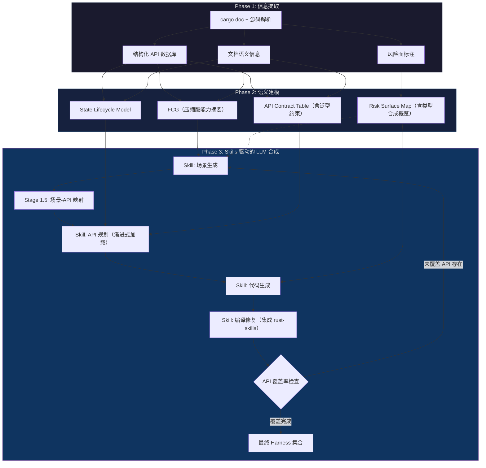

> [!IMPORTANT]
> **v4 关键变化**：
> 1. Pipeline 引入**覆盖率反馈环路**：场景迭代生成直到覆盖所有目标 API
> 2. FCG 以**压缩摘要**形式输入 LLM，不再是完整图结构
> 3. 新增 **Stage 1.5：场景-API 映射**，显式关联场景与具体 API
> 4. 所有 Prompt 模板重构为 **Skills 架构**，模块化、可扩展、可组合
> 5. Stage 4 编译修复集成 **rust-skills** 现有能力
> 6. 实现架构从纯 Rust 迁移为 **Rust CLI + OpenHarness** 分层架构
> 7. 提炼 **CISAL 架构模式**，作为可复用的通用 Agent 特化方法

---

## 3. Phase 1：信息提取 — 从 `cargo doc` 及源码中获取什么

### 3.1 提取手段

不要只依赖 `cargo doc` 生成的 HTML。应该**多源并用**：

| 提取源 | 工具/方法 | 获取内容 |
|--------|-----------|----------|
| `cargo doc --document-private-items` | 解析生成的 JSON（`--output-format json`，nightly 特性） | 完整 API 结构化数据 |
| `rustdoc JSON output` | `RUSTDOCFLAGS="-Z unstable-options --output-format json" cargo +nightly doc` | 机器可读的完整 API 描述 |
| `syn` / `ra_ap_syntax` crate | 源码 AST 解析 | unsafe 块、panic 调用、assert 条件 |
| `cargo expand` | 宏展开后的源码 | 宏生成的隐藏 API |
| `Cargo.toml` | 直接解析 | feature flags、依赖关系 |

> [!IMPORTANT]
> **优先使用 `rustdoc JSON`**（Nightly 的 `--output-format json`），它是目前最结构化的 API 元数据源。其输出包含 item ID、类型签名、泛型约束、trait impl、文档文本等完整信息。如果 Nightly 不可用，可以 fallback 到解析 HTML 或使用 `syn` 解析源码。

### 3.2 需要提取的信息清单

#### A. 函数与方法信息（API 骨架 + 归属关系）

```
对每个 public 函数/方法，提取：
├── 基本信息
│   ├── 模块路径 (e.g., crate::parser::Config)
│   ├── Item 类型 (free fn / associated fn / method / trait method)
│   └── 可见性 (pub / pub(crate) / pub(super))
│
├── 归属关系（Method Hierarchy）
│   ├── 所属类型（挂载在哪个 struct/enum 的 impl 块下）
│   ├── 是 inherent impl 还是 trait impl
│   │   └── 如果是 trait impl：实现的是哪个 trait？是否覆盖了默认方法？
│   ├── 是静态方法（Associated Function，无 self）还是实例方法（有 self）
│   │   └── 静态方法中返回 Self 的 → 标记为构造器（Constructor）
│   └── 是否为 trait 的 required method 还是 provided method（有默认实现）
│
├── 完整签名
│   ├── 函数修饰符：async / unsafe / const / extern "C"
│   ├── 泛型参数 + trait bounds
│   ├── where 子句（完整保留，不能丢弃）
│   ├── 参数列表
│   │   ├── 参数名 + 类型
│   │   ├── 是否为 mut 参数
│   │   ├── 是否为 impl Trait 参数（语法糖，需展开为泛型约束）
│   │   └── 是否为 dyn Trait 参数（trait object）
│   ├── 方法接收器类型
│   │   ├── &self / &mut self / self / Pin<&mut Self>
│   │   └── self 的消耗语义标记（self → 调用后对象不可再用）
│   ├── 返回类型
│   │   ├── 具体类型
│   │   ├── 是否为 impl Trait 返回类型
│   │   ├── 是否为 Result<T, E>（提取具体的 E 类型 → 决定错误处理方式）
│   │   ├── 是否为 Option<T>（标记不可盲目 unwrap）
│   │   └── 是否为 ! (never type)（函数发散，不返回）
│   └── Lifetime 注解
│       ├── 不仅提取有 <'a>，还要提取参数与返回值的生命周期绑定关系
│       └── 例：fn get<'a>(&'a self) -> &'a str → 返回值不能比 self 存活更久
│
└── 关键 Attributes
    ├── #[must_use] → 忽略返回值意味着未完成业务流
    ├── #[deprecated] → Fuzzing 废弃接口意义不大，降低优先级
    ├── #[inline] / #[cold] → 性能提示（影响覆盖率分析）
    └── #[cfg(...)] → 条件编译，标记仅在特定 feature 下可用
```

#### B. Trait 信息（接口契约）

```
对每个 public trait，提取：
├── 基本信息
│   ├── Trait 路径 (e.g., crate::io::Parseable)
│   ├── 是否为 unsafe trait（实现者有额外安全义务）
│   ├── 超 Trait 约束 (supertrait bounds，如 trait Foo: Send + Clone)
│   └── 泛型参数 + where 子句
│
├── 关联项（Associated Items）
│   ├── 关联类型（Associated Types）
│   │   ├── type Output;
│   │   ├── 类型约束 (type Output: Display + Debug;)
│   │   └── LLM 必须知道关联类型才能正确书写泛型约束和实现
│   ├── 关联常量（Associated Constants）
│   │   └── const MAX_SIZE: usize; → 有些配置通过 Trait 常量传递
│   └── 关联函数/方法
│       ├── Required Methods（无默认实现，实现者必须提供）
│       │   └── LLM Mock 一个 Trait 时，这些是强制要求手写的
│       ├── Provided Methods（有默认实现，可选覆盖）
│       │   └── 标记默认实现的存在，LLM 可以选择不实现
│       └── 每个方法的完整签名（同 A 节的签名规范）
│
├── 已知实现者（Known Implementors）
│   ├── 库内哪些类型实现了此 Trait
│   └── 标准库中的常见实现者（如果适用）
│
└── 文档
    ├── Trait 级文档（说明此接口的语义契约）
    └── 每个方法的文档（同 E 节文档提取规范）
```

#### C. 类型系统信息（状态空间 + 内存布局）

```
对每个 public struct，提取：
├── 结构体种类
│   ├── 普通结构体 (named fields)
│   ├── 元组结构体 (tuple struct)
│   └── 单元结构体 (unit struct)
│
├── 字段信息
│   ├── 字段名 + 类型
│   ├── 字段可见性（pub / pub(crate) / pub(super) / private）
│   │   └── 若所有字段均为 private → 外部不可直接构造，必须通过构造器
│   ├── 是否为 Option<T>（标记可选状态）
│   ├── 是否为 Vec/HashMap 等集合（标记可能为空）
│   └── 序列化相关属性
│       ├── #[serde(default)] → 反序列化时有默认值
│       ├── #[serde(skip)] → 不参与序列化
│       └── #[serde(rename = "...")] → 字段映射
│
├── 内存布局标签（Representation）
│   ├── #[repr(C)] → C 兼容布局，可安全进行 FFI 指针转换
│   ├── #[repr(transparent)] → 与内部类型布局一致，可安全 transmute
│   ├── #[repr(packed)] → 紧凑布局，对齐限制，取引用可能 UB
│   └── #[repr(align(N))] → 对齐要求
│
├── 构造约束
│   ├── #[non_exhaustive] → 外部不可穷举构造（即使字段全 pub）
│   ├── 构造器列表（返回 Self 的关联函数）
│   ├── Builder 模式检测（是否有对应的 XxxBuilder 类型）
│   └── Default 实现 → 可通过 Default::default() 构造
│
├── 实现的关键 Trait（同前，此处不再重复）
│
└── 泛型约束（约束了使用方式）

────────────────────────────────────────

对每个 public enum，提取：
├── Enum 级信息
│   ├── #[non_exhaustive] → 外部匹配必须有 _ 通配分支
│   ├── #[repr(u8/u16/C/...)] → 判别值的内存表示
│   └── 泛型参数
│
├── 变体信息（Variants）— 每个变体单独提取：
│   ├── 变体名称
│   ├── 变体类型
│   │   ├── 单元变体 (Unit: e.g., Option::None)
│   │   ├── 元组变体 (Tuple: e.g., Option::Some(T)，提取内部类型列表)
│   │   └── 结构体变体 (Struct: e.g., Error::Io { source: io::Error }，提取字段)
│   └── 变体的文档注释
│
├── 模式匹配指导
│   └── LLM 必须知道所有变体的确切形态才能正确构造和 match
│
└── 实现的关键 Trait
```

#### D. impl 块分类与关联项

```
对每个 impl 块，提取：
├── impl 类型
│   ├── Inherent impl（impl MyType { ... }）
│   └── Trait impl（impl TraitName for MyType { ... }）
│       ├── 实现的 Trait 名称
│       └── 是否为条件实现（impl<T: Clone> ... for Vec<T>）
│
├── 关联项
│   ├── 关联类型定义（type Output = ...;）
│   ├── 关联常量定义（const MAX: usize = 1024;）
│   └── 方法列表（引用 A 节详细规范）
│
└── 方法分类
    ├── 构造器（返回 Self 的关联函数，无 self 参数）
    ├── 访问器（&self，只读查询）
    ├── 修改器（&mut self，状态变更）
    ├── 消耗器（self，消耗所有权，终态操作）
    └── 转换器（self → 返回其他类型，如 into_inner()）
```

#### E. 文档语义信息（人类知识 + API 契约）

这是**最关键**的差异化信息源——现有工作几乎不提取文档语义：

```
对每个文档注释，提取：
├── 模块级文档
│   └── 功能描述、设计哲学、典型使用场景
├── 类型级文档
│   └── "这个类型代表什么"、"它的核心职责"
├── 函数级文档
│   ├── 功能描述（自然语言）
│   ├── # Arguments 节 → 参数语义（不只是类型，还有含义和合法范围）
│   ├── # Returns 节 → 返回值语义
│   ├── # Errors 节 → 错误条件 **[关键：API 契约]**
│   │   └── 提取具体的错误类型和触发条件，用于决定 match 分支
│   ├── # Panics 节 → panic 触发条件 **[关键：前置条件]**
│   │   └── 极其重要！区分 Bug 和 Expected Behavior 的依据
│   │       例：文档说明传 0 会 panic → 生成的 harness 应避免或故意测试
│   ├── # Safety 节 → unsafe 调用的安全条件 **[关键：安全契约]**
│   │   └── LLM 调用 unsafe fn 前必须满足此处的所有条件
│   └── # Examples 节 → 人类使用模式 **[关键：黄金样例]**
└── 内联注释中的 TODO/FIXME/HACK（潜在缺陷区域）
```

> [!TIP]
> **关于 Doc Examples 的选择性加载**（回应 review：不要一次性加载所有 examples）
>
> Doc examples 是最有价值的信息源，但**不能全部塞给 LLM**。采用以下策略：
> 1. **索引而不加载**：提取阶段只建立 examples 索引（来源 API、涉及类型、演示能力标签）
> 2. **按需检索**：Stage 2/3 时，根据当前场景涉及的 API，仅加载相关的 examples
> 3. **相关度评分**：`score = 涉及的当前场景API数 / example总API数`，取 top-K
> 4. **去重合并**：多个 example 演示相同模式时，只保留最完整的一个

#### F. 安全与属性标记（Fuzzing 的生命线）

> [!WARNING]
> LLM 如果不知道 API 的隐式契约，就会写出导致 False Positive（误报）的 Harness。以下标记信息是区分真 Bug 和 Expected Behavior 的依据。

```
对每个 public item，提取安全与属性标记：
├── Safety 标记
│   ├── 函数签名中是否有 unsafe fn
│   ├── Trait 是否为 unsafe trait
│   ├── impl 块是否为 unsafe impl
│   └── 函数体中包含的 unsafe 块数量和位置
│
├── 关键 Attributes
│   ├── #[must_use] → 忽略返回值通常意味着未完成完整业务流
│   ├── #[deprecated] / #[deprecated(since, note)] → 废弃接口，降低 fuzzing 优先级
│   ├── #[non_exhaustive] → 影响外部构造和匹配（struct/enum 均适用）
│   ├── #[cfg(feature = "...")] → 条件编译，标记 feature gate
│   └── #[doc(hidden)] → 隐藏 API，通常不应被外部使用
│
├── 返回值特征（影响错误处理策略）
│   ├── Result<T, E> → 提取具体的 E 类型
│   │   └── LLM 需要知道 E 是什么才能决定 match 分支或 map_err
│   ├── Option<T> → 标记绝不可盲目 unwrap
│   ├── #[must_use] 的 Result/Option → 强制处理
│   └── 裸指针返回 (*const T / *mut T) → 高风险标记
│
└── 内存布局标签（FFI 与 transmute 深水区）
    ├── #[repr(C)] → C ABI 兼容，可安全 FFI 传递
    ├── #[repr(transparent)] → 与内部类型布局一致，可安全 transmute
    ├── #[repr(packed)] → 紧凑布局，取未对齐字段引用会 UB
    └── #[repr(align(N))] → 对齐要求
```

#### G. 依赖边界与路径信息

```
├── 生命周期绑定关系（Lifetime Bindings）
│   ├── 不仅提取签名中存在 <'a>，还要提取参数与返回值之间的映射
│   ├── 例：fn get<'a>(&'a self) -> &'a str
│   │   └── 语义：返回值不能比 self 活得更久
│   ├── 例：fn iter<'a>(&'a self) -> Iter<'a, T>
│   │   └── 语义：迭代器的生命周期绑定到容器
│   └── 这对防止 LLM 写出编译不通过的 use-after-free 代码至关重要
│
├── Re-exports（重导出）
│   ├── pub use crate::internal::Type;
│   ├── pub use other_crate::Something;
│   └── LLM 必须使用重导出的公共路径，而非深层私有路径
│       例：应 use serde_json::Value; 而非 use serde_json::value::Value;
│
├── Type Aliases（类型别名）
│   ├── pub type Result<T> = std::result::Result<T, MyError>;
│   └── LLM 需要知道别名展开后的实际类型
│
└── Feature Gates（特性门控）
    ├── 哪些 API 仅在特定 feature 下可用
    ├── feature 之间的依赖关系
    └── 默认启用的 features
```

#### H. 风险面信息（Fuzz 目标区域）

```
扫描源码，标注以下风险点：
├── unsafe 函数签名 → 需要满足 safety 文档中的前置条件
├── unsafe 块
│   ├── 原始指针操作 (*const T / *mut T 解引用)
│   ├── FFI 调用 (extern "C" fn)
│   ├── transmute / 类型擦除
│   ├── union 字段访问
│   └── 内联汇编
├── panic 源
│   ├── 显式 panic!() / unreachable!() / todo!()
│   ├── unwrap() / expect() 调用
│   ├── 数组索引（非 .get()）
│   ├── 整数除法（可能除以零）
│   └── slice::from_raw_parts 等
├── 潜在 UB 点
│   ├── 未初始化内存 (MaybeUninit)
│   ├── 引用别名违规
│   ├── 数据竞争可能性（!Send/!Sync 但跨线程使用）
│   └── #[repr(packed)] 字段取引用
└── 外部输入处理
    ├── 解析函数 (parse / from_str / from_bytes)
    ├── 反序列化函数
    └── 文件/网络 IO 处理
```

### 3.3 输出数据格式 — 多层级知识库

将所有提取信息组织为一个**分层结构的 JSON 知识库**，支持按需加载不同精度的信息：

```json
{
  "crate_name": "example_lib",
  "crate_doc": "A library for parsing and manipulating FOO format files...",

  "level_0_summary": {
    "one_line": "FOO 格式文件的解析与操作库",
    "capabilities": ["解析", "查询", "修改", "序列化"],
    "key_types": ["Parser", "Document", "Node"],
    "api_count": 47,
    "risk_summary": "3 unsafe fn, 5 FFI calls, 12 panic points"
  },

  "level_1_modules": [
    {
      "path": "example_lib::parser",
      "doc_summary": "FOO 格式的流式解析器",
      "types": ["Parser", "ParserConfig", "ParseError"],
      "api_names": [
        "Parser::new", "Parser::parse", "Parser::reset", "Parser::set_config",
        "Parser::from_reader", "ParserConfig::default", "ParserConfig::set_strict",
        "ParseError::line", "ParseError::column"
      ],
      "api_count": 9
    }
  ],

  "level_2_types": [
    {
      "id": "type_001",
      "path": "example_lib::parser::Parser",
      "kind": "struct",
      "doc": "A streaming parser for FOO format",
      "generic_params": [
        {"name": "R", "bounds": ["Read"], "default": null}
      ],
      "constructors": ["new(input: R) -> Self where R: Read"],
      "method_names": ["parse", "reset", "set_config"],
      "traits_impl": [
        {"trait": "Iterator", "conditional_bounds": null},
        {"trait": "Drop", "conditional_bounds": null},
        {"trait": "Send", "conditional_bounds": "R: Send"}
      ],
      "lifecycle_summary": "construct → configure → parse → iterate → drop"
    }
  ],

  "level_3_apis": [
    {
      "id": "fn_001",
      "path": "example_lib::parser::Parser::parse",
      "signature": "pub fn parse(&mut self) -> Result<Ast, ParseError>",
      "generic_params": [],
      "where_clauses": [],
      "doc_full": "Parse the input into an AST...",
      "contract": {
        "preconditions": ["Input must be valid UTF-8"],
        "panics": ["If the parser has already been consumed"],
        "errors": ["ParseError::InvalidSyntax if ..."],
        "safety": null
      },
      "risk_markers": ["contains_unwrap", "index_access"],
      "related_examples_ids": ["ex_001", "ex_003"]
    },
    {
      "id": "fn_015",
      "path": "example_lib::codec::decode",
      "signature": "pub fn decode<T: Decodable>(data: &[u8]) -> Result<T, DecodeError>",
      "generic_params": [
        {"name": "T", "bounds": ["Decodable"], "is_return_type": true}
      ],
      "where_clauses": [],
      "doc_full": "Decode binary data into a type implementing Decodable...",
      "contract": {
        "preconditions": [],
        "panics": [],
        "errors": ["DecodeError::InvalidFormat if data is malformed"],
        "safety": null
      },
      "risk_markers": ["external_input"],
      "related_examples_ids": ["ex_007"]
    }
  ],

  "trait_registry": [
    {
      "id": "trait_001",
      "path": "example_lib::codec::Decodable",
      "is_unsafe": false,
      "supertraits": ["Sized"],
      "generic_params": [],
      "associated_types": [
        {"name": "Error", "bounds": ["std::error::Error"], "default_type": null}
      ],
      "required_methods": [
        {"name": "decode", "signature": "fn decode(buf: &[u8]) -> Result<Self, Self::Error>"}
      ],
      "provided_methods": [
        {"name": "decode_with_config", "signature": "fn decode_with_config(buf: &[u8], config: Config) -> Result<Self, Self::Error>"}
      ],
      "known_implementors": ["example_lib::Message", "example_lib::Header"],
      "doc": "Types that can be decoded from a byte buffer"
    },
    {
      "id": "trait_002",
      "path": "example_lib::alloc::Allocator",
      "is_unsafe": true,
      "supertraits": [],
      "generic_params": [],
      "associated_types": [],
      "required_methods": [
        {"name": "allocate", "signature": "fn allocate(&self, layout: Layout) -> Result<NonNull<[u8]>, AllocError>"},
        {"name": "deallocate", "signature": "unsafe fn deallocate(&self, ptr: NonNull<u8>, layout: Layout)"}
      ],
      "provided_methods": [],
      "known_implementors": ["example_lib::BumpAllocator"],
      "doc": "Custom memory allocator interface. UNSAFE: implementors must guarantee memory safety invariants"
    }
  ],

  "examples_index": [
    {
      "id": "ex_001",
      "source_api": "Parser::parse",
      "involved_apis": ["Parser::new", "Parser::parse", "Ast::root"],
      "capability_tags": ["parsing", "tree_traversal"],
      "line_count": 3,
      "code_ref": {"file": "src/parser.rs", "start_line": 45, "end_line": 47}
    }
  ],

  "risk_surface": {
    "unsafe_functions": [...],
    "ffi_boundaries": [...],
    "panic_points": [...],
    "ub_risks": [...]
  },
  
  "api_coverage_tracker": {
    "total_public_apis": 47,
    "covered_apis": [],
    "uncovered_apis": ["fn_001", "fn_002", "..."]
  }
}
```

> [!IMPORTANT]
> **分层设计的意义**：
> - **Level 0**：~200 tokens，用于 Stage 1 场景生成（LLM 只需知道库能做什么）
> - **Level 1**：~1-2K tokens，用于 Stage 1.5 场景-API 映射（包含模块结构 + API 名称列表）
> - **Level 2**：~2-5K tokens/场景，用于 Stage 2 API 规划（只加载场景相关类型，含泛型参数 + 条件 trait impl）
> - **Level 3**：~1-3K tokens/API，用于 Stage 3 代码生成（只加载被选中的 API 详情，含泛型约束 + where 子句）
>
> 此外，`trait_registry` 存储所有 public trait 的完整信息（required/provided methods、associated types、unsafe 标记、supertrait 链）。当 Stage 2-3 涉及泛型 API 时，按 trait bound 引用查询对应 trait 的详情。
>
> 这样，即使库有 200+ API，单次 LLM 调用也只需处理 5-15K tokens 的库信息。
>
> **覆盖率口径**：`total_apis` 默认基于 `default features` 下的 public API 集合。可通过 `--features all` 扩展。

---

## 4. Phase 2：语义建模 — 如何处理提取的信息

> [!IMPORTANT]
> 这一阶段是本方案的**核心学术贡献**。不是简单地建 API 依赖图，而是构建四个语义模型，让 LLM 能像人一样"理解"这个库。

### 4.1 Functional Capability Graph (FCG) — 功能能力图

**核心思想**：人使用库时想的不是"我要调用函数 A、B、C"，而是"我要用这个库**解析**一个文件、**转换**数据、**输出**结果"。

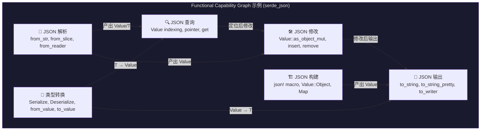

**构建方法**：

1. **模块聚类**：将同一模块下的 API 按功能聚类（模块本身就是库作者的功能分组）
2. **文档驱动命名**：用模块文档和类型文档的第一句话作为能力节点的名称
3. **类型流分析**：分析类型 A 的方法返回类型 B → A 的能力连接到 B 的能力
4. **trait 关联**：实现了同一 trait 的类型提供同一类能力

#### FCG 的渐进式加载（解决 LLM 上下文溢出）

> [!TIP]
> **FCG 不以图结构直接输入 LLM**。采用**渐进式引导加载**：先给 LLM 压缩摘要，LLM 判断需要深入了解哪些能力，再按需加载对应能力的完整 API 列表。

**渐进式加载策略（两轮交互）**：

```
第 1 轮：LLM 接收压缩摘要（~200 tokens）
──────────────────────────────────────
"本库提供 6 项核心能力：
  1. JSON解析（3个入口API）
  2. JSON构建（3个API）
  3. 类型转换（4个API）
  4. JSON输出（3个API）
  5. JSON查询（3个API）
  6. JSON修改（3个API）
 典型能力链：解析→查询→修改→输出"

LLM 输出："我想构思一个涉及 解析+查询+修改 的场景，
          请提供这三个能力的详细 API 列表。"

第 2 轮：系统按需加载被选中能力的完整信息（~500-800 tokens）
──────────────────────────────────────
"能力 1 - JSON解析 的详细 API：
  - from_str<T>(s: &str) -> Result<T, Error>
  - from_slice<T>(v: &[u8]) -> Result<T, Error>
  - from_reader<T>(rdr: impl Read) -> Result<T, Error>
  连接到能力：→查询, →修改, →类型转换

 能力 5 - JSON查询...（同上格式）
 能力 6 - JSON修改...（同上格式）"

LLM 输出：完整的场景描述 + 涉及的具体 API
```

> [!NOTE]
> **渐进式 vs 静态压缩的对比**：
> | 维度 | 静态压缩（策略 A） | 渐进式引导（策略 B，本方案采用） |
> |------|---------------|------------------|
> | Token 消耗 | ~200 固定 | ~200 首轮 + ~500 按需 |
> | LLM 调用次数 | 1 次 | 2 次（多一轮交互） |
> | 信息精度 | 只有能力名称 | 包含 LLM 选中能力的完整 API 签名 |
> | 场景质量 | 可能因信息不足而泛化 | LLM 能基于具体 API 构思更精准的场景 |
> | 适用场景 | 小型库（≤30 API） | 中大型库（30+ API） |
>
> **推荐策略**：小型库直接静态压缩（省一次 LLM 调用），中大型库使用渐进式引导。

**实现**：

```rust
fn compress_fcg_summary(fcg: &CapabilityGraph) -> String {
    // 第 1 轮：只生成能力名称和 API 数量
    let mut summary = format!("本库提供 {} 项核心能力：\n", fcg.capabilities.len());
    for (i, cap) in fcg.capabilities.iter().enumerate() {
        summary += &format!("{}. {}（{}个API）\n", i+1, cap.name, cap.apis.len());
    }
    summary += "\n典型能力链：\n";
    for chain in &fcg.capability_chains[..min(3, fcg.capability_chains.len())] {
        summary += &format!("  {}\n", chain.iter().map(|c| &c.name).join(" → "));
    }
    summary
}

fn expand_capabilities(fcg: &CapabilityGraph, selected_ids: &[CapId]) -> String {
    // 第 2 轮：展开 LLM 选中的能力节点的完整 API 列表
    let mut detail = String::new();
    for id in selected_ids {
        let cap = &fcg.capabilities[id];
        detail += &format!("\n能力: {}\n", cap.name);
        detail += &format!("描述: {}\n", cap.description);
        detail += "API 列表：\n";
        for api in &cap.apis {
            detail += &format!("  - {}\n", api.signature);
        }
        detail += &format!("连接到能力：{}\n",
            cap.connects_to.iter().map(|c| &c.name).join(", "));
    }
    detail
}
```

### 4.2 State Lifecycle Model (SLM) — 状态生命周期模型

**核心思想**：对库中的核心类型，建模其完整的生命周期状态机。这解决了"拿未初始化的 struct 去调用方法"的问题。

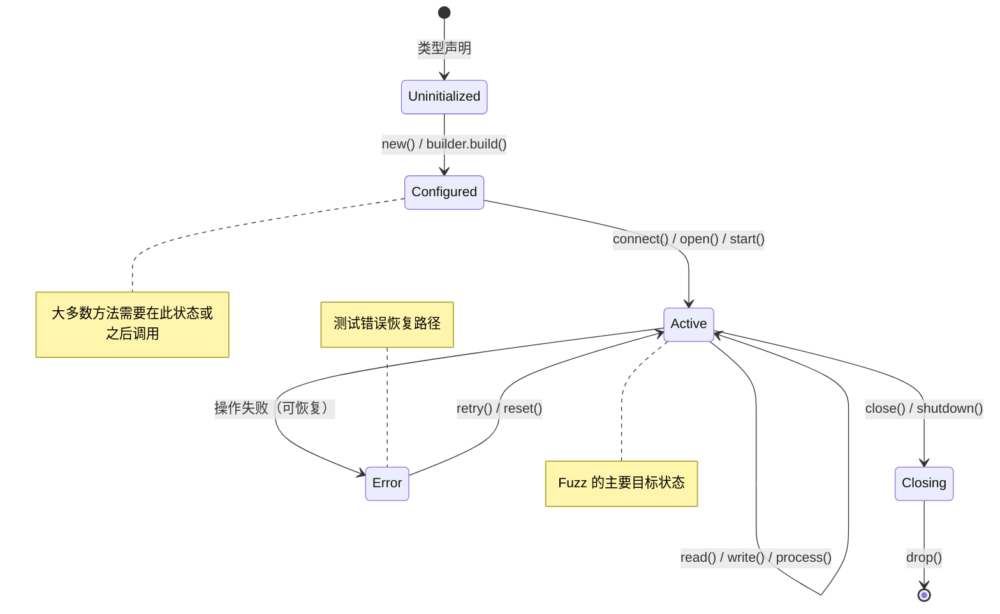

**构建方法**：

```
「核心类型」判定标准（得分 ≥ 3 为 core）：
  +3: 实现了 Drop（有资源管理）
  +2: 有 ≥3 个 &mut self 方法（有复杂状态转换）
  +2: 文档中提及状态/阶段/生命周期相关词汇
  +1: 是其他 API 的返回类型（被依赖）
  +1: 有 # Panics 文档（暗示状态前置条件）

  ≥ 3 → 构建完整 SLM
  1-2 → 构建简化 SLM（仅 construct → use → drop）
  0   → 不建模，标记为 stateless

对评分为 core 的类型 T：
1. 识别构造阶段：
   - 哪些函数返回 T？(new, default, from, builder.build)
   - 构造需要什么参数？参数的合法范围？

2. 识别状态转换方法：
   - 接收 &mut self 的方法 → 可能改变状态
   - 返回 Result 的方法 → 有失败状态转换
   - 消耗 self 的方法 → 终态转换

3. 识别状态前置条件：
   - # Panics 文档 → "在 X 状态下调用会 panic" → X 是禁止前置状态
   - 方法名语义 → connect() 暗示需要已 configure
   - 字段检查 → 方法内部 assert!(!self.closed) → closed=true 是禁止状态

4. 识别析构：
   - 是否实现 Drop → 有资源清理逻辑
   - 析构顺序要求
```

**输出格式**：

```json
{
  "type": "TcpConnection",
  "lifecycle": {
    "states": ["Uninitialized", "Configured", "Connected", "Closed"],
    "transitions": [
      {"from": "Uninitialized", "to": "Configured", "via": "TcpConnection::new(addr)", "precondition": "addr is valid"},
      {"from": "Configured", "to": "Connected", "via": ".connect()", "precondition": null},
      {"from": "Connected", "to": "Connected", "via": ".send(data)", "precondition": "data.len() > 0"},
      {"from": "Connected", "to": "Closed", "via": ".close()", "precondition": null},
      {"from": "*", "to": "Dropped", "via": "drop()", "precondition": null}
    ],
    "fuzzable_states": ["Connected"],
    "forbidden_transitions": [
      {"from": "Closed", "via": ".send()", "reason": "panics: connection already closed"}
    ]
  }
}
```

### 4.3 API Contract Table — API 契约表

**核心思想**：将分散在文档各处的隐式契约显式化、结构化。

```
对每个 public 函数/方法，提取契约：

┌─────────────────────────────────────────────────────────────────┐
│ API: HashMap::get(&self, key: &K) -> Option<&V>                │
├──────────────┬──────────────────────────────────────────────────┤
│ 前置条件      │ K: Eq + Hash（编译时保证）                        │
│ 后置条件      │ 返回 Some(&v) 如果 key 存在，否则 None             │
│ 不变量       │ self 不被修改（&self 保证）                        │
│ Panic 条件   │ 无                                               │
│ 错误条件     │ 无（通过 Option 表达）                              │
│ Safety       │ N/A（safe 函数）                                  │
│ 副作用       │ 无                                                │
└──────────────┴──────────────────────────────────────────────────┘
```

**提取方法**：

```
1. 从 # Panics 文档 → panic 条件 → 反转为前置条件
2. 从 # Errors 文档 → 错误条件 → 可恢复的失败路径
3. 从 # Safety 文档 → safety 条件 → unsafe 调用的硬性前置条件
4. 从返回类型推导：
   - Result<T, E> → 有可恢复错误
   - Option<T> → 可能无结果（不应 unwrap）
   - ! (never type) → 函数不返回（发散）
5. 从参数类型推导：
   - NonZeroUsize → 不接受 0
   - &Path → 可能涉及文件系统
   - &[u8] → 可能解析二进制数据（好的 fuzz 入口）
6. 从泛型参数推导（泛型 API 额外提取）：
   - 展开 trait bound 链（含 supertrait）
   - 收集 associated types 及其约束
   - 标记 unsafe trait
   - 确定实例化策略（A/B/C/D，见 4.5 CTS）
```

**泛型 API 的契约（含 `generic_constraints` 字段）**：

```json
{
  "api": "decode<T: Decodable>",
  "preconditions": ["buf 为有效的编码数据"],
  "postconditions": ["返回 Ok(T) 或 Err(T::Error)"],
  "panic_conditions": [],
  "error_conditions": ["输入数据格式无效"],
  "safety": "N/A",
  "generic_constraints": {
    "params": [
      {
        "name": "T",
        "direct_bounds": ["Decodable"],
        "full_bound_chain": ["Decodable", "Sized"],
        "associated_types": [
          {"name": "Error", "bounds": ["std::error::Error"]}
        ],
        "is_unsafe_trait": false,
        "instantiation_strategy": "C",
        "bug_hunting_value": "HIGH",
        "synthesis_guidance": "构造自定义 Decodable 实现，decode 返回 Err 或部分解码结果",
        "known_implementors": ["example_lib::Message", "example_lib::Header"],
        "overridable_defaults": ["decode_with_config(...)"]
      }
    ]
  }
}
```

> [!NOTE]
> `generic_constraints` 仅在 API 接受泛型参数时出现。对非泛型 API，该字段不存在或为空。`instantiation_strategy` 和 `bug_hunting_value` 的判定逻辑见 4.5.3 节。

### 4.4 Risk Surface Map — 风险面地图

将 Phase 1 提取的风险信息与 API 契约关联，生成 fuzz 优先级排序：

```json
{
  "high_priority_targets": [
    {
      "api": "Parser::parse_untrusted",
      "risk_level": "HIGH",
      "reasons": [
        "接受 &[u8] 外部输入",
        "内部有 3 处 unsafe 块",
        "解析逻辑复杂（300+ 行）",
        "# Safety 文档不完整"
      ],
      "recommended_fuzz_strategy": "用 arbitrary 生成 &[u8] 输入，在 Connected 状态下调用"
    }
  ],
  "type_synthesis_overview": {
    "generic_api_count": 12,
    "strategy_distribution": {"A": 3, "B": 4, "C": 4, "D": 1},
    "high_value_targets": 4,
    "dominant_assumption_categories": ["行为假设", "资源假设", "一致性假设"],
    "one_liner": "12 个泛型 API，4 个适合自定义类型合成（IO×2, Iterator×1, Comparison×1）"
  },
  "trait_related_risks": [
    {
      "api": "process<T: Handler>",
      "risk_level": "HIGH",
      "risk_type": "generic_trait_misuse",
      "reasons": [
        "接受泛型参数 T: Handler",
        "Handler trait 有 3 个可覆盖默认方法",
        "Handler::on_error 默认实现 swallows 错误（自定义实现可暴露假设）",
        "非 unsafe trait → 适合构造自定义实现"
      ],
      "recommended_fuzz_strategy": "构造自定义 Handler 实现，on_data 返回异常长度，on_error 传播错误",
      "cts_strategy": "C",
      "assumption_category": "行为假设",
      "bug_hunting_value": "HIGH"
    },
    {
      "api": "alloc_with<A: Allocator>",
      "risk_level": "MEDIUM",
      "risk_type": "unsafe_trait_boundary",
      "reasons": [
        "接受 unsafe trait Allocator",
        "不应自定义实现，但仍需测试不同分配器的行为差异"
      ],
      "recommended_fuzz_strategy": "使用 std::alloc::System 和库定义的 BumpAllocator 分别测试",
      "cts_strategy": "D",
      "bug_hunting_value": "MEDIUM"
    }
  ],
  "rust_feature_risks": [
    {
      "feature": "lifetime_bounds",
      "apis_affected": ["StreamParser::from_ref", "Iter::new"],
      "risk": "生命周期约束违反（use-after-free 模式）",
      "assumption_category": "所有权/生命周期假设",
      "strategy": "构造 harness 测试借用在容器修改后是否仍有效"
    },
    {
      "feature": "non_exhaustive",
      "types_affected": ["Config", "ErrorKind"],
      "risk": "外部代码对 #[non_exhaustive] 的不完整 match",
      "strategy": "确保 harness 中的 match 包含 _ 通配分支"
    },
    {
      "feature": "conditional_impl",
      "impl_affected": ["impl<T: Clone> Container<T>"],
      "risk": "条件 impl 导致某些泛型实例化下方法不可用",
      "assumption_category": "行为假设",
      "strategy": "用不实现 Clone 的自定义类型（newtype 包装）测试 Container<T>"
    },
    {
      "feature": "panic_in_drop",
      "types_affected": ["ResourceGuard", "Transaction"],
      "risk": "Drop 实现中 panic 导致 double-free 或资源泄漏",
      "assumption_category": "控制流假设",
      "strategy": "构造 custom Drop 类型，在 Drop 中注入 panic，测试库的 panic safety"
    }
  ]
}
```

> [!NOTE]
> `type_synthesis_overview` 聚合了所有泛型 API 的实例化策略统计，供 Stage 1（scenario-generator）使用。`one_liner` 字段提供压缩摘要（~30 tokens），避免在场景生成阶段注入过多细节。各 risk 条目中的 `assumption_category` 对应 4.5.1 的假设违反分类，指导 LLM 选择合适的类型构造手段。

### 4.5 Custom Type Synthesis Strategy (CTS) — 自定义类型合成策略

> [!IMPORTANT]
> **核心原理**：Rust 库中绝大多数深层 bug（内存安全错误、逻辑错误、panic）源于**库对泛型参数行为的隐式假设被违反**。近 90% 的 Rust 内存安全错误 PoC 涉及使用泛型参数的 API（参考 deepSURF 研究）。但触发 bug 的手段不仅限于自定义 trait 实现——任何能让库的隐式假设不成立的类型构造都是有效的 fuzz 策略。

**设计定位**：CTS 不是一个独立的数据模型，而是贯穿 Phase 2-3 的**设计原则**。它的核心分析（per-API 的泛型约束和实例化策略）已并入 API Contract Table（见 4.3 `generic_constraints` 字段）；跨 API 的聚合统计已并入 Risk Surface Map（见 4.4 `type_synthesis_overview`）。本节定义**策略框架**——告诉系统"该构造什么样的类型来触发 bug"。

#### 4.5.1 假设违反分类

一切 bug 触发策略的统一原则：**构造违反库隐式假设的类型**。

```
┌───────────────────┬───────────────────────────────┬────────────────────────────┬─────────────────┐
│ 假设类别           │ 库的隐式假设                    │ 类型构造方式                │ 目标 Bug 类型    │
├───────────────────┼───────────────────────────────┼────────────────────────────┼─────────────────┤
│ 行为假设           │ trait 方法行为"正常"、返回值     │ 自定义 trait 实现 + 偏差行为  │ 逻辑错误、panic  │
│                   │ 合理、不会在意外时刻失败         │ （短读、异常返回、panic）     │ 内存安全错误     │
├───────────────────┼───────────────────────────────┼────────────────────────────┼─────────────────┤
│ 资源假设           │ IO/分配总是成功，或失败后        │ 自定义 IO/Allocator 注入     │ 资源泄漏         │
│                   │ 不需要回滚                      │ 定点失败                    │ panic、未回滚    │
├───────────────────┼───────────────────────────────┼────────────────────────────┼─────────────────┤
│ 一致性假设         │ Eq/Ord/Hash 满足数学性质        │ 不一致的比较/哈希实现        │ 无限循环         │
│                   │ （自反、传递、对称）             │ （违反传递性、hash 不一致）   │ 逻辑错误、panic  │
├───────────────────┼───────────────────────────────┼────────────────────────────┼─────────────────┤
│ 线程安全假设       │ 泛型参数 T: Send+Sync           │ !Send/!Sync 包装类型        │ 数据竞争         │
│                   │                               │ interior mutability 类型    │ UB              │
├───────────────────┼───────────────────────────────┼────────────────────────────┼─────────────────┤
│ 大小/布局假设      │ 类型有非零大小、标准对齐          │ ZST (零大小类型)            │ 内存损坏         │
│                   │                               │ 超对齐类型                  │ 未定义行为       │
├───────────────────┼───────────────────────────────┼────────────────────────────┼─────────────────┤
│ 控制流假设         │ 回调不重入、Drop 不 panic        │ 重入闭包（回调中调用库方法）  │ 死锁、栈溢出     │
│                   │ unwinding 期间无二次 panic       │ panicking Drop              │ double-free      │
├───────────────────┼───────────────────────────────┼────────────────────────────┼─────────────────┤
│ 所有权/生命周期假设 │ 借用在容器修改前释放             │ 自引用结构                  │ use-after-free   │
│                   │ trait object 生命周期正确        │ dyn Trait 生命周期边界测试    │ dangling pointer │
└───────────────────┴───────────────────────────────┴────────────────────────────┴─────────────────┘
```

#### 4.5.2 类型构造工具箱

以下 6 种类型构造手段可以单独或组合使用来实例化泛型参数、满足 trait 约束、同时注入 bug 触发行为：

**① 自定义 struct（最基础的构造手段）**

```rust
// 基本模式：fuzzer 控制内部状态
#[derive(Arbitrary, Debug)]
struct FuzzType {
    data: Vec<u8>,
    pos: usize,
    fail_at: Option<usize>,  // fuzzer 控制的失败注入点
}
```

变体：
- **Interior mutability**：内含 `Cell<T>` 或 `RefCell<T>`，通过共享引用修改状态 → 测试库对不可变引用的信任
- **Custom Drop**：在 Drop 中记录调用顺序或注入 panic → 测试 drop 顺序依赖和 panic safety
- **ZST**：`struct Zero;` 作为泛型参数 → 测试库对 `size_of::<T>() > 0` 的假设
- **!Send/!Sync**：内含 `Rc<T>` 或 `*const T` → 测试库对线程安全的假设
- **超对齐**：`#[repr(align(4096))] struct Aligned(u8)` → 测试对齐假设

**② 自定义 trait 实现（deepSURF 的核心方法，最高 bug 发现价值）**

为自定义 struct 实现库要求的 trait，但故意引入"偏差行为"：

| Trait 语义类别 | 偏差策略 | 示例 |
|---|---|---|
| IO 类 (Read, Write, Seek) | 短读/短写、定点错误返回、EOF 不一致 | `read()` 每次只返回 1 字节 |
| 迭代器类 (Iterator) | panic-on-nth、无限迭代、size_hint 不准 | `next()` 在第 N 次返回 panic |
| 比较/排序类 (Eq, Ord, Hash) | 违反传递性、hash 与 eq 不一致 | `a < b && b < c` 但 `a > c` |
| 序列化类 (Serialize, Deserialize) | 产出截断/非法格式数据 | `serialize()` 写入不完整的数据 |
| 回调/处理器类 (Handler, Visitor) | 重入调用、异常返回值 | `on_data()` 返回值与实际处理量不一致 |

> 关键原则：偏差行为应由 fuzzer 输入驱动（如 `fail_at: Option<usize>`），而非硬编码 — 让 fuzzer 自动搜索触发 bug 的输入模式。

**③ Trait object (`dyn Trait`) 构造**

```rust
// 动态分发 vs 静态分发走不同代码路径
let handler: Box<dyn Handler> = Box::new(fuzz_handler);
library.process_dyn(&*handler);  // vtable dispatch

// Trait object + Send + Sync 组合
let handler: Box<dyn Handler + Send + Sync> = ...;
// Trait object 生命周期
let handler: Box<dyn Handler + 'static> = ...;
```

价值：库中对 `dyn Trait` 和 `impl Trait` 可能走不同的优化路径；fat pointer 布局可能暴露与泛型单态化不同的 bug。

**④ Newtype 包装**

```rust
// 选择性实现 trait：只实现库要求的，不实现库假设的
struct Wrapper<T>(T);
impl<T: Read> Read for Wrapper<T> { ... }
// 故意不实现 Clone — 测试条件 impl 路径
// 或故意让 Drop 行为不同于 T 的 Drop
```

价值：当库有 `impl<T: Clone> Container<T> { fn dup(&self) ... }`（条件 impl），用不实现 `Clone` 的 `Wrapper<T>` 实例化 → 测试条件 impl 不可用时的代码路径。

**⑤ 闭包合成**

```rust
// 重入闭包：回调中调用库方法 → 测试重入安全
let callback = |data: &[u8]| {
    library.process(data);  // 回调中再次调用库 → 死锁？栈溢出？
};
library.with_callback(callback);

// Panicking 闭包：FnOnce 中 panic → 测试 panic safety
let callback = move || { panic!("injected") };
```

价值：闭包作为 `Fn`/`FnMut`/`FnOnce` trait 的天然实现者，是传递给接受 `F: FnMut(...)` 泛型 API 的最自然方式。

**⑥ 自定义迭代器/Future/智能指针**

```rust
// 非终止迭代器
struct InfiniteIter;
impl Iterator for InfiniteIter {
    type Item = u8;
    fn next(&mut self) -> Option<u8> { Some(0) }  // 永不返回 None
}

// Panicking Future
impl Future for FuzzFuture {
    type Output = ();
    fn poll(self: Pin<&mut Self>, _cx: &mut Context<'_>) -> Poll<()> {
        panic!("poll panic");  // 测试 executor 的 panic handling
    }
}

// 非标准 Deref
impl Deref for SmartPtr {
    type Target = [u8];
    fn deref(&self) -> &[u8] { &[] }  // 返回空 slice → 测试库对非空假设
}
```

价值：这些都是特定 trait 的自定义实现（属于手段②的特化），但因为 Iterator/Future/Deref 在 Rust 生态中极为常见，单独列出以强调。

#### 4.5.3 实例化策略选择

当 API 接受泛型参数 `T: SomeTrait` 时，按以下优先级选择实例化方式：

```
策略 A: 库内已有类型
  └── 使用 trait_registry.known_implementors 中列出的类型
      优先使用：这是库作者测试过的路径，覆盖正常使用场景

策略 B: 标准库类型
  └── 对常见 trait (Read, Write, Iterator, Clone, Debug...)
      使用 Vec, String, Cursor, BufReader 等
      适用于：marker trait 或无自定义方法的 trait

策略 C: 自定义类型合成 ← 【bug 发现的关键路径】
  └── 组合使用上述 6 种构造手段，满足 trait 约束的同时注入偏差行为
      适用条件：
      - trait 有 required methods 或可覆盖的 provided methods
      - 非 unsafe trait
      - API Contract 的 bug_hunting_value 为 MEDIUM 或 HIGH
      
      生成指导：
      1. 根据 4.5.1 假设违反分类，确定最适合的假设违反类别
      2. 从 4.5.2 工具箱选择构造手段（可组合）
      3. 偏差行为应由 fuzzer 输入驱动（Arbitrary 派生）
      4. 同一 API 可生成多个 harness：策略 A/B + 策略 C 各一

策略 D: unsafe trait — 仅使用已有实现
  └── 对 unsafe trait (Send, Sync, GlobalAlloc, Allocator, TrustedLen...)
      不构造自定义实现（避免引入 UB 而非发现 bug）
      使用库内或标准库的已有兼容类型
```

> [!WARNING]
> **unsafe trait 原则**：unsafe trait 的自定义实现必须满足安全不变量（soundness contract），错误实现引入的是 UB 而非发现库 bug。当 API 同时受 safe trait + unsafe trait 约束时，自定义类型应实现 safe trait 部分，unsafe trait 部分使用已有实现（如通过 newtype 包装标准库类型获得 Send/Sync）。

---

## 5. Phase 3：Skills 驱动的 LLM Harness 合成

### 5.1 Skills 架构总览

> [!IMPORTANT]
> **核心设计变更**：所有 Prompt 模板重构为模块化的 **Skills**，借鉴 [rust-skills](https://github.com/actionbook/rust-skills) 的分层认知框架。每个 Skill 是一个独立的认知单元，有自己的触发条件、输入规范、推理指引和输出格式。

```
seraph-skills/
│
├── skills/                           # 核心 Skills
│   ├── harness-router/               # 入口路由 Skill（类似 rust-router）
│   │   └── SKILL.md
│   │
│   ├── scenario-generator/           # Stage 1: 场景生成 Skill
│   │   ├── SKILL.md
│   │   └── references/
│   │       └── scenario-patterns.md  # 常见场景模式库
│   │
│   ├── scenario-api-mapper/          # Stage 1.5: 场景-API 映射 Skill
│   │   ├── SKILL.md
│   │   └── references/
│   │       └── mapping-rules.md
│   │
│   ├── api-planner/                  # Stage 2: API 规划 Skill
│   │   ├── SKILL.md
│   │   └── references/
│   │       ├── rust-idioms.md        # Rust 惯用模式
│   │       └── anti-patterns.md      # 禁止模式
│   │
│   ├── harness-codegen/              # Stage 3: 代码生成 Skill
│   │   ├── SKILL.md
│   │   └── references/
│   │       ├── harness-template.md   # Harness 模板
│   │       └── fuzz-framework.md     # Fuzz 框架规范
│   │
│   ├── compile-fixer/                # Stage 4: 编译修复 Skill
│   │   ├── SKILL.md
│   │   └── references/
│   │       └── common-fixes.md       # 常见编译错误修复模式
│   │
│   ├── coverage-tracker/             # API 覆盖率追踪 Skill
│   │   └── SKILL.md
│   │
│   └── shared-references/            # 跨 Skill 共享规则
│       ├── rust-safety-rules.md      # Rust 安全规则（所有 Skill 共享）
│       └── harness-quality.md        # Harness 质量标准
│
├── external-skills/                  # 集成的外部 Skills
│   ├── rust-skills/                  # 来自 actionbook/rust-skills
│   │   ├── m01-ownership/            # 所有权分析
│   │   ├── m06-error-handling/       # 错误处理指导
│   │   ├── unsafe-checker/           # Unsafe 审查
│   │   └── m15-anti-pattern/         # 反模式检测
│   └── ...
│
└── dynamic-skills/                   # [Phase 2 扩展] 动态生成的库专属 Skills
    └── {crate_name}/                 # 针对当前目标库生成（初版不实现）
        ├── SKILL.md                  # 该库的语义概要
        └── references/
            ├── capability-summary.md # FCG 压缩摘要
            └── lifecycle-models.md   # SLM 模型
```

### 5.2 Skills 工作流程

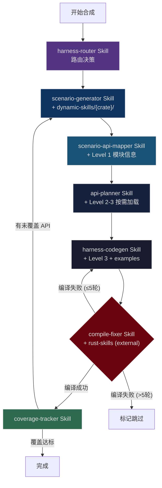

### 5.3 各 Skill 详细设计

#### Skill 1: `scenario-generator` — 场景生成

```yaml
---
name: scenario-generator
description: "CRITICAL: Use for generating realistic usage scenarios for a Rust crate. 
  Triggers on: harness generation, scenario planning, usage pattern design"
---
```

```markdown
# Scenario Generator Skill

> Stage 1: 场景构思 (What — 我想用这个库做什么)

## Core Question
**作为一个真实的 Rust 程序员，我会用这个库来完成什么样的任务？**

## Input Specification (信息加载级别: Level 0)
- Crate 名称 + 一句话功能描述
- 功能能力摘要（压缩版 FCG，~200 tokens）
- Risk surface 摘要（一句话）
- 已覆盖的 API 列表（用于避免重复场景）
- 未覆盖的 API 列表（用于引导新场景覆盖它们）
- 类型合成概览（来自 Risk Surface Map 的 `type_synthesis_overview`：有多少泛型 API、多少适合自定义类型合成）
- Rust 特性风险提示（来自 Risk Surface Map 的 rust_feature_risks 摘要）

## Reasoning Framework
1. 阅读库的功能能力摘要，理解"这个库能做什么"
2. 从能力链中选择一条或多条，构思一个真实的使用任务
3. 确保场景覆盖至少 1 个未覆盖的 API（参考未覆盖列表）
4. 考虑风险面：场景是否自然地涉及 unsafe/解析/FFI 操作
5. **【类型合成维度】**（参考 4.5 CTS 策略框架）：
   - 场景是否涉及泛型 API？如果是，选择合适的假设违反类别
   - 是否有机会通过自定义类型来测试库的隐式假设？（行为/资源/一致性/控制流/...）
   - 是否涉及 Rust 特有机制（生命周期借用、条件 impl、#[non_exhaustive]）？

## Scenario Types（场景类型分类）
场景应在以下类型之间均衡分配：
- **功能场景**：模拟正常使用（解析文件、构建数据、序列化输出）
- **边界场景**：测试极端输入（空数据、超长数据、恶意格式）
- **类型合成场景**：构造自定义类型（struct + trait 实现 / trait object / wrapper / 闭包），测试泛型 API 的假设
  - 例：「用一个自定义 Read 实现来测试 Parser::from_reader，该 Read 每次只返回 1 字节」→ 行为假设违反
  - 例：「用一个违反 Ord 契约的自定义类型来测试排序相关 API」→ 一致性假设违反
  - 例：「用一个在 Drop 中 panic 的类型测试容器的 panic safety」→ 控制流假设违反
- **Rust 机制场景**：利用 Rust 特有语义触达深层路径
  - 例："构造一个借用场景，测试迭代器在容器修改后的行为"
  - 例："用不实现 Clone 的类型测试条件 impl 的边界"

## Output Format
场景描述 JSON（含名称、自然语言描述、涉及能力 ID、fuzz 变异点）

## Anti-Patterns（禁止的场景类型）
- ❌ 单一 API 调用（太简单，不像真实使用）
- ❌ 随机 API 组合（没有功能目标）
- ❌ 重复已覆盖 API 的场景（浪费资源）

## Related Skills
→ scenario-api-mapper（下一步：将场景映射到具体 API）
→ coverage-tracker（检查覆盖进度）
```

**输入示例**（注意只有压缩信息，不是完整 FCG）：

```
库名：serde_json
功能：Rust 的 JSON 序列化/反序列化库

能力摘要：本库提供 6 项核心能力：
  1. JSON 解析（from_str, from_slice, from_reader）
  2. JSON 构建（json! macro, Value 构造）
  3. 类型转换（Serialize/Deserialize trait）
  4. JSON 输出（to_string, to_writer）
  5. JSON 查询（Value 索引, pointer）
  6. JSON 修改（insert, remove）
  典型能力链：解析→查询→修改→输出

风险摘要：2 unsafe fn, 0 FFI, 5 panic points（主要在索引越界）

已覆盖 API：[from_str, to_string]
未覆盖 API：[from_reader, from_value, to_value, Value::pointer, ...]
```

---

#### Skill 1.5: `scenario-api-mapper` — 场景-API 映射

> [!IMPORTANT]
> **这是 v4 新增的关键步骤**（回应 review："前面是不是要将场景与 API 关联起来"）。在 Stage 1 生成场景后，显式地将场景映射到具体的 API 集合，为 Stage 2 的按需加载提供依据。

```yaml
---
name: scenario-api-mapper
description: "CRITICAL: Use for mapping scenarios to specific APIs.
  Triggers on: scenario-api mapping, API selection, capability resolution"
---
```

```markdown
# Scenario-API Mapper Skill

> Stage 1.5: 场景-API 映射 (Which Module, Which Type — 涉及哪些模块和类型)

## Core Question
**这个场景需要涉及哪些模块、类型和 API？**

## Input Specification (信息加载级别: Level 1+)
- Stage 1 生成的场景描述
- Level 1 模块信息（各模块功能 + 类型列表 + **API 名称列表**，~1-2K tokens）
- 未覆盖 API 列表

## Reasoning Framework
1. 根据场景描述，识别涉及的功能模块
2. 在每个模块的 API 名称列表中，选择完成任务需要的具体 API
3. 为每个核心类型，列出需要使用的方法（构造/操作/销毁）
4. 确保至少包含未覆盖 API 中的 1-3 个
5. 标注每个 API 在场景中的角色（入口/核心操作/辅助/清理）

## Output Format
```json
{
  "scenario": "...",
  "api_mapping": [
    {
      "api_id": "fn_001",
      "api_path": "serde_json::from_reader",
      "role": "entry",
      "reason": "从 Reader 解析 JSON，这是场景的入口操作"
    },
    {
      "api_id": "fn_012",
      "api_path": "Value::pointer",
      "role": "core",
      "reason": "使用 JSON Pointer 查询嵌套字段"
    }
  ],
  "types_needed": ["Value", "Map<String, Value>"],
  "targeted_apis": ["from_reader", "Value::pointer"]
}
```

## Trace Down ↓
→ api-planner（下一步：为映射的 API 规划调用序列）

## Key Rule
**映射时需要 Level 1+ 信息**（模块 + 类型名 + API 名称列表），不需要 API 的完整签名。
完整签名在 Stage 2 才按需加载。
```

---

#### Skill 2: `api-planner` — API 规划（渐进式加载）

```yaml
---
name: api-planner
description: "CRITICAL: Use for planning API call sequences with state lifecycle awareness.
  Triggers on: API planning, call sequence, state transition"
---
```

```markdown
# API Planner Skill

> Stage 2: API 规划 (Which — 需要用哪些 API，以什么顺序)

## Core Question
**按照这个场景，API 应该以什么顺序调用？每步的状态是什么？**

## Input Specification (信息加载级别: Level 2-3，按需加载)
- Stage 1.5 的场景-API 映射结果
- 仅映射中涉及的类型的 Level 2 信息（签名 + 方法列表 + SLM）
- 仅映射中涉及的 API 的 Level 3 信息（完整签名 + 契约）
- 涉及类型的 SLM（状态生命周期模型）
- **涉及 API 的泛型约束**（来自 API Contract Table 的 `generic_constraints`：trait 边界 → 实例化策略 → 合成指导）
- **涉及 trait 的完整定义**（从 trait_registry 加载：required/provided methods、associated types）

## Reasoning Framework (遵循 Trace Up/Down 模式)

### Trace Up ↑ (从 API 签名回溯到设计意图)
对每个 API：
1. 接收器类型告诉我什么？(&self = 只读, &mut self = 状态变更, self = 消耗)
2. 返回类型告诉我什么？(Result = 可能失败, Option = 可能无值)
3. 契约告诉我什么？(Panics = 前置条件, Errors = 可恢复)
4. **泛型参数告诉我什么？(T: Trait = 需要满足 Trait 约束的具体类型)**

### Trace Down ↓ (从设计意图到调用顺序)
1. 哪些 API 是构造器？→ 必须首先调用
2. SLM 模型中，状态转换的合法路径是什么？
3. 哪些前置条件必须满足？如何满足？
4. 哪些参数由 fuzzer 提供？哪些用固定值？
5. **对泛型 API，确定类型合成方案**（参考 4.5 CTS 策略框架）：
   - 查看 API Contract 的 `generic_constraints`：策略 A / B / C / D
   - 如果场景类型为"类型合成场景"且推荐策略 C：
     - 确定目标假设违反类别（行为/资源/一致性/控制流/...）
     - 选择类型构造手段（自定义 struct + trait 实现 / trait object / wrapper / 闭包）
     - 规划自定义类型的定义和所需 trait 的实现
     - 决定偏差行为（参考 `synthesis_guidance`）
   - 如果涉及 unsafe trait：强制使用策略 D，在计划中标注

## Output Format
有序的 API 调用计划，每步包含：状态、前置条件、参数来源、返回值处理。
**新增**：对泛型 API，附加类型合成决策：
```json
{
  "type_synthesis": {
    "T": {
      "strategy": "C",
      "assumption_violated": "行为假设",
      "construction": {
        "type": "custom_struct + trait_impl",
        "concrete_type": "FuzzHandler（自定义）",
        "struct_fields": ["data: Vec<u8>", "call_count: usize", "fail_at: Option<usize>"],
        "trait_impl": {
          "trait": "Handler",
          "required_methods": ["fn on_data(&mut self, data: &[u8]) -> usize"],
          "overridden_defaults": ["fn on_error(&mut self, e: Error) { /* 传播而非吞掉 */ }"],
          "deviation": "on_data 返回与 data.len() 不一致的值，测试库对返回值的信任程度"
        }
      }
    }
  }
}
```

## Anti-Patterns（读取 references/anti-patterns.md）
**IMPORTANT: Before planning, read `./references/anti-patterns.md`**

- ❌ 对可能为 None 的 Option 调用 unwrap()
- ❌ 使用 Default::default() 构造有必填字段的类型
- ❌ 在对象已被 self 消耗后再次使用
- ❌ 忽略 Result 错误，除非文档明确表示不会失败
- ❌ 在 Drop 之后访问对象
- ❌ 违反 SLM 中标注的 forbidden_transitions

## Related Skills
→ scenario-api-mapper（上一步提供的映射）
→ harness-codegen（下一步：基于此计划生成代码）
→ external: m01-ownership（所有权分析）
→ external: m06-error-handling（错误处理指导）
```

**渐进式 API 加载机制**：

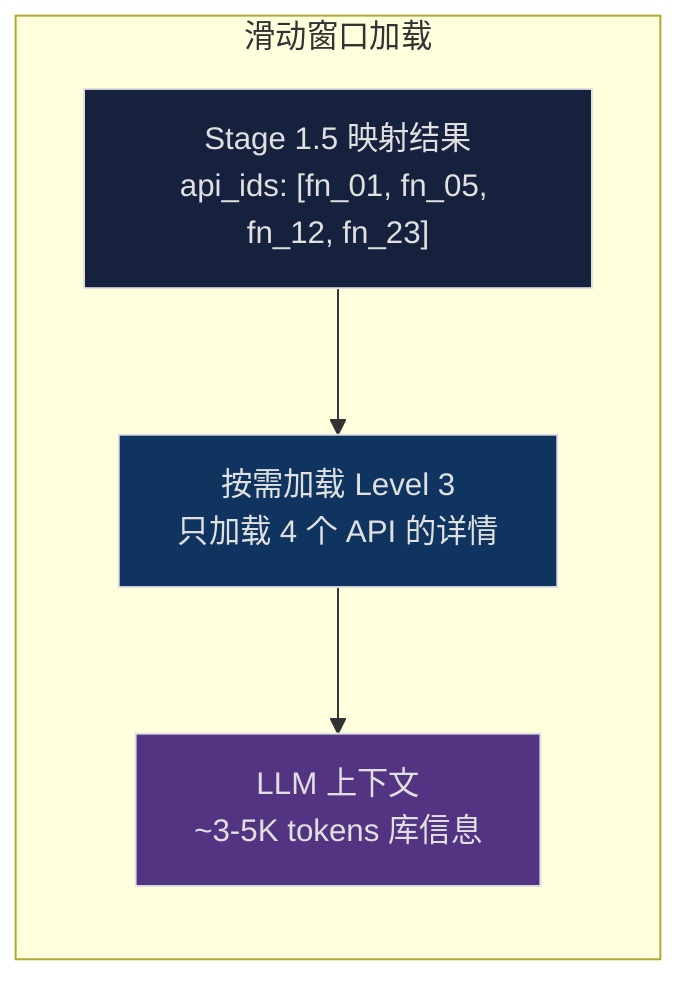

> [!TIP]
> **渐进式加载的关键设计**（回应 review："这里可不可以设计为和 skills 一样的渐进式加载"）
> 
> 每轮场景迭代只加载该场景涉及的 API 详情（通过 Stage 1.5 映射确定）。
> 随着场景不断变化，不同的 API 被"滑动窗口"式地加载。
> Coverage Tracker 确保最终所有 API 都被至少一个场景覆盖。

---

#### Skill 3: `harness-codegen` — 代码生成

```yaml
---
name: harness-codegen
description: "CRITICAL: Use for generating fuzz harness Rust code.
  Triggers on: harness code, fuzz target, code generation"
---
```

```markdown
# Harness Code Generator Skill

> Stage 3: 代码生成 (How — 编写 harness 代码)

## Core Question
**如何将 API 调用计划转化为一个语义正确、可编译、高效的 fuzz harness？**

## Input Specification (信息加载级别: Level 3 + Examples)
- Stage 2 的 API 调用计划（含类型合成决策 `type_synthesis`）
- 仅被选中 API 的 Level 3 详情（完整签名 + 契约）
- 涉及 trait 的完整定义（required/provided methods、associated types）
- 相关的 doc examples（仅与当前 API 相关的，通过 examples_index 检索，top-3）
- 风险面标注（仅当前 API 涉及的 unsafe/panic/trait-misuse 信息）

**IMPORTANT: Before generating code, read `./references/harness-template.md`**
**IMPORTANT: Before generating code, read `./references/fuzz-framework.md`**
**IMPORTANT: Always read `../shared-references/rust-safety-rules.md`**

## Harness Template (from references/harness-template.md)

**默认模板（非解析器类库）**：
```rust
#![no_main]
use libfuzzer_sys::fuzz_target;
use arbitrary::Arbitrary;

#[derive(Arbitrary, Debug)]
struct FuzzInput {
    // 根据场景定义有意义的输入字段
}

fuzz_target!(|input: FuzzInput| {
    // 1. 输入校验→ 2. 构造状态→ 3. 执行 API 调用→ 4. match Result/Option
});
```

**解析器/编解码器模板（接受 &[u8] 输入的 API）**：
```rust
#![no_main]
use libfuzzer_sys::fuzz_target;

fuzz_target!(|data: &[u8]| {
    // 解析器类 API 天然接受外部输入，直接使用原始字节
    let _ = target_lib::parse(data);
});
```

**Async API 模板**：
```rust
#![no_main]
use libfuzzer_sys::fuzz_target;
use arbitrary::Arbitrary;
use tokio::runtime::Runtime;

#[derive(Arbitrary, Debug)]
struct FuzzInput { /* ... */ }

// 复用 runtime，避免每次 fuzz 迭代重新创建的开销
thread_local! {
    static RT: Runtime = Runtime::new()
        .expect("failed to create tokio runtime — fuzz cannot proceed");
}

fuzz_target!(|input: FuzzInput| {
    RT.with(|rt| {
        rt.block_on(async {
            // async API 调用
        });
    });
});
```

**类型合成模板**（策略 C 场景 — 自定义 struct + trait 实现）：
```rust
#![no_main]
use libfuzzer_sys::fuzz_target;
use arbitrary::Arbitrary;

// 自定义类型：模拟用户定义代码中的不规范/边界行为
#[derive(Arbitrary, Debug)]
struct FuzzReader {
    data: Vec<u8>,
    pos: usize,
    fail_at: Option<usize>,  // fuzzer 控制：在第 N 次 read 时返回错误
}

// 自定义 trait 实现：故意引入边界行为来测试库的假设（行为假设违反）
impl std::io::Read for FuzzReader {
    fn read(&mut self, buf: &mut [u8]) -> std::io::Result<usize> {
        // fuzzer 控制的失败点
        if let Some(fail_pos) = self.fail_at {
            if self.pos >= fail_pos {
                return Err(std::io::Error::new(
                    std::io::ErrorKind::Interrupted, "fuzz-injected error"
                ));
            }
        }
        // 每次只返回部分数据（测试库对短读的处理）
        let available = &self.data[self.pos..];
        let n = std::cmp::min(buf.len(), std::cmp::min(available.len(), 1)); // 每次最多 1 字节
        buf[..n].copy_from_slice(&available[..n]);
        self.pos += n;
        Ok(n)
    }
}

fuzz_target!(|input: FuzzReader| {
    // 使用自定义 Reader 调用泛型 API
    let _ = target_lib::Parser::from_reader(input);
});
```

**类型合成模板变体**（策略 C — panicking Drop / wrapper / trait object）：
```rust
// --- 变体 1: Panicking Drop（控制流假设违反）---
#[derive(Arbitrary, Debug)]
struct PanicOnDrop {
    data: Vec<u8>,
    should_panic: bool,  // fuzzer 控制
}
impl Drop for PanicOnDrop {
    fn drop(&mut self) {
        if self.should_panic { panic!("drop panic"); }
    }
}

// --- 变体 2: Newtype Wrapper（条件 impl 测试）---
struct NoClone<T>(T);  // 故意不 derive Clone
// 用 NoClone<T> 测试 impl<T: Clone> Container<T> 的条件路径

// --- 变体 3: Trait Object（动态分发路径）---
let handler: Box<dyn Handler + Send> = Box::new(fuzz_handler);
library.process_dyn(&*handler);  // vtable dispatch 可能走不同代码路径
```

> [!NOTE]
> 生成的 harness 文件应放到 `fuzz/fuzz_targets/` 目录下，
> 并在 `fuzz/Cargo.toml` 中注册 `[[bin]]` target。
> 编译命令为 `cargo +nightly fuzz build target_name`，不是 `cargo check`。

## Generation Rules
1. **默认**使用 `Arbitrary` derive 构造结构化输入。**例外**：当 API 主要用途是解析/反序列化外部数据时（`from_bytes`, `parse`, `from_str`, `deserialize`），直接使用 `&[u8]` / `&str`
2. 对 fuzzer 不控制的参数使用文档推荐的或合理的固定值
3. 对 Result/Option 使用 match，遇到 Err/None 时 return 或分支处理
4. 不要使用 catch_unwind 来掩盖 panic
5. 添加注释说明每一步的意图
6. 如果需要调用 unsafe 函数，必须满足 # Safety 文档中的所有条件
7. 如果 API 是 async fn，使用 async 模板（tokio `block_on`）
8. **【类型合成规则】**对接受泛型参数的 API（参考 4.5 CTS 策略框架）：
   - 查看 api_plan.json 中的 `type_synthesis` 决策
   - 策略 A/B：直接使用库内类型或标准库类型实例化
   - 策略 C：根据 `assumption_violated` 类别选择构造手段：
     - **行为假设**：自定义 struct + trait 实现，偏差行为由 fuzzer 驱动（`fail_at`, `short_read`）
     - **一致性假设**：自定义 Ord/Hash 实现，故意违反数学性质
     - **控制流假设**：panicking Drop / 重入闭包
     - **所有权假设**：trait object (`dyn Trait`) / newtype wrapper
     - 通用原则：自定义类型应 derive `Arbitrary`；同一 API 可生成策略 A/B 和策略 C 各一个 harness
   - 策略 D：对 unsafe trait，使用库内或 std 已有实现，不自定义
9. **【Rust 机制利用规则】**充分利用 Rust 特有机制暴露 bug：
   - 生命周期：构造借用链，测试返回引用的生命周期正确性
   - 所有权转移：测试 `self`（消耗器）调用后对象不可再用
   - `#[non_exhaustive]`：match 必须含 `_` 分支
   - 条件 impl：用不满足额外 bound 的类型测试，验证编译约束正确性
   - `Drop` 顺序：当多个对象存在交叉引用时，测试析构顺序的影响

## Doc Examples 参考
当 LLM 生成代码时，参考相关 doc examples 的代码风格和用法，但不要直接复制。
仅加载与当前场景相关的 top-3 examples。

## Related Skills
→ compile-fixer（下一步：编译验证和修复）
→ external: m06-error-handling（错误处理模式）
→ external: unsafe-checker（unsafe 代码审查）
```

---

#### Skill 4: `compile-fixer` — 编译修复（集成 rust-skills）

> [!IMPORTANT]
> **集成外部 rust-skills**（回应 review："这里的修复可以使用现有的 skills"）
> 
> Stage 4 的编译修复不再使用简单的 prompt 模板，而是**集成 [rust-skills](https://github.com/actionbook/rust-skills) 的相关 Skills**，利用其三层认知框架进行深度错误分析和修复。

```yaml
---
name: compile-fixer
description: "CRITICAL: Use for fixing compilation errors in generated harnesses.
  Triggers on: compilation error, cargo fuzz build failed, type mismatch, E0"
---
```

```markdown
# Compilation Fixer Skill

> Stage 4: 编译修复 (Fix — 集成 rust-skills 进行深度修复)

## Core Question
**这个编译错误的根本原因是什么？是类型问题、所有权问题、还是 API 使用错误？**

## Error Analysis Framework (借鉴 rust-skills 三层认知)

### Layer 1: 语言机制层 (HOW — 错误码说明了什么)
根据错误码路由到对应的 rust-skills Skill：
| 错误码模式 | 加载的 External Skill | 说明 |
|-----------|----------------------|------|
| E0382, E0505, E0507 | m01-ownership | 所有权/借用错误 |
| E0277 (Send/Sync) | m07-concurrency | 并发安全约束 |
| E0308, E0271 | m05-type-driven | 类型不匹配 |
| E0106, E0495 | m12-lifecycle | 生命周期错误 |
| 通用编译错误 | m15-anti-pattern | 反模式检测 |
| unsafe 相关 | unsafe-checker | Unsafe 审查 |

### Layer 2: 设计选择层 (WHAT — 应该如何修复)
- 是否需要改变所有权策略 (clone vs borrow vs Arc)?
- 是否需要改变错误处理方式 (unwrap → match)?
- 是否使用了错误的 API (应该用 try_from 而非 from)?

### Layer 3: 场景意图层 (WHY — 不能破坏场景语义)
- 修复不能改变 harness 的测试场景和意图
- 修复不能移除关键的 API 调用
- 修复应保持 fuzz 输入结构的合理性

## Input Specification
- 失败的 harness 代码
- 完整的编译错误信息（rustc 输出）
- 被测 API 的签名列表（确保类型正确）
- 当前所处的修复轮次 (1-5)

## Repair Strategy
```
轮次 1-2: 精确修复
  - 仅修改编译错误指向的具体行
  - 参照 API 签名修正类型
  - 添加缺失的 use 语句

轮次 3-4: 结构调整
  - 调整变量作用域和借用关系
  - 替换不合适的 API 为等价的正确 API
  - 修改 FuzzInput 结构体定义

轮次 5: 降级修复
  - 简化 harness 逻辑
  - 移除无法编译的可选分支
  - 保留核心 API 调用路径
```

## Loop Control
最多 5 轮。5 轮后仍失败 → 标记为"需要人工检查"并记录原因。

## Related Skills
→ external: m01-ownership（所有权修复）
→ external: m06-error-handling（错误处理修复）
→ external: unsafe-checker（unsafe 审查）
→ external: m15-anti-pattern（反模式检测）
→ coverage-tracker（编译成功后更新覆盖率）
```

---

#### 辅助 Skill: `coverage-tracker` — API 覆盖率追踪与渐进式场景生成

> [!IMPORTANT]
> **渐进式 API 遍历机制**（回应 review："场景可以一直变化，对应设计的 API 也会进行变化，达到遍历库中所有 API 的目的"）

```yaml
---
name: coverage-tracker
description: "CRITICAL: Use for tracking API coverage and guiding scenario iteration.
  Triggers on: coverage check, API traversal, scenario iteration"
---
```

```markdown
# API Coverage Tracker Skill

> 覆盖率追踪与迭代控制

## Core Question
**当前的 harness 集合覆盖了多少 API？下一轮应该优先覆盖哪些？**

## Coverage Tracking Algorithm

```
覆盖率的 4 种状态（仅最后一种计入 covered_apis）：
  1. targeted:     Stage 1.5 映射到（harness 还未生成，不算覆盖）
  2. generated:    Stage 3 生成了包含该 API 的 harness（未编译，不算）
  3. compiled:     harness 编译通过（未运行，不算）
  4. validated:    harness 编译通过 + 10s smoke run 未在 harness 自身代码中 crash
  ⇒ 只有 validated 状态才计入 covered_apis

Smoke Run Crash 分类：
  当 smoke run 以非零退出码结束时，需要区分 crash 来源：
  - harness_bug:  crash 堆栈顶部位于 harness 代码或 fuzz_target! 宏内
                  → 递增 failed_attempts[api]，harness 本身有 bug
  - library_bug:  crash 堆栈顶部位于目标库代码内
                  → 计入 covered_apis + found_bugs，是真实 bug 发现
  - oom/timeout:  exit code 77 或 -9
                  → 递增 failed_attempts[api]，资源耗尽

  分类方法：s3-coverage --validate 分析 smoke_err.log 中的堆栈信息，
  按 crash 地址所属 crate（harness vs 目标库）自动分类。

输入：
  - total_apis: 库的所有 public API 集合（基于 default features）
  - covered_apis: 已被 validated harness 使用的 API 集合
  - failed_attempts: API → fail_count 映射（每次编译失败/harness bug 时 +1）
  - found_bugs: smoke run 中发现的疑似真实库 bug（crash 在库代码中）
  - MAX_FAIL_ATTEMPTS = 3  # 同一 API 失败超过此次数才视为"暂时放弃"

计算：
  exhausted_apis = { api | failed_attempts[api] >= MAX_FAIL_ATTEMPTS }
  coverage_rate = |covered_apis| / |total_apis|
  uncovered_apis = total_apis - covered_apis - exhausted_apis
  
  注意：fail_count < MAX_FAIL_ATTEMPTS 的 API 仍然留在候选池中，
  但优先级被降权（priority 乘以衰减因子 0.5^fail_count）。
  
优先级排序 uncovered_apis：
  base_priority = risk_level * 3 + (1 if has_doc_examples else 0) * 2 + is_public_entry * 1
  priority = base_priority * (0.5 ^ failed_attempts.get(api, 0))
  
输出：
  - 当前覆盖率报告
  - 下一轮应优先覆盖的 top-K 未覆盖 API
  - 推荐的场景方向（基于未覆盖 API 所属的能力节点）
```

## Iteration Strategy

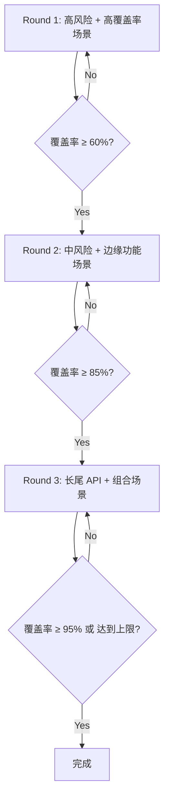

## Coverage Report Output
```json
{
  "total_apis": 47,
  "covered": 38,
  "exhausted": 2,
  "retrying": 1,
  "uncovered": 6,
  "coverage_rate": "80.9%",
  "found_bugs": [
    {"api": "Value::from_str", "crash_type": "buffer-overflow", "harness": "harness_005_01"}
  ],
  "failed_attempts": {
    "Deserializer::from_slice": 3,
    "Value::pointer_mut": 3,
    "Map::retain": 1
  },
  "next_priority": [
    {"api": "Parser::from_reader", "reason": "高风险，接受外部输入"},
    {"api": "Value::take", "reason": "消耗语义，容易误用"}
  ],
  "recommended_scenario_direction": "IO 流式解析场景（覆盖 from_reader + StreamDeserializer）"
}
```

## Termination Conditions
- 覆盖率 ≥ 95%
- 或 连续 3 轮未新增覆盖 API
- 或 总 harness 数达到预设上限 (默认 50)
```

---

### 5.4 Skill 间的信息传递与上下文控制

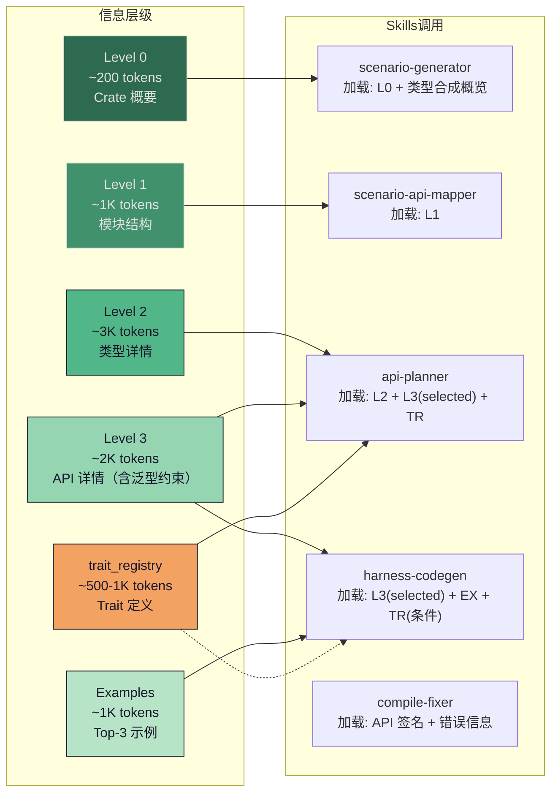

**每个 Skill 的 LLM 调用 Token 预算**（含库信息 + Skill 指令 + 上下文 + 输出）：

| Skill | 库信息 | Skill 指令 | 上下文 | 输出 | 总计 |
|-------|--------|-----------|--------|------|------|
| scenario-generator | ~300 (L0 + 类型合成概览 + Rust特性风险) | ~500 | ~300 (已覆盖列表) | ~500 | ~1.6K |
| scenario-api-mapper | ~1K | ~400 | ~500 (场景描述) | ~500 | ~2.4K |
| api-planner | ~5-7K (L2-3 含泛型约束 + trait定义) | ~800 | ~500 (场景+映射) | ~1K | ~7-9K |
| harness-codegen | ~3-4K (L3 + EX + trait定义条件) | ~600 | ~1K (计划+examples) | ~2K | ~6-8K |
| compile-fixer | ~1K (签名) | ~600 | ~2K (代码+错误) | ~2K | ~5-6K |

> [!TIP]
> 单次 LLM 调用最多 ~9K tokens（当 api-planner 映射到含泛型 API 的 ≤5 个 API 批次时）。
> 若映射 API 超过 5 个，`s3-context` 会自动分批加载（详见 6.7 节），确保单次调用不超出上下文窗口。
> **推荐使用 16K+ 上下文窗口的模型**以获得最佳效果。

---

## 6. 实现架构

### 6.1 技术选型：Rust CLI + OpenHarness

> [!IMPORTANT]
> **核心决策**：Phase 1-2 使用自写 **Rust CLI** 工具链（信息提取与语义建模必须深度集成 Rust 工具链），Phase 3 使用 **[OpenHarness](https://open-harness.dev)** 作为 LLM 编排层。
>
> **注意**：OpenHarness 是一个基于 Vercel AI SDK 的开源 Agent 工具包（`@openharness/core`）。本文档中描述的 `oh run --skill` CLI 语法、`oh.config.json` 配置格式、以及 SKILL.md 原生加载等功能，**部分为基于 OpenHarness 能力的计划性适配扩展**，实际集成时可能需要编写适配层或验证 API 兼容性。如果 OpenHarness 的 CLI 工具不支持所描述的参数格式，可替换为自写的薄编排脚本调用 OpenHarness SDK。

**为什么不用 LangChain/LangGraph**：
1. 不原生支持 SKILL.md 认知协议，强行适配等于重写
2. Pipeline 本质是"顺序多阶段 + 编译修复循环"，不需要有向图引擎
3. Python 生态与 Rust 工具链（rustdoc/syn/cargo）存在跨语言调用开销
4. 过重框架对学术论文不利（reviewer 会质疑必要性）

**为什么不完全自写**：
1. Skills 加载/热更新、上下文压缩、多模型切换、命令执行沙箱——OpenHarness 已实现，自己写无学术价值
2. 与 rust-skills 生态直接兼容，无需适配层

**为什么选 OpenHarness**：
1. 支持 SKILL.md 格式的 Prompt 模板加载与管理（可能需要适配层）
2. 内置 Agent Loop（编译修复循环直接可用）
3. 内置命令执行（`cargo fuzz` 直接调用）
4. 多模型支持（Anthropic/OpenAI/Ollama）
5. 轻量声明，论文中一句 "We built our agent on top of OpenHarness" 即可

### 6.2 分层系统架构

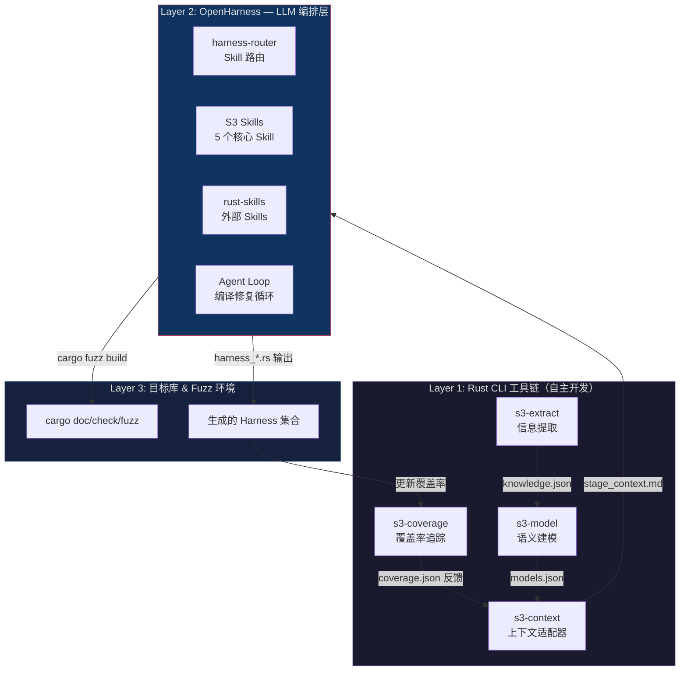

### 6.3 完整目录结构与组件说明

```
seraph/
│
│  ═══════════════════════════════════════════════════
│  Layer 1: Rust CLI 工具链（Cargo workspace）
│  ═══════════════════════════════════════════════════
│
├── Cargo.toml                        # Workspace 根配置
│
├── s3-extract/                       # Phase 1: 信息提取 CLI
│   ├── Cargo.toml                    # 依赖: serde, syn, cargo_metadata
│   └── src/
│       ├── main.rs                   # CLI 入口：s3-extract --crate <path>
│       ├── rustdoc_json.rs           # 解析 rustdoc JSON 输出
│       │                             #   - 提取所有 public items
│       │                             #   - 解析签名、泛型、trait bounds、where 子句
│       │                             #   - 提取 Method Hierarchy（归属关系）
│       │                             #   - 提取 Trait 关联项（associated types/consts）
│       │                             #   - 提取 Enum 变体结构
│       │                             #   - 提取 Re-exports 路径
│       ├── source_scanner.rs         # AST 扫描（使用 syn crate）
│       │                             #   - unsafe 块/函数标注
│       │                             #   - panic!() / unwrap() / 数组索引检测
│       │                             #   - FFI 边界（extern "C"）
│       │                             #   - #[repr(C/packed/transparent)] 检测
│       │                             #   - #[must_use] / #[deprecated] 检测
│       ├── doc_parser.rs             # 文档语义解析
│       │                             #   - 提取 # Panics / # Safety / # Errors / # Examples 节
│       │                             #   - 提取参数与返回值的 lifetime 绑定关系
│       │                             #   - 解析 feature gate 标注
│       ├── examples_indexer.rs       # 构建 examples 索引（不全量加载代码）
│       │                             #   - 为每个 example 生成 ID
│       │                             #   - 标记涉及的 API 和能力标签
│       │                             #   - 计算相关度评分公式参数
│       └── knowledge_base.rs         # 输出多层级 JSON 知识库
│                                     #   - 生成 Level 0/1/2/3 分层结构
│                                     #   - 输出 knowledge.json
│
├── s3-model/                         # Phase 2: 语义建模 CLI
│   ├── Cargo.toml
│   └── src/
│       ├── main.rs                   # CLI 入口：s3-model --input knowledge.json
│       ├── capability_graph.rs       # 构建 Functional Capability Graph
│       │                             #   - 模块聚类
│       │                             #   - 类型流分析
│       │                             #   - Trait 关联分析
│       ├── fcg_compressor.rs         # FCG → 压缩摘要文本
│       │                             #   - 生成 Level 0 能力摘要（~200 tokens）
│       │                             #   - 生成各能力节点的展开详情（渐进式加载用）
│       ├── lifecycle_model.rs        # 构建 State Lifecycle Model
│       │                             #   - 识别构造器/访问器/修改器/消耗器
│       │                             #   - 建模状态转换和禁止转换
│       ├── contract_extractor.rs     # 半自动提取 API 契约
│       │                             #   - 规则匹配: "Panics if" → precondition
│       │                             #   - 类型推导: fn(self) → 消耗语义
│       │                             #   - Result<T,E> 的 E 类型提取
│       ├── risk_mapper.rs            # 构建风险面地图 + 优先级排序
│       └── output.rs                 # 输出 models.json
│
├── s3-context/                       # 上下文适配器：桥接 Rust CLI ↔ OpenHarness
│   ├── Cargo.toml
│   └── src/
│       ├── main.rs                   # CLI 入口：s3-context --stage <N> --input ...
│       ├── context_builder.rs        # 分层上下文构建器（核心）
│       │                             #   - 根据 stage 选择 Level 0/1/2/3
│       │                             #   - 按场景-API 映射按需加载
│       │                             #   - 检索相关 doc examples（top-K）
│       ├── markdown_formatter.rs     # 将 JSON 上下文格式化为 Markdown
│       │                             #   - OpenHarness 读取 .md 文件作为 Skill 上下文
│       │                             #   - 不同 stage 生成不同格式的 context.md
│       └── examples_retriever.rs     # Examples 按需检索
│                                     #   - 相关度评分 + top-K 选择
│
├── s3-coverage/                      # API 覆盖率追踪
│   ├── Cargo.toml
│   └── src/
│       ├── main.rs                   # CLI 入口，子命令：
│       │                             #   --init: 初始化覆盖率状态（从 knowledge.json 提取 total_apis）
│       │                             #   --register-target: 注册 fuzz target 到 fuzz/Cargo.toml
│       │                             #   --mark-attempt: 递增 API 的 fail_count（非永久排除）
│       │                             #   --validate: 验证 smoke run 结果（含 crash 分类）
│       │                             #   --report: 生成覆盖率报告（format: rate|full）
│       ├── tracker.rs                # 覆盖率追踪逻辑
│       │                             #   - 维护 covered/uncovered/exhausted API 集合
│       │                             #   - failed_attempts 计数 + 衰减优先级
│       │                             #   - 计算优先级排序
│       │                             #   - 生成下一轮推荐方向
│       ├── crash_classifier.rs       # Smoke run crash 分类
│       │                             #   - 分析 crash 堆栈判断 harness_bug vs library_bug
│       │                             #   - 解析 libFuzzer/sanitizer 输出格式
│       └── report.rs                 # 生成覆盖率报告 JSON
│
│  ═══════════════════════════════════════════════════
│  Layer 2: OpenHarness Skills & 配置
│  ═══════════════════════════════════════════════════
│
├── oh.config.json                    # OpenHarness 配置文件
│
├── skills/                           # S3 核心 Skills（OpenHarness 原生加载）
│   ├── harness-router/               # 入口路由 Skill
│   │   └── SKILL.md
│   │
│   ├── scenario-generator/           # Stage 1: 场景生成
│   │   ├── SKILL.md
│   │   └── references/
│   │       └── scenario-patterns.md
│   │
│   ├── scenario-api-mapper/          # Stage 1.5: 场景-API 映射
│   │   ├── SKILL.md
│   │   └── references/
│   │       └── mapping-rules.md
│   │
│   ├── api-planner/                  # Stage 2: API 规划
│   │   ├── SKILL.md
│   │   └── references/
│   │       ├── rust-idioms.md
│   │       └── anti-patterns.md
│   │
│   ├── harness-codegen/              # Stage 3: 代码生成
│   │   ├── SKILL.md
│   │   └── references/
│   │       ├── harness-template.md
│   │       └── fuzz-framework.md
│   │
│   ├── compile-fixer/                # Stage 4: 编译修复
│   │   ├── SKILL.md
│   │   └── references/
│   │       └── common-fixes.md
│   │
│   ├── coverage-tracker/             # 覆盖率检查
│   │   └── SKILL.md
│   │
│   └── shared-references/            # 跨 Skill 共享
│       ├── rust-safety-rules.md
│       └── harness-quality.md
│
├── external-skills/                  # 外部 Skills（symlink 或 git submodule）
│   └── rust-skills -> ~/.local/share/rust-skills/skills/
│       ├── m01-ownership/
│       ├── m06-error-handling/
│       ├── m15-anti-pattern/
│       └── unsafe-checker/
│
│  ═══════════════════════════════════════════════════
│  Layer 3: 编排与输出
│  ═══════════════════════════════════════════════════
│
├── scripts/
│   ├── run.sh                        # 主编排脚本（完整 pipeline）
│   ├── extract.sh                    # Phase 1 独立运行
│   └── model.sh                      # Phase 2 独立运行
│
├── workspace/                        # 运行时工作目录（gitignore）
│   ├── knowledge.json                # Phase 1 输出
│   ├── models.json                   # Phase 2 输出
│   ├── coverage.json                 # 覆盖率追踪状态
│   ├── contexts/                     # 每个 stage 的动态上下文
│   │   ├── stage1_context.md
│   │   ├── stage1.5_context.md
│   │   ├── stage2_context.md
│   │   └── stage3_context.md
│   ├── sub_plans/                    # 子计划文件（>5 API 时自动拆分）
│   │   ├── sub_plan_01.json
│   │   └── ...
│   └── fuzz/                         # cargo-fuzz 项目目录
│       ├── Cargo.toml                # fuzz 专用 Cargo.toml
│       └── fuzz_targets/             # 生成的 fuzz 目标（cargo fuzz 标准路径）
│           ├── harness_001_01.rs
│           ├── harness_002_01.rs
│           └── ...
│
└── README.md
```

### 6.4 OpenHarness 配置与集成

#### OpenHarness 配置文件

```jsonc
// oh.config.json
{
  "name": "seraph",
  "description": "SERAPH: SEmantic Rust Agent-driven Program Harness Synthesis",
  
  "provider": {
    "default": "anthropic",
    "model": "claude-sonnet-4-20250514",
    "fallback": {
      "provider": "openai",
      "model": "gpt-4o"
    }
  },
  
  "skills": {
    "paths": [
      "./skills",
      "./external-skills/rust-skills"
    ],
    "entry_skill": "harness-router",
    "auto_load": ["shared-references"]
  },
  
  "context": {
    "files": [
      "./workspace/contexts/current_context.md"
    ],
    "max_tokens": 16000,
    "compression": "auto"
  },
  
  "tools": {
    "permissions": {
      "allow": [
        "Bash(cargo +nightly fuzz *)",
        "Bash(s3-context *)",
        "Bash(s3-coverage *)",
        "FileRead(./workspace/*)",
        "FileWrite(./workspace/fuzz/fuzz_targets/*)"
      ],
      "deny": [
        "Bash(rm -rf *)",
        "Bash(cargo publish *)"
      ]
    }
  },

  "agent_loop": {
    "max_iterations_per_harness": 5,
    "max_total_iterations": 50,
    "on_compile_error": "invoke compile-fixer skill"
  }
}
```

#### Rust CLI ↔ OpenHarness 数据流

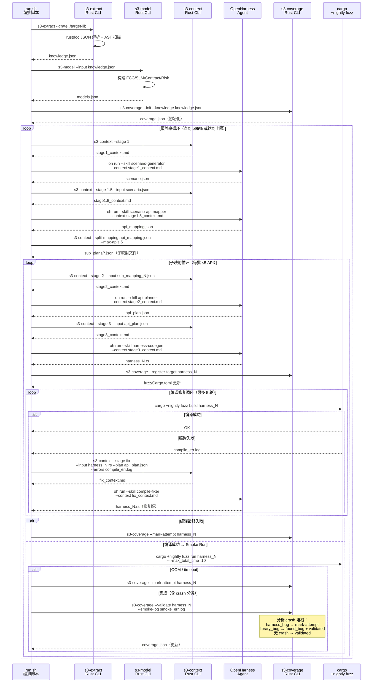

#### `s3-context` 适配器详细设计

`s3-context` 是桥接 Rust 知识库与 OpenHarness Skill 输入的**核心适配组件**。它提供两个子命令：
- `s3-context --stage <N>` — 根据 stage 构建 Markdown 上下文文件
- `s3-context --split-mapping <path>` — 将 api_mapping.json 按 API 数量分批

```rust
// s3-context/src/main.rs
use clap::{Parser, Subcommand};

#[derive(Parser)]
struct Cli {
    #[command(subcommand)]
    command: Commands,
}

#[derive(Subcommand)]
enum Commands {
    /// 构建指定 stage 的上下文 Markdown（run.sh 主流程调用）
    #[command(name = "--stage")]  // 保持 CLI 兼容性：s3-context --stage 1
    Stage(StageArgs),
    
    /// 将 api_mapping.json 按 API 数量分批为多个子映射文件
    #[command(name = "--split-mapping")]
    SplitMapping(SplitArgs),
}

#[derive(Parser)]
struct StageArgs {
    /// 当前 Stage: 1, 1.5, 2, 3, fix
    stage: String,
    
    /// knowledge.json 路径
    #[arg(long, default_value = "./workspace/knowledge.json")]
    knowledge: PathBuf,
    
    /// models.json 路径
    #[arg(long, default_value = "./workspace/models.json")]
    models: PathBuf,
    
    /// 上一 stage 的输出（scenario.json / api_mapping.json / api_plan.json / harness_N.rs）
    #[arg(long)]
    input: Option<PathBuf>,
    
    /// 编译错误日志路径（fix stage 必需）
    #[arg(long)]
    errors: Option<PathBuf>,
    
    /// 对应的 API 计划路径（fix stage 使用，用于获取准确的 API 列表）
    #[arg(long)]
    plan: Option<PathBuf>,
    
    /// coverage.json 路径
    #[arg(long, default_value = "./workspace/coverage.json")]
    coverage: PathBuf,
    
    /// 输出的 context markdown 路径
    #[arg(long, default_value = "./workspace/contexts/current_context.md")]
    output: PathBuf,
}

#[derive(Parser)]
struct SplitArgs {
    /// 待拆分的 api_mapping.json 路径
    mapping: PathBuf,
    
    /// 每批最大 API 数量
    #[arg(long, default_value = "5")]
    max_apis: usize,
    
    /// 子映射文件输出目录
    #[arg(long, default_value = "./workspace/sub_plans/")]
    output_dir: PathBuf,
}

fn main() {
    let cli = Cli::parse();
    match cli.command {
        Commands::Stage(args) => run_stage(args),
        Commands::SplitMapping(args) => run_split_mapping(args),
    }
}

fn run_split_mapping(args: SplitArgs) {
    let mapping: ApiMapping = load_json(&args.mapping);
    let api_ids = mapping.api_ids();
    
    std::fs::create_dir_all(&args.output_dir).unwrap();
    
    if api_ids.len() <= args.max_apis {
        // 不需要拆分 — 直接复制为唯一子映射
        let dest = args.output_dir.join("sub_mapping_01.json");
        std::fs::copy(&args.mapping, &dest).unwrap();
    } else {
        // 按 max_apis 分批
        for (i, chunk) in api_ids.chunks(args.max_apis).enumerate() {
            let sub = mapping.filter_apis(chunk);
            let dest = args.output_dir.join(format!("sub_mapping_{:02}.json", i + 1));
            save_json(&dest, &sub);
        }
    }
}

fn run_stage(args: StageArgs) {
    let kb = KnowledgeBase::load(&args.knowledge);
    let models = SemanticModels::load(&args.models);
    let coverage = CoverageState::load(&args.coverage);
    
    let context_md = match args.stage.as_str() {
        "1" => {
            // Stage 1: Level 0 能力摘要 + 覆盖率状态 + 类型合成概览 + 风险摘要
            format!(
                "# 场景生成上下文\n\n\
                 ## 库概要\n{}\n\n\
                 ## 功能能力摘要\n{}\n\n\
                 ## 未覆盖 API（优先关注）\n{}\n\n\
                 ## 风险面摘要\n{}\n\n\
                 ## 类型合成概览\n{}\n\n\
                 ## Rust 特性风险提示\n{}\n",
                kb.level_0_summary(),
                models.fcg_compressed_summary(),  // ~200 tokens
                coverage.uncovered_api_names(),
                kb.risk_summary_oneliner(),
                models.risk_surface.type_synthesis_overview.one_liner,  // "12个泛型API, 4个适合自定义类型合成"
                models.risk_surface.rust_feature_risks_summary() // ~100 tokens
            )
        }
        "1.5" => {
            // Stage 1.5: Level 1 模块信息 + 场景描述
            let scenario: Scenario = load_json(&args.input.unwrap());
            format!(
                "# 场景-API 映射上下文\n\n\
                 ## 当前场景\n{}\n\n\
                 ## 模块结构（Level 1）\n{}\n\n\
                 ## 未覆盖 API 列表\n{}\n",
                scenario.to_markdown(),
                kb.level_1_modules_markdown(),    // ~1K tokens
                coverage.uncovered_api_details()
            )
        }
        "2" => {
            // Stage 2: Level 2-3 按需加载 + SLM + API 契约含泛型约束 + trait 定义
            let mapping: ApiMapping = load_json(&args.input.unwrap());
            let types = kb.level_2_types(&mapping.types_needed());
            let apis = kb.level_3_apis(&mapping.api_ids());  // 含 generic_constraints
            let slm = models.lifecycle_models(&mapping.types_needed());
            let generic_trait_ids = apis.collect_trait_ids_from_constraints();
            let traits = kb.trait_registry_for(&generic_trait_ids);
            format!(
                "# API 规划上下文\n\n\
                 ## 场景\n{}\n\n\
                 ## 涉及类型详情（Level 2）\n{}\n\n\
                 ## 涉及 API 签名与契约（Level 3，含泛型约束）\n{}\n\n\
                 ## 类型状态生命周期模型\n{}\n\n\
                 ## 涉及 Trait 的完整定义\n{}\n",
                mapping.scenario_markdown(),
                types.to_markdown(),              // ~2-3K tokens
                apis.to_markdown(),               // ~1-2K tokens（含 generic_constraints）
                slm.to_markdown(),
                traits.to_markdown()              // ~500-1K tokens
            )
        }
        "3" => {
            // Stage 3: Level 3 + 相关 examples + trait 定义（用于类型合成）
            let plan: ApiPlan = load_json(&args.input.unwrap());
            let apis = kb.level_3_apis(&plan.api_ids());
            let examples = kb.examples_index()
                .find_relevant(&plan.api_ids(), /*top_k=*/3);
            let risks = kb.risk_for_apis(&plan.api_ids());
            let trait_defs = if plan.has_type_synthesis() {
                kb.trait_definitions_for(&plan.required_traits())
            } else {
                String::new()
            };
            format!(
                "# 代码生成上下文\n\n\
                 ## API 调用计划（含类型合成决策）\n{}\n\n\
                 ## API 详细签名与契约\n{}\n\n\
                 ## 参考代码（来自库文档示例，top-3）\n{}\n\n\
                 ## 风险标注\n{}\n\n\
                 ## 需实现的 Trait 定义（类型合成参考）\n{}\n",
                plan.to_markdown(),
                apis.to_markdown(),
                examples.to_markdown(),           // ~1K tokens
                risks.to_markdown(),
                trait_defs                         // 仅策略 C 时非空, ~500-1K tokens
            )
        }
        "fix" => {
            // Stage 4 (fix): 编译失败时的修复上下文
            let harness_path = args.input.expect("--input required for fix stage");
            let errors_path = args.errors.expect("--errors required for fix stage");
            let harness_code = std::fs::read_to_string(&harness_path).unwrap();
            let compile_errors = std::fs::read_to_string(&errors_path).unwrap();
            // 优先从 api_plan（子计划）获取 API 列表，避免从生成代码反向工程
            let apis = if let Some(plan_path) = &args.plan {
                let plan: ApiPlan = load_json(plan_path);
                kb.level_3_apis(&plan.api_ids())
            } else {
                // 兜底：无 plan 时从 harness 代码推断（不推荐，可能不准确）
                kb.level_3_apis_from_harness(&harness_code)
            };
            format!(
                "# 编译修复上下文\n\n\
                 ## 失败的 Harness 代码\n```rust\n{}\n```\n\n\
                 ## 编译错误（完整 rustc 输出）\n```\n{}\n```\n\n\
                 ## 涉及 API 的正确签名\n{}\n",
                harness_code,
                compile_errors,
                apis.to_markdown()
            )
        }
        _ => panic!("Unknown stage: {}", args.stage),
    };
    
    std::fs::write(&args.output, context_md).unwrap();
}
```

### 6.5 外部 Skills 集成方式

#### rust-skills 集成

通过 **symlink + Skills paths** 直接集成，无需适配代码：

```bash
# 安装 rust-skills 到本地
git clone https://github.com/actionbook/rust-skills.git ~/.local/share/rust-skills

# 在项目中创建 symlink
ln -s ~/.local/share/rust-skills/skills ./external-skills/rust-skills

# OpenHarness 通过 oh.config.json 的 skills.paths 自动加载
```

`compile-fixer` Skill 在 SKILL.md 中引用外部 Skills：

```markdown
# compile-fixer SKILL.md（节选）

## Error Analysis — 根据错误码路由到 rust-skills

当编译错误包含以下模式时，加载对应的外部 Skill：

| 错误码 | 加载 Skill | 路径 |
|--------|-----------|------|
| E0382, E0505 | m01-ownership | external-skills/rust-skills/m01-ownership/ |
| E0277 (Send/Sync) | m07-concurrency | external-skills/rust-skills/m07-concurrency/ |
| E0308, E0271 | m05-type-driven | external-skills/rust-skills/m05-type-driven/ |
| unsafe 相关 | unsafe-checker | external-skills/rust-skills/unsafe-checker/ |

**IMPORTANT: 在修复前，先阅读对应 Skill 的 SKILL.md 获取认知框架。**
```

### 6.6 完整运行流程

#### 端到端执行流程叙述

以下从系统启动到 harness 合成完成，逐步描述每个阶段做了什么、产出什么数据、数据如何在阶段间传递。特别关注 Phase 2 的四个语义模型（FCG、SLM、API 契约、风险面）在 Phase 3 的各 Stage 中何时、以何种形式被传递给 LLM。其中 API 契约表包含泛型约束分析（`generic_constraints`），风险面地图包含类型合成概览（`type_synthesis_overview`）——两者共同驱动 Phase 3 的自定义类型合成策略。

---

**Phase 1：信息提取（s3-extract）**

系统从 `cargo doc`（rustdoc JSON）和源码 AST 扫描中提取目标库的全部结构化信息。

```
输入: 目标库源码路径
执行: s3-extract --crate ./target-lib --output ./workspace/knowledge.json
产出: knowledge.json — 多层级知识库
```

`knowledge.json` 按精度分为四个层级：

| 层级 | 内容 | 大小 | 何时使用 |
|------|------|------|---------|
| Level 0 | 库名、一句话描述、核心类型名、API 总数、风险摘要 | ~200 tokens | Stage 1 场景生成 |
| Level 1 | 各模块路径、模块功能描述、类型名列表、API 名称列表 | ~1-2K tokens | Stage 1.5 场景-API 映射 |
| Level 2 | 各类型的完整定义：字段/变体、构造器、方法列表、trait impl | ~2-5K tokens/场景 | Stage 2 API 规划 |
| Level 3 | 各 API 的完整签名、文档全文、契约（前置/后置/panic/safety）、risk markers | ~1-3K tokens/API | Stage 2-3 API 规划+代码生成 |

此外还包含：`examples_index`（doc examples 索引）和 `risk_surface`（风险面原始数据）。

Phase 1 产出的是**原始提取数据**，还不是语义模型。Phase 2 将在其基础上加工。

---

**Phase 2：语义建模（s3-model）**

读取 `knowledge.json`，构建四个语义模型，写入 `models.json`。

```
输入: knowledge.json
执行: s3-model --input ./workspace/knowledge.json --output ./workspace/models.json
产出: models.json — 四个语义模型
```

四个模型的含义和在 Phase 3 中的使用时机：

| 模型 | 含义 | 数据形态 | Phase 3 中何时给 LLM |
|------|------|---------|---------------------|
| **FCG（功能能力图）** | 将 API 按功能聚类为"能力节点"（如"JSON 解析""JSON 查询"），并建立能力间的连接关系（如"解析→查询→修改→输出"） | 能力名称 + 包含的 API 列表 + 能力链 | **Stage 1**：以**压缩摘要**形式（仅能力名称 + API 数量 + 典型能力链，~200 tokens）给 LLM，让其构思使用场景 |
| **SLM（状态生命周期模型）** | 对核心类型建模**完整的状态机**：有哪些状态（如 Uninitialized→Configured→Active→Closed）、哪些方法触发状态转换、每个转换的前置条件、禁止的状态转换 | 状态列表 + 转换列表（含 from/to/via/precondition）+ forbidden_transitions | **Stage 2**：当 LLM 规划 API 调用顺序时，SLM 告诉它"必须先调 new() 再调 connect()，在 Closed 状态不能调 send()"。注意：SLM 不是某个时刻的快照，而是该类型**从创建到销毁的完整合法路径图** |
| **API 契约表** | 将分散在 `# Panics`、`# Errors`、`# Safety` 等文档节中的隐式契约结构化。**对泛型 API，额外包含 `generic_constraints`**：trait 边界链、实例化策略（A/B/C/D）、bug hunting 价值、合成指导 | 每个 API 的 contract 字段（preconditions / panics / errors / safety / generic_constraints） | **Stage 2-3**：Stage 2 规划时用于决定调用顺序和参数约束；泛型 API 的 `generic_constraints` 指导 LLM 规划类型合成方案（选择策略 A/B/C/D，规划自定义类型定义）；Stage 3 生成代码时用于 match 分支和类型合成代码 |
| **风险面地图** | 将 Phase 1 扫描的 unsafe 块、panic 点、FFI 调用等与具体 API 关联，按风险等级排序。**含 `type_synthesis_overview`（泛型 API 聚合统计）+ trait 相关风险 + Rust 特性风险** | high_priority_targets + type_synthesis_overview + trait_related_risks + rust_feature_risks | **Stage 1**：以一句话风险摘要 + 类型合成概览（泛型 API 数、策略 C 数）+ Rust 特性风险提示给 LLM；**Stage 3**：以 API 级风险标注给 LLM |

> [!IMPORTANT]
> **SLM 的作用澄清**：SLM 不是某个运行时刻的数据快照，而是**类型的完整合法调用序列图谱**。它告诉 LLM：
> - 该类型有哪些"状态"（Uninitialized / Configured / Active / Closed / Error）
> - 每个状态下可以调用哪些方法
> - 调用某个方法后状态如何转换（如 `connect()` 使 Configured → Active）
> - 哪些转换是**禁止的**（如 Closed 状态下调 `send()` 会 panic）
>
> LLM 在 Stage 2 规划 API 调用序列时，参照 SLM 确保生成的调用顺序不违反状态前置条件。这是"语义感知"的核心——不是随机组合 API，而是按合法的生命周期路径组织调用。

---

**Phase 3：Skills 驱动的 Harness 合成（run.sh + s3-context + OpenHarness）**

Phase 3 是一个迭代循环，每轮生成一个使用场景并合成对应的 harness，直到 API 覆盖率达标。

首先，初始化覆盖率追踪：
```
执行: s3-coverage --init --knowledge ./workspace/knowledge.json --output ./workspace/coverage.json
产出: coverage.json — 包含 total_apis（所有 public API 的 ID 集合），covered_apis 初始为空
```

然后进入覆盖率驱动的迭代循环。**每一轮**执行以下 Stage：

**Stage 1：场景生成** — "我想用这个库做什么？"

```
数据准备 (s3-context --stage 1):
  从 knowledge.json 读取: Level 0 摘要（库名、一句话功能、核心类型名）
  从 models.json 读取:   FCG 压缩摘要（能力名称 + API 数量 + 典型能力链, ~200 tokens）
  从 models.json 读取:   风险面一句话摘要（如 "3 unsafe fn, 5 panic points"）
  从 coverage.json 读取: 未覆盖 API 名称列表
  ──────────────────────────────────────
  合计注入 LLM 上下文: ~500 tokens

LLM 执行 (oh run --skill scenario-generator):
  LLM 看到的是: "这个库有6项能力: 解析/构建/转换/输出/查询/修改，典型链: 解析→查询→修改→输出"
  LLM 输出的是: 一个自然语言场景描述 + 涉及的能力 ID

产出: scenario.json
```

> 此阶段只给 LLM **FCG 的压缩摘要**，不给完整的 API 列表。LLM 不需要知道 API 签名细节，只需知道库能做什么，构思一个合理的使用任务。

**Stage 1.5：场景-API 映射** — "这个场景涉及哪些具体 API？"

```
数据准备 (s3-context --stage 1.5):
  从 knowledge.json 读取: Level 1 模块信息（模块路径 + 类型名 + API 名称列表, ~1-2K tokens）
  继承:                   Stage 1 的场景描述
  从 coverage.json 读取:  未覆盖 API 详细列表
  ──────────────────────────────────────
  合计注入 LLM 上下文: ~2K tokens

LLM 执行 (oh run --skill scenario-api-mapper):
  LLM 看到的是: 场景描述 + 各模块下的 API 名称列表（注意: 只有名称，没有签名）
  LLM 输出的是: 场景需要使用的具体 API ID 列表 + 需要的类型名 + 每个 API 在场景中的角色

产出: api_mapping.json
```

> 此阶段只给 LLM **Level 1 信息**（API 名称，不是签名）。LLM 根据 API 名称的语义（如 `from_reader`、`pointer`、`insert`）判断场景需要哪些 API。

**API 分批**（如果映射到的 API 超过 5 个）

```
执行: s3-context --split-mapping ./workspace/api_mapping.json --max-apis 5 --output-dir ./workspace/sub_plans/
产出: sub_plans/sub_mapping_01.json, sub_mapping_02.json, ...（每个 ≤5 API）
```

> 分批在 Stage 2 **之前**执行，确保每个 api-planner 调用的 Token 输入不超标。

以下 Stage 2-5 在**每个子映射**上独立执行：

**Stage 2：API 规划** — "API 应以什么顺序调用？每步的状态约束是什么？"

```
数据准备 (s3-context --stage 2):
  从 knowledge.json 读取: Level 2 类型详情（仅子映射涉及的类型, ~2-3K tokens）
  从 knowledge.json 读取: Level 3 API 签名与契约（仅子映射涉及的 API, ~1-2K tokens）
  从 models.json 读取:   SLM 状态生命周期模型（仅涉及类型的状态机）
  继承:                   场景描述（来自子映射）
  ──────────────────────────────────────
  合计注入 LLM 上下文: ~5-7K tokens

LLM 执行 (oh run --skill api-planner):
  LLM 看到的是:
    ① 场景描述（"从文件读取 JSON → 按 pointer 查询 → 修改字段 → 输出"）
    ② 涉及类型的完整定义 + 方法列表（如 Value 的构造器、方法、trait impl）
    ③ 涉及 API 的完整签名 + 契约（如 from_reader 的前置条件、错误条件）
    ④ 涉及类型的 SLM（如 Value 是 stateless; Parser 是 new→configure→parse→drop）
  LLM 输出的是:
    有序的 API 调用计划：每步包含当前状态、前置条件、参数来源（fuzzer/固定值）、返回值处理方式

产出: api_plan.json
```

> **这是 Phase 2 四个模型信息密度最高的阶段**。LLM 在这里同时看到：
> - **API 契约**：知道哪些参数有范围约束、哪些调用可能 panic；**泛型 API 的 `generic_constraints` 告知 trait 约束和实例化策略**
> - **SLM**：知道类型的合法调用顺序，避免在错误状态调用方法
> - **类型详情**：知道构造器、字段、trait 实现
> - **trait 定义**：知道需要实现的 trait 有哪些 required/provided methods（策略 C 时加载）

**Stage 3：代码生成** — "基于调用计划，生成 fuzz harness 代码"

```
数据准备 (s3-context --stage 3):
  从上一步读取:            api_plan.json（有序 API 调用计划）
  从 knowledge.json 读取:  Level 3 API 详细签名与契约（与 Stage 2 相同的 API 集合）
  从 knowledge.json 读取:  相关 doc examples（top-3，按相关度评分选择, ~1K tokens）
  从 models.json 读取:     风险标注（涉及 API 的 risk_level + reasons）
  ──────────────────────────────────────
  合计注入 LLM 上下文: ~4-5K tokens

LLM 执行 (oh run --skill harness-codegen):
  LLM 看到的是:
    ① API 调用计划（Stage 2 输出的有序步骤）
    ② API 签名与契约（决定 match 分支、错误处理、参数范围）
    ③ 参考代码（doc examples 中的用法模式）
    ④ 风险标注（如 "此 API 含 unsafe 块，需确保 data.len() > 0"）
  LLM 输出的是: 完整的 .rs harness 文件（含 fuzz_target! 宏、Arbitrary derive、错误处理等）

产出: fuzz/fuzz_targets/harness_RRR_SS.rs
```

> **风险面信息**在这里以 API 级标注形式给 LLM，让其在生成代码时注意 unsafe/panic 处理。

**Stage 4：编译修复**（最多 5 轮循环）

```
编译: cargo +nightly fuzz build harness_RRR_SS --manifest-path ./workspace/fuzz/Cargo.toml
如果失败:
  数据准备 (s3-context --stage fix):
    ① 失败的 harness 源码
    ② 完整的 rustc 编译错误输出
    ③ 涉及 API 的正确签名（从 api_plan.json 获取 API ID，再查 Level 3）
  LLM 执行 (oh run --skill compile-fixer):
    根据错误码路由到对应的 rust-skills 外部 Skill（如 E0382→m01-ownership）
    输出修复后的 harness 代码
循环直到编译成功或达到 5 轮上限
```

**Stage 5：Smoke Run 验收**

```
执行: cargo +nightly fuzz run harness_RRR_SS -- -max_total_time=10
Crash 分类 (s3-coverage --validate):
  - 无 crash → validated，计入 covered_apis
  - crash 在目标库代码中 → found_bug + validated（真实 bug 发现）
  - crash 在 harness 代码中 → mark-attempt（harness 自身 bug，递增 fail_count）
  - OOM/timeout → mark-attempt
```

---

**各阶段数据依赖关系总览**

```
Phase 1 产出: knowledge.json（原始提取数据，含 Level 0-3 分层 + trait_registry）
                │
                ▼
Phase 2 产出: models.json（四个语义模型）
                │
                ├── FCG 压缩摘要 ─────────────────────→ Stage 1  (场景生成)
                ├── 风险面摘要 + 类型合成概览 ──────────→ Stage 1  (场景生成)
                ├── Rust 特性风险摘要 ─────────────────→ Stage 1  (场景生成)
                │
                │   knowledge.json Level 1 ──────────→ Stage 1.5 (场景-API 映射)
                │
                ├── SLM 状态生命周期模型 ─────────────→ Stage 2  (API 规划)
                ├── API 契约表（含 generic_constraints）→ Stage 2  (API 规划)
                │   knowledge.json Level 2-3 ────────→ Stage 2  (API 规划)
                │   trait_registry（涉及 trait 定义）──→ Stage 2  (API 规划)
                │
                ├── 风险标注 (API 级 + trait 相关) ───→ Stage 3  (代码生成)
                │   knowledge.json Level 3 ──────────→ Stage 3  (代码生成)
                │   examples_index ──────────────────→ Stage 3  (代码生成)
                │   trait_registry（策略 C 时加载）───→ Stage 3  (代码生成)
                │
                │   knowledge.json Level 3 ──────────→ Stage 4  (编译修复)
                │   (API 正确签名)
                │
                └── (不参与) ─────────────────────────→ Stage 5  (Smoke Run，纯外部验证)
```

#### run.sh 脚本

```bash
#!/bin/bash
# scripts/run.sh — SERAPH 主编排脚本

set -euo pipefail  # Phase 1-2 期间严格模式（任何失败即退出）

TARGET_CRATE="$1"  # 目标库路径
MAX_ROUNDS=50       # 最大场景轮数
COVERAGE_TARGET=95  # 目标覆盖率

echo "=== Phase 1: 信息提取 ==="
s3-extract --crate "$TARGET_CRATE" \
           --output ./workspace/knowledge.json

echo "=== Phase 2: 语义建模 ==="
s3-model --input ./workspace/knowledge.json \
         --output ./workspace/models.json

# Phase 3 需要精细错误处理，关闭 set -e
set +e

echo "=== Phase 3: Skills 驱动的 Harness 合成 ==="
s3-coverage --init --knowledge ./workspace/knowledge.json \
            --output ./workspace/coverage.json

ROUND=0
while true; do
    ROUND=$((ROUND + 1))
    echo "--- Round $ROUND ---"
    
    # 检查终止条件
    RATE=$(s3-coverage --report ./workspace/coverage.json --format rate)
    if [ "$RATE" -ge "$COVERAGE_TARGET" ] || [ "$ROUND" -gt "$MAX_ROUNDS" ]; then
        echo "覆盖率 $RATE% 达标或达到上限，终止"
        break
    fi
    
    # Stage 1: 场景生成
    s3-context --stage 1 --output ./workspace/contexts/current_context.md
    oh run --skill scenario-generator \
           --context ./workspace/contexts/current_context.md \
           --output ./workspace/scenario.json

    # Stage 1.5: 场景-API 映射
    s3-context --stage 1.5 --input ./workspace/scenario.json \
               --output ./workspace/contexts/current_context.md
    oh run --skill scenario-api-mapper \
           --context ./workspace/contexts/current_context.md \
           --output ./workspace/api_mapping.json

    # API 分批：在 Stage 2 前根据 api_mapping 拆分（控制 api-planner 的 Token 输入）
    # 如果映射到的 API 数量 >5，拆为多个子映射；否则原映射作为唯一子映射
    rm -rf ./workspace/sub_plans/
    mkdir -p ./workspace/sub_plans/
    s3-context --split-mapping ./workspace/api_mapping.json \
               --max-apis 5 \
               --output-dir ./workspace/sub_plans/
    SUB_MAPPINGS=(./workspace/sub_plans/*.json)

    SUB_IDX=0
    for SUB_MAPPING in "${SUB_MAPPINGS[@]}"; do
        SUB_IDX=$((SUB_IDX + 1))
        HARNESS_NAME="harness_$(printf "%03d_%02d" $ROUND $SUB_IDX)"

        # Stage 2: API 规划（每个子映射独立规划，≤5 API/批）
        s3-context --stage 2 --input "$SUB_MAPPING" \
                   --output ./workspace/contexts/current_context.md
        oh run --skill api-planner \
               --context ./workspace/contexts/current_context.md \
               --output ./workspace/api_plan.json

        # Stage 3: 代码生成
        s3-context --stage 3 --input ./workspace/api_plan.json \
                   --output ./workspace/contexts/current_context.md
        oh run --skill harness-codegen \
               --context ./workspace/contexts/current_context.md \
               --output ./workspace/fuzz/fuzz_targets/${HARNESS_NAME}.rs

        # 注册 fuzz target 到 fuzz/Cargo.toml
        s3-coverage --register-target ${HARNESS_NAME} \
                    --fuzz-dir ./workspace/fuzz

        # Stage 4: 编译验证（条件触发 compile-fixer）
        COMPILE_OK=false
        for RETRY in $(seq 1 5); do
            if cargo +nightly fuzz build ${HARNESS_NAME} \
                  --manifest-path ./workspace/fuzz/Cargo.toml 2>compile_err.log; then
                COMPILE_OK=true
                break
            fi
            # 编译失败 -> 构建修复上下文（含错误信息+代码+API签名）
            s3-context --stage fix \
                       --input ./workspace/fuzz/fuzz_targets/${HARNESS_NAME}.rs \
                       --plan ./workspace/api_plan.json \
                       --errors compile_err.log \
                       --output ./workspace/contexts/current_context.md
            oh run --skill compile-fixer \
                   --context ./workspace/contexts/current_context.md \
                   --output ./workspace/fuzz/fuzz_targets/${HARNESS_NAME}.rs
        done

        if [ "$COMPILE_OK" = false ]; then
            echo "Round $ROUND/$SUB_IDX: 编译失败（5 轮修复未收敛），跳过"
            # 递增 fail_count（非永久排除；达到 MAX_FAIL_ATTEMPTS 后降为低优先级）
            s3-coverage --mark-attempt ${HARNESS_NAME} --state ./workspace/coverage.json
            continue
        fi

        # Stage 5: Smoke Run 验收（10 秒短时 fuzz）
        if cargo +nightly fuzz run ${HARNESS_NAME} \
              --manifest-path ./workspace/fuzz/Cargo.toml \
              -- -max_total_time=10 2>smoke_err.log; then
            SMOKE_EXIT=0
        else
            SMOKE_EXIT=$?
        fi
        if [ $SMOKE_EXIT -eq 77 ]; then
            echo "Round $ROUND/$SUB_IDX: Smoke run OOM，跳过"
            s3-coverage --mark-attempt ${HARNESS_NAME} --state ./workspace/coverage.json
            continue
        fi

        # Crash 分类：区分 harness bug vs 真实库 bug
        # s3-coverage --validate 内部分析 smoke_err.log 的 crash 堆栈：
        #   - crash 在 harness 代码中 → mark-attempt（递增 fail_count）
        #   - crash 在目标库中 → 记为 found_bug + validated
        #   - 无 crash（正常退出） → validated
        s3-coverage --validate ${HARNESS_NAME} \
                   --smoke-log smoke_err.log \
                   --state ./workspace/coverage.json
    done  # end sub-mapping loop
done

echo "=== 完成 ==="
s3-coverage --report ./workspace/coverage.json --format full
echo "生成的 harnesses 位于 ./workspace/fuzz/fuzz_targets/"
```

### 6.7 关键设计决策

#### Context Builder — 分层上下文构建器

`s3-context` CLI 内部实现了分层上下文构建逻辑。每个 Stage 加载的信息级别严格控制：

| Stage | Skill | 加载级别 | ~上下文注入量 | 输入依赖 |
|-------|-------|---------|------------|---------|
| 1 | scenario-generator | Level 0 + 覆盖率 + 类型合成概览 + Rust 特性风险 | ~600 | models.json |
| 1.5 | scenario-api-mapper | Level 1+（含 API 名称列表） | ~2K | scenario.json |
| 2 | api-planner | Level 2-3（含泛型约束）+ trait 定义（按需，≤5 API/批） | ~7-9K | sub_mapping（分批后） |
| 3 | harness-codegen | Level 3 + examples + trait 定义（策略 C 时加载） | ~5-6K | api_plan.json |
| 4 (fix) | compile-fixer | 失败代码 + rustc 错误 + API 签名 | ~4K | harness + compile_err.log |
| 5 | smoke-run | N/A（外部验证） | N/A | compiled harness |

> [!NOTE]
> **Token 预算说明**：上表仅统计 `s3-context` 构建的上下文注入量（不含 Skill 指令和 LLM 输出）。加上 Skill 指令（~400-800）和 LLM 输出（~500-2K），单次 LLM 调用总消耗约 ~5-11K tokens（完整预算见 5.4 节表格）。含泛型 API 的批次因加载泛型约束和 trait 定义会偏高。
>
> **Token 溢出处理**：如果 Stage 1.5 映射到的 API 超过 5 个，`s3-context --split-mapping` 在 **Stage 2 前**将 `api_mapping.json` 按 API 数量分批（每批 ≤5 个），生成多个子映射文件到 `workspace/sub_plans/` 目录。每个子映射独立经过 Stage 2（api-planner）→ Stage 3（codegen）→ Stage 4（compile-fix）→ Stage 5（smoke run）完整流水线。这确保 api-planner 本身的 Token 输入也被控制在预算内。子计划命名格式：`harness_RRR_SS.rs`（RRR=轮次，SS=子批序号）。

#### API 契约的半自动提取

在 `s3-model` 的 `contract_extractor.rs` 中实现：

```
1. 规则匹配（优先）：
   - "Panics if {condition}" → precondition = NOT {condition}
   - "Returns Err(...) if {condition}" → error_case = {condition}
   - "# Safety\n\n{text}" → safety_requirement = {text}

2. LLM 辅助提取（兜底）：
   对于复杂的自然语言描述，通过 OpenHarness 调用一个轻量 LLM 请求
   来结构化提取契约（独立于主 pipeline 的一次性预处理）
   
3. 类型系统推导（补充）：
   - fn(&self) → 不修改状态（无状态转换副作用）
   - fn(self) → 消耗所有权（之后不可用）
   - fn() -> Result<T,E> → 有可恢复失败路径
   - Result<T, E> 中提取具体 E 类型 → 决定错误处理策略
```

#### 数据格式约定

各组件间通过标准化 JSON 文件通信。关键文件格式：

```jsonc
// workspace/scenario.json — Stage 1 输出
{
  "round": 3,
  "scenario": {
    "name": "流式解析大型 JSON 文件并统计字段",
    "description": "程序员需要处理超大 JSON 文件...",
    "target_capabilities": ["cap_parse", "cap_query"],
    "fuzz_points": ["输入 JSON 字节流", "查询路径"],
    "risk_focus": "解析器对畸形输入的健壮性"
  }
}
```

```jsonc
// workspace/api_mapping.json — Stage 1.5 输出
{
  "scenario_name": "流式解析大型 JSON 文件并统计字段",
  "mapped_apis": [
    {"api_id": "fn_003", "path": "serde_json::from_reader", "role": "entry"},
    {"api_id": "fn_015", "path": "Value::pointer", "role": "core"}
  ],
  "types_needed": ["Value", "StreamDeserializer"],
  "targeted_apis": ["from_reader", "StreamDeserializer::new"]
}
```

```jsonc
// workspace/coverage.json — 覆盖率追踪
{
  "total_apis": 47,
  "covered": ["fn_001", "fn_002", "fn_003"],
  "failed": ["fn_045"],
  "uncovered": ["fn_004", "fn_005", "..."],
  "coverage_rate": 6.4,
  "history": [
    {"round": 1, "harness": "harness_001.rs", "newly_covered": 2},
    {"round": 2, "harness": "harness_002.rs", "newly_covered": 3}
  ],
  "next_priority": [
    {"api_id": "fn_010", "reason": "高风险，包含 unsafe 块"}
  ]
}
```

---

### 6.8 架构模式：CISAL — 外部编排的领域特化 Agent 模式

> [!IMPORTANT]
> SERAPH 的架构揭示了一种**可复用的通用设计模式**，我们将其命名为 **CISAL（Context-Injected Skill-Specialized Agent Loop）**。这个模式的核心思想是：**不修改通用 Agent 的任何代码，仅通过「上下文注入」和「认知技能声明」将其特化为领域专用 Agent。**

#### 6.8.1 模式定义

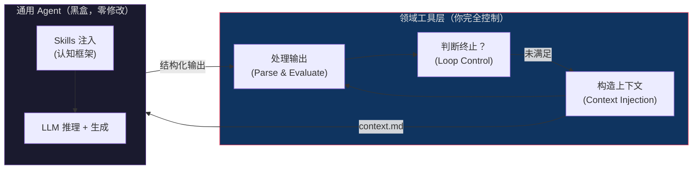

**CISAL 的两个注入点**：

| 注入点 | 手段 | 作用 | 在 SERAPH 中的实现 |
|--------|------|------|-------------------|
| **认知注入** | SKILL.md 文件 | 告诉 Agent "如何思考" | scenario-generator、api-planner 等 Skills |
| **信息注入** | context.md 文件 | 告诉 Agent "思考什么" | s3-context CLI 生成的分层上下文 |

**关键特征**：Agent 的输出不是最终产物——它只是**中间产物**，由外部领域工具来验证（cargo fuzz build）、评估（s3-coverage）和决定是否继续。

#### 6.8.2 五条设计原则

```
1. Agent 无状态性
   Agent 不维护跨调用的领域状态。
   所有状态由外部工具管理（knowledge.json, coverage.json）。
   每次调用都是独立的、自包含的。

2. 上下文构造外部化
   每次调用 Agent 前，由领域工具精确构造最小化上下文。
   在 SERAPH 中：s3-context CLI 根据 stage 从分层知识库中按需提取。

3. 认知框架声明式
   Agent 的推理方式通过声明式 Skills 注入（SKILL.md），
   而非编程式绑定（Agent 插件代码）。
   Skills 是可热更新的 Markdown 文件，不是编译时依赖。

4. 输出验证外部化
   Agent 的输出由外部工具验证（cargo fuzz build、s3-coverage），
   而非 Agent 自我评估。
   这消除了 LLM 的"自我确认偏差"。

5. 循环控制外部化
   何时终止、何时重试、何时降级、覆盖率是否达标——
   全部由外部编排脚本决定，Agent 不参与控制流决策。
```

#### 6.8.3 与传统 Agent 框架的对比

| 维度 | 传统 Agent 框架（LangChain 等） | CISAL 模式（SERAPH） |
|------|-------------------------------|---------------------|
| **控制流方向** | Agent 是主控方，内部调用 Tool | 外部脚本是主控方，调用 Agent 作为服务 |
| **状态管理** | Agent 内部管理对话历史和状态 | 外部工具管理所有领域状态 |
| **领域逻辑位置** | 嵌入 Agent 代码（Plugin/Tool） | 完全在 Agent 之外的独立工具 |
| **终止判断** | Agent 自我判断何时完成 | 外部标准（覆盖率/编译通过率）判断 |
| **可替换性** | Agent 与 Tool 紧耦合 | Agent 是可替换的黑盒 |
| **领域迁移成本** | 需重写 Plugin/Tool 代码 | 只需替换 CLI 工具 + Skills 文件 |

**类比**：
- 传统做法 = "给厨师一个厨房让他做菜"（厨师决定一切）
- CISAL 模式 = "你来配菜、控制火候、决定出锅时机，厨师只负责翻炒"（你掌控全局）

#### 6.8.4 CISAL 的跨领域复用性

CISAL 模式**高度可复用**。只需替换三个组件即可迁移到新领域：

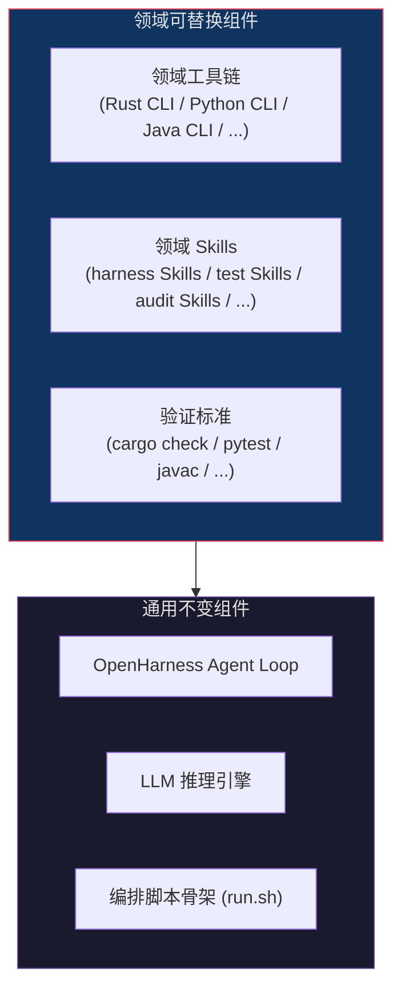

**跨领域迁移示例**：

| 目标领域 | 领域工具链 | 领域 Skills | 验证标准 |
|---------|-----------|------------|----------|
| **Rust Fuzz Harness (SERAPH)** | s3-extract / s3-model / s3-context | scenario-generator, harness-codegen | cargo fuzz build + fuzz run |
| Python 单元测试生成 | AST 解析 + docstring 提取 | test-scenario, pytest-codegen | pytest --tb=short |
| API 文档生成 | OpenAPI schema 解析 | doc-writer, example-gen | openapi-validator |
| 智能合约审计 | Solidity AST + Slither 输出 | vuln-scanner, audit-reporter | solc + slither |
| Java 集成测试 | javadoc 解析 + Maven 依赖分析 | integration-planner, junit-codegen | mvn test |

#### 6.8.5 CISAL 与现有 Agent 特化方法的学术定位

| 方法 | 代表 | 耦合度 | 领域迁移成本 | Agent 修改 |
|------|------|--------|-------------|------------|
| 从零训练专用模型 | CodeFuse fine-tuning | 完全绑定 | 重新训练 | 重写模型 |
| 通用 Agent 内写插件 | LangChain Tool/Agent | 高 | 重写插件 | 修改代码 |
| 纯 Prompt Engineering | GPT + 长 prompt | 低但脆弱 | 改 prompt | 不修改 |
| **CISAL 模式** | **SERAPH** | **零耦合** | 替换 CLI + Skills | **不修改** |

CISAL 是唯一同时满足 **Agent 零修改** + **外部验证** + **可复用编排骨架** 的方法。

---

## 7. 学术创新点总结

| 创新点 | 对比现有工作 | 关键贡献 |
|--------|-------------|---------|
| **Functional Capability Graph** | 现有工作用 API 依赖图（类型匹配） | 从"能调用什么"提升到"能做什么"，场景驱动而非 API 驱动 |
| **State Lifecycle Model** | 现有工作不建模对象状态 | 避免在非法状态调用方法，消除"不可能的使用模式" |
| **Contract-Guided Generation** | 现有工作忽略文档语义 | 首次系统性地从 Rust 文档提取 API 契约并用于指导代码生成 |
| **Skills-Based Prompt Architecture** | 现有工作用固定 prompt 模板 | 模块化、可组合、可扩展的认知框架，借鉴元认知设计 |
| **Progressive API Coverage** | 现有工作随机选择 API 组合 | 渐进式场景迭代确保系统性覆盖所有 API |
| **Multi-Level Context Loading** | 现有工作全量加载库信息 | 分层信息架构，按需加载，解决 Token 预算限制 |
| **CISAL 架构模式** | 现有工作在 Agent 内部嵌入领域逻辑 | 外部编排的领域特化 Agent 模式，Agent 零修改，领域知识完全外部化 |

**可以提炼的论文 Contribution**：

> 1. 我们提出了 **Scenario-Driven Harness Synthesis**，一种从高层使用场景出发、自顶向下合成语义有效的 fuzz harness 的范式，区别于现有的从 API 签名出发的自底向上方法。
> 2. 我们设计了 **Functional Capability Graph** 和 **State Lifecycle Model** 两种新的程序分析抽象，分别刻画库的功能空间和类型的状态空间，为 LLM 提供了结构化的库理解信息。
> 3. 我们实现了 **Contract-Guided Code Generation**，通过从文档中系统提取 API 契约（前置条件、panic 条件、safety 要求），确保生成的代码不违反 API 使用规范。
> 4. 我们提出了 **Skills-Based Prompt Architecture**，一种模块化、可扩展的 LLM 提示框架，结合分层上下文加载和渐进式 API 覆盖策略，实现了在有限 Token 预算下的系统性 API 测试。
> 5. 我们提出了 **CISAL（Context-Injected Skill-Specialized Agent Loop）**，一种将通用 Agent 特化为领域专用 Agent 的可复用架构模式。通过「上下文注入 + 认知技能声明 + 外部验证驱动的循环」，实现了与通用 Agent 的零耦合集成，同时保持完整的领域控制权。
> 6. 实验表明，与现有方法相比，我们生成的 harness 在语义有效性（maintainer acceptance rate）和 bug 发现能力上均有显著提升。

---

## 8. 可能的挑战与应对

| 挑战 | 应对策略 |
|------|---------|
| 文档不全或缺失 | 对文档缺失的 API，使用源码 AST 分析作为补充；对关键缺失信息（如 panic 条件），用 LLM 推测 + 编译测试验证 |
| LLM 的 Rust 代码生成准确率不够高 | 集成 rust-skills 进行多层认知修复；Stage 2 的 API 规划阶段降低 Stage 3 的生成难度；提供 doc examples 作为 few-shot |
| 大型 crate 信息量超过 LLM Token 限制 | **分层压缩 + 按需加载**（本方案核心设计）：FCG 压缩摘要、Stage 1.5 映射后才加载详情、examples 选择性加载 |
| 状态生命周期建模的准确性 | 结合文档 + 类型签名 + 编译器反馈进行迭代验证；不需要完美，只需要比"无模型"好 |
| 如何评估 harness 的"语义有效性" | 设计人工评估 protocol：让库维护者对生成的 harness 评分（maintainer study）；同时设计自动化代理指标 |
| Skills 架构的可维护性 | 借鉴 rust-skills 的扁平目录结构 + SKILL.md 标准格式 + 共享 references；支持热加载和动态 Skills |

---

## 9. 评估方案建议

### 9.1 评估指标

```
1. 编译通过率 (Compilation Rate)
   - 生成的 harness 中能通过 `cargo +nightly fuzz build` 的比例

2. 语义有效率 (Semantic Validity Rate)
   - 不产生"harness 自身 bug"的比例
   - 可通过短时 fuzz 运行 + 分析 crash 位置来自动判断

3. 开发者接受率 (Developer Acceptance Rate) 
   - 核心指标：让库维护者评估"这个使用场景是否合理"
   - 对标现有方法的开发者拒绝问题

4. API 覆盖率 (API Coverage Rate)
   - 最终 harness 集合覆盖了多少 public API
   - 对比基线方法的覆盖率

5. Bug 发现能力 (Bug-Finding Capability)
   - 在目标库中发现的 unique crash / bug 数量
   - 代码覆盖率（line / branch / function coverage）
   - 与现有 harness 生成工具（如 FUDGE、RULF）对比

6. 效率指标
   - Harness 生成时间
   - LLM Token 消耗
   - 从生成到发现第一个 bug 的时间 (Time-to-First-Bug)
```

### 9.2 Benchmark 选择

```
推荐使用以下类型的 crate 做评估：
- 解析器类：serde_json, toml, csv, image, nom
- 加密类：ring, rustls, ed25519-dalek
- 网络类：hyper, reqwest (部分), url
- 数据结构类：hashbrown, indexmap, petgraph
- 编码类：base64, hex, flate2, brotli

选择标准：
1. 已有已知 CVE 或已修复 bug → 可验证是否能复现
2. 文档质量各异 → 测试对文档缺失的鲁棒性
3. API 复杂度各异 → 从简单到复杂评估扩展性

⚠️ 网络类 crate I/O 隔离策略：
  hyper / reqwest 等网络库的 harness 不应发起真实网络请求，否则会导致：
  - smoke run 因超时/DNS 失败产生误报
  - CI 环境下无网络导致所有 harness 被标记为 failed
  - 非确定性行为使 crash 不可复现

  隔离方案（按优先级）：
  a. 仅 fuzz 解析层：只测试 HTTP 解析、header 处理、URL routing 等
     纯计算逻辑，输入为 &[u8]，不涉及 I/O（推荐）
  b. Mock transport：使用 tokio::io::duplex() 或 hyper::client::conn
     手动注入 mock 连接，避免真实 TCP
  c. 标记为 "partial"：如 reqwest (部分) 所示，明确仅 fuzz 其
     不涉及网络 I/O 的子集（如 URL 构建、header 操作）

  scenario-generator Skill 应自动识别网络 I/O 依赖的 API，
  并在场景描述中标注 "无网络 I/O" 约束。
```
