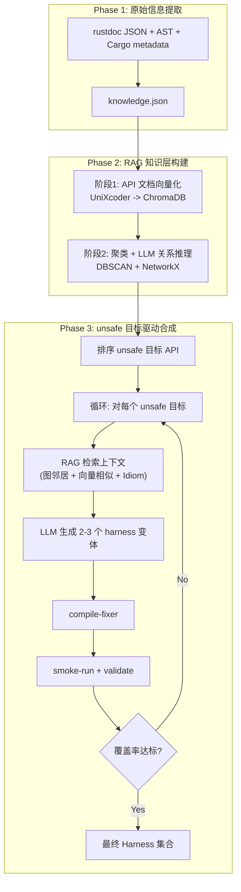

# SERAPH: SEmantic Rust Agent-driven Program Harness Synthesis

> 面向 Rust 库的语义感知 Fuzz Harness 自动合成系统设计方案（v5.1 — RAG 驱动重构版）

## 0. v5.1 修订清单

本版在 v5 一致性重构的基础上，进行**RAG 驱动的架构重构**。核心修订如下：

1. **Phase 2 从规则建模改为 RAG 检索增强**
   - 删除 `s3-model` 规则引擎和 `models.json` 静态文件。
   - 改为三阶段 RAG 管线：API 文档向量化 → 语义关系图构建 → 按需检索。

2. **聚焦 unsafe API 作为首要测试目标**
   - 只测试包含 unsafe 代码块的 Rust 库。
   - 以 unsafe API 为锚点排序测试优先级。

3. **简化 Phase 3 多 Stage 流程**
   - 删除 Stage 1（scenario-generator）、Stage 1.5（scenario-api-mapper）、Stage 2（api-planner）。
   - API 调用序列的决策权完全交给 LLM，RAG 只提供上下文。
   - Phase 3 简化为：目标选择 → RAG 检索 → LLM 生成 → 编译修复 → 验证。

4. **混合技术栈**
   - Phase 1（提取）和 coverage 管理保持 Rust。
   - RAG 管线使用 Python（ChromaDB、sklearn、NetworkX 生态成熟）。

5. **引入 Rust Idiom 索引**
   - 从 Rust 官方文档 + Rustonomicon 自动提取安全惯用法。
   - 跨 crate 复用，一次构建所有项目受益。

6. **保留的 v5 设计**
   - Phase 1 信息提取（`s3-extract` + `knowledge.json`）不变。
   - 稳定 ID 体系（`api_id`、`type_id`、`trait_id`）不变。
   - 覆盖率三态（`targeted` / `attempted` / `validated`）不变。
   - 编译修复（`compile-fixer`）不变。
   - Smoke run 与 crash 分类不变。
   - Fuzz workspace bootstrap 不变。

---

## 1. 问题本质分析

现有 harness 合成工作的核心缺陷不是“不能调用 API”，而是**缺乏使用意图（usage intent）**。

| 维度 | 现有方法（语法驱动） | 本方案（语义驱动） |
|------|----------------------|---------------------|
| 出发点 | API 签名类型匹配 | “我要用这个库完成什么任务” |
| API 选择 | 返回值→参数的类型链 | 围绕一个功能场景的 API 子集 |
| 状态构造 | 随机值 / 默认值 | 满足前置条件的有意义状态 |
| 错误处理 | `unwrap()` 一切 | 区分应处理错误与不应发生错误 |
| 维护者认可度 | “我们不会这样用” | “这确实是一个合理的使用场景” |

本方案的学术创新点在 v5.1 中调整为：

1. RAG-Driven Semantic Knowledge Assembly（RAG 驱动的语义知识组装）
2. Unsafe-Focused Target Prioritization（以 unsafe 为中心的目标优先级）
3. Vector Similarity + Graph-Based API Relation Discovery（向量相似度 + 图驱动的 API 关系发现）
4. Cross-Crate Rust Idiom Knowledge Reuse（跨 crate 的 Rust 惯用法知识复用）
5. LLM-Decided Call Sequence Synthesis（LLM 自主决定的调用序列合成）
6. Deterministic Orchestration + External Validation（外部确定性编排 + 验证）

---

## 2. 设计约束与一致性原则

### 2.1 单一控制面原则

LLM 不负责维护全局状态。全局状态只能由外部编排层维护：

- `knowledge.json`
- `workspace/vectordb/`（ChromaDB 向量库）
- `workspace/graph.pkl`（语义关系图）
- `coverage.json`
- `target_crate.json`
- `workspace/fuzz/`

LLM 的职责仅限于：

- 阶段 2 中对 cluster 内 API 关系的推理
- 生成 harness 代码
- 修复编译错误

### 2.2 单一职责阶段原则

每个阶段只做一件事：

1. Phase 1：提取原始信息（`knowledge.json`）
2. Phase 2-RAG 阶段 1：向量化 API 文档
3. Phase 2-RAG 阶段 2：聚类 + LLM 关系推理 -> 语义图
4. Phase 3 - 检索：RAG 检索 unsafe 目标上下文
5. Phase 3 - 生成：LLM 生成 harness（自主决定调用序列）
6. Phase 3 - 修复：编译修复
7. Phase 3 - 验证：smoke run + 覆盖率更新

### 2.3 稳定 ID 原则

除展示字段外，所有跨阶段连接都必须使用稳定 ID：

- `type_id`
- `api_id`
- `trait_id`

名字字符串只用于给 LLM 阅读、生成日志和方便人工理解。

### 2.4 unsafe 优先原则

本系统只测试包含 unsafe 代码块的 Rust 库。

- 以包含 unsafe 的 API 为首要测试目标
- 通过语义图提取 unsafe API 的关联上下文
- 不包含 unsafe 的纯安全 Rust 库不在本系统的测试范围内

### 2.5 覆盖率口径原则

一个 API 只有在以下条件满足时才可计入覆盖：

1. 它被某个已生成 harness 显式针对
2. harness 成功编译并进入 smoke run
3. 验证日志中出现该 API 的 `SERAPH_STEP_OK:<step_no>:<api_id>`
4. 本次结果不是因为日志缺失而进入 `needs_review`

覆盖率口径为：

> **covered = validated dynamic use**

---

## 3. 整体架构（Pipeline）



### 3.1 关键闭环

闭环是：

`unsafe 目标选择 -> RAG 上下文检索 -> LLM 代码生成 -> 编译修复 -> 外部验证 -> 覆盖率状态`

核心原则：

- RAG 只负责检索相关 API 上下文
- LLM 自主决定 API 调用序列和组合方式
- 外部工具负责验证和推进状态
- 所有“是否继续”的判断均由外部编排决定

---

## 4. Phase 1：信息提取

### 4.1 提取手段

| 提取源 | 工具/方法 | 获取内容 |
|--------|-----------|----------|
| rustdoc JSON | `cargo +nightly doc --document-private-items` + `--output-format json` | public items、签名、文档、impl、trait |
| 源码 AST | `syn` / `ra_ap_syntax` | `unsafe`、`panic!`、`unwrap`、索引、`Drop`、`extern "C"` |
| `cargo metadata` | Cargo 官方元数据接口 | package 名、lib target 名、feature、依赖边界 |
| `Cargo.toml` | 直接解析 | feature gate、crate 类型、workspace 关系 |
| 文档示例 | rustdoc examples 提取 | examples 索引 |

### 4.2 需要提取的原始信息

Phase 1 只提取“事实”，不做语义推理。核心字段包括：

1. API 结构信息
   - 模块路径
   - item 类型
   - 完整签名
   - receiver 语义
   - 返回类型形态
   - 泛型参数与 where 子句

2. 类型系统信息
   - struct / enum / type alias
   - 字段 / 变体
   - private / public 构造限制
   - `#[non_exhaustive]`
   - `repr(...)`
   - builder / constructor / default

3. trait 定义与 impl surface
   - `trait_registry`：required / provided methods、associated types / constants、supertraits、unsafe trait 标记
   - `trait_impl_registry`：public trait impl surface、known implementors、条件 impl、associated type / const bindings

4. 文档语义原文
   - `# Panics`
   - `# Errors`
   - `# Safety`
   - `# Examples`
   - 第一段概述

5. 原始风险面
   - `unsafe` 块
   - FFI 边界
   - panic 点
   - `panic in Drop`
   - `repr(packed)`
   - 条件 impl
   - 生命周期敏感返回值

6. examples 索引
   - example ID
   - 涉及 API
   - 代码位置
   - 能力标签

### 4.3 `knowledge.json` 与上下文分层视图

说明：

- 仓库内**实际落地**的 Phase 1 权威原始 schema 应以 `seraph-types::Knowledge` 为准
- 其核心是归一化实体集合：`crate_meta`、`modules`、`types`、`apis`、`symbols`、`trait_registry`、`trait_impl_registry`、`examples`、`risk_facts`
- 下面的 `level_0/1/2/3` 示例是为了说明 Phase 3 如何被 `s3-context` 分层消费，可作为派生缓存 / 上下文视图，不要求与磁盘上的原始 JSON 一模一样

```json
{
  "crate_name": "serde_json",
  "crate_import_name": "serde_json",
  "crate_doc": "JSON serialization file format",
  "public_api_count": 47,
  "default_features": ["std"],
  "level_0_summary": {
    "one_line": "Rust 的 JSON 解析与序列化库",
    "key_types": ["Value", "Map", "Error"]
  },
  "level_1_type_surface": [
    {
      "anchor_kind": "module_entry",
      "anchor_module_id": "mod_001",
      "anchor_type_id": null,
      "path": "serde_json",
      "doc_summary": "顶层 JSON 解析与序列化入口",
      "api_ids": ["fn_001", "fn_002", "fn_003"],
      "api_names": ["from_str", "from_slice", "from_reader"]
    },
    {
      "anchor_kind": "type",
      "anchor_module_id": "mod_001",
      "anchor_type_id": "type_001",
      "path": "serde_json::Value",
      "doc_summary": "通用 JSON 值表示",
      "api_ids": ["fn_015", "fn_016"],
      "api_names": ["pointer", "pointer_mut"]
    }
  ],
  "level_2_types": [
    {
      "type_id": "type_001",
      "path": "serde_json::Value",
      "kind": "enum",
      "constructors": [],
      "method_ids": ["fn_015", "fn_016"],
      "trait_impls": ["Clone", "Debug"]
    }
  ],
  "level_3_apis": [
    {
      "api_id": "fn_003",
      "path": "serde_json::from_reader",
      "module_id": "mod_001",
      "signature": "pub fn from_reader<R, T>(rdr: R) -> Result<T, Error> where R: Read, T: DeserializeOwned",
      "receiver": null,
      "generic_params": ["R", "T"],
      "where_clauses": ["R: Read", "T: DeserializeOwned"],
      "doc_full": "Deserializes an instance of type T from an IO stream of JSON.",
      "related_example_ids": ["ex_001"],
      "risk_markers": ["external_input"]
    }
  ],
  "trait_registry": [
    {
      "trait_id": "trait_001",
      "path": "serde::de::DeserializeOwned",
      "is_unsafe": false,
      "required_methods": [],
      "provided_methods": [],
      "associated_types": []
    }
  ],
  "trait_impl_registry": [
    {
      "trait_impl_id": "trait_impl_001",
      "target_type_id": "type_001",
      "trait_id": "trait_001",
      "trait_ref_text": "serde::de::DeserializeOwned",
      "trait_canonical_path": "serde::de::DeserializeOwned"
    }
  ],
  "examples_index": [
    {
      "example_id": "ex_001",
      "source_api_id": "fn_003",
      "involved_api_ids": ["fn_003"],
      "code_ref": {"file": "src/de.rs", "start_line": 100, "end_line": 105}
    }
  ],
  "raw_risk_surface": {
    "unsafe_functions": [],
    "ffi_boundaries": [],
    "panic_points": [],
    "repr_packed_types": [],
    "panic_in_drop_types": []
  }
}
```

其中，`level_1_type_surface` 提供的是 **Phase 1 的锚点目录**。  
它的 `anchor_kind / anchor_module_id / anchor_type_id` 必须与 Phase 2 的 FCG capability 复用同一套坐标系，避免 Stage 1.5 在 capability 与锚点概览之间再次做名称猜测。
其中当 `anchor_kind = "type"` 时，`anchor_type_id` 就是该锚点对应的稳定 `type_id`。

### 4.4 Phase 1 输出边界

`knowledge.json` 中**不应**出现以下字段：

- `api_coverage_tracker`
- `capability_api_index`
- `type_synthesis_overview`
- `contract_summary`
- `risk_summary_oneliner`

这些都属于 Phase 2 的语义建模结果。

---

## 5. Phase 2：RAG 驱动的语义知识层

Phase 2 不再生成静态的 `models.json`，而是将 `knowledge.json` 的内容向量化并构建语义关系图，供 Phase 3 按需检索。

```
┌──────────────────────────────────────────────────────────┐
│  阶段 1：API 文档向量化（RAG 索引构建）                     │
├──────────────────────────────────────────────────────────┤
│  knowledge.json → 提取 API 签名 + 文档 + unsafe 标记       │
│       → 代码嵌入模型 (UniXcoder) → 向量库 (ChromaDB)       │
│       → 同时构建 Rust Idiom 索引 (从官方文档提取)            │
└──────────────────────────────────────────────────────────┘
                            ↓
┌──────────────────────────────────────────────────────────┐
│  阶段 2：语义关系图构建                                     │
├──────────────────────────────────────────────────────────┤
│  向量相似度 → 功能聚类 (DBSCAN) → LLM 关系推理              │
│       → 语义图 (NetworkX)                                  │
│       → 以 unsafe API 为锚点标记关联子图                     │
└──────────────────────────────────────────────────────────┘
```

### 5.1 阶段 1：API 文档向量化

#### 输入

直接读取 Phase 1 生成的 `knowledge.json`，提取每个 API 的信息。

#### 文档构造

每个 API 构造一个嵌入文档。文档文本是以下字段拼接的自然语言段落：

```python
def build_doc_text(api: dict) -> str:
    parts = [
        f"{api['path']}: {api['doc_summary']}",
        f"Signature: {api['signature']}",
    ]
    if api.get('receiver'):
        parts.append(f"Receiver: {api['receiver']}")
    if api.get('generic_params'):
        parts.append(f"Generic bounds: {', '.join(api['where_clauses'])}")
    if api.get('doc_panics'):
        parts.append(f"Panics: {api['doc_panics']}")
    if api.get('doc_errors'):
        parts.append(f"Errors: {api['doc_errors']}")
    if api.get('doc_safety'):
        parts.append(f"Safety: {api['doc_safety']}")
    if api.get('is_unsafe'):
        parts.append("WARNING: contains unsafe code block")
    return "\n".join(parts)
```

#### 元数据（metadata filter 用）

每个文档附带结构化元数据，用于 ChromaDB 的过滤查询：

```python
metadata = {
    "api_id": "fn_003",
    "module_id": "mod_001",
    "owner_type_id": "type_001",  # 或 null
    "has_unsafe": True,           # ⭐ 核心筛选字段
    "has_ffi": False,
    "has_panic_points": True,
    "receiver": "&mut self",      # null / "&self" / "&mut self" / "self"
    "return_shape": "Result",     # "Result" / "Option" / "Self" / "Primitive" / "Void" / "Other"
    "risk_level": "HIGH",         # 从 risk_facts 推断
}
```

#### 向量化与存储

```python
import chromadb
from transformers import AutoModel, AutoTokenizer

# 使用代码专用嵌入模型
model = AutoModel.from_pretrained("microsoft/unixcoder-base")
tokenizer = AutoTokenizer.from_pretrained("microsoft/unixcoder-base")

client = chromadb.PersistentClient(path="./workspace/vectordb")
collection = client.get_or_create_collection(
    name="api_docs",
    metadata={"hnsw:space": "cosine"}
)

for api in knowledge["apis"]:
    text = build_doc_text(api)
    embedding = encode(model, tokenizer, text)  # 产出 768 维向量
    collection.add(
        ids=[api["api_id"]],
        embeddings=[embedding],
        documents=[text],
        metadatas=[build_metadata(api)]
    )
```

#### Rust Idiom 索引

同一个 ChromaDB 实例中创建第二个 collection：

```python
idiom_collection = client.get_or_create_collection(name="rust_idioms")
```

语料来源：从 Rust 官方文档 + Rustonomicon 自动提取，按以下分类：

| 类别 | 提取源 | 示例 |
|------|--------|------|
| unsafe 语义 | Rustonomicon Ch.1-7 | "unsafe block 中的引用必须满足别名规则" |
| 所有权规则 | The Rust Book Ch.4 | "&mut 引用在作用域内独占" |
| 错误处理 | The Rust Book Ch.9 | "Result 应 match 或 ? 传播，fuzz 中用 early return" |
| FFI 规约 | Rustonomicon Ch.11 | "extern C 函数的指针参数不能为 null 除非文档允许" |
| Drop 语义 | Rustonomicon Ch.3.4 | "实现 Drop 的类型析构顺序影响 safety" |
| trait 安全 | Rustonomicon Ch.3.3 | "unsafe trait 的 impl 必须维护 trait 文档声明的不变式" |

每条惯用法约 2-5 句话，预计 100-200 条，一次性构建，跨 crate 复用。

### 5.2 阶段 2：语义关系图构建

#### 相似度计算

对 `api_docs` collection 中所有 API 两两计算余弦相似度：

```python
import numpy as np
from sklearn.cluster import DBSCAN

embeddings = collection.get(include=["embeddings"])["embeddings"]
api_ids = collection.get()["ids"]

# 余弦相似度矩阵
sim_matrix = cosine_similarity(np.array(embeddings))
```

#### 功能聚类

用 DBSCAN 按功能语义聚类（不需要预设簇数）：

```python
distance_matrix = 1 - sim_matrix
clustering = DBSCAN(eps=0.3, min_samples=2, metric="precomputed")
labels = clustering.fit_predict(distance_matrix)
```

每个 cluster 代表一组**功能语义相近的 API**，由数据驱动而非规则定义。

#### LLM 关系推理

对每个 cluster 内的 API，用一次 LLM 调用推断关系：

```
Prompt:
以下是同一功能群组中的 Rust API：
{cluster 内各 API 的签名 + 文档摘要}

请推断它们之间的关系，输出 JSON：
- 哪些是构造器 (constructor)
- 哪些是操作方法 (operation)
- 哪些需要在另一个之后调用 (depends_on)
- 哪些共享同一个 owner type
- 哪些涉及 unsafe，以及 unsafe 的具体原因
```

#### 语义图构建

用 NetworkX 构建内存图：

```python
import networkx as nx

G = nx.DiGraph()

# 节点 = API
for api in apis:
    G.add_node(api["api_id"], **api_metadata)

# 边来源 1: 类型系统（确定性）
for api in apis:
    if api.get("owner_type_id"):
        G.add_edge(api["owner_type_id"], api["api_id"], rel="has_method")
    if api.get("return_type_id"):
        G.add_edge(api["api_id"], api["return_type_id"], rel="returns")

# 边来源 2: LLM 推断的 cluster 内关系
for rel in llm_inferred_relations:
    G.add_edge(rel["from"], rel["to"], rel=rel["type"])

# 边来源 3: 向量相似度（弱边）
for i, j in high_similarity_pairs:  # sim > threshold
    G.add_edge(api_ids[i], api_ids[j], rel="semantically_similar", weight=sim_matrix[i][j])
```

#### unsafe 子图标记

以 unsafe API 为锚点，提取其关联上下文子图：

```python
unsafe_apis = [n for n, d in G.nodes(data=True) if d.get("has_unsafe")]

for unsafe_api in unsafe_apis:
    # 获取 2 跳邻居：调用 unsafe API 前需要准备什么，之后会产出什么
    subgraph = nx.ego_graph(G, unsafe_api, radius=2, undirected=True)
    G.nodes[unsafe_api]["unsafe_context_subgraph"] = list(subgraph.nodes())
```

产出：**每个 unsafe API 都有一个"上下文 API 集合"**，即"要测试这个 unsafe API，可能需要哪些相关 API 来构造前置状态和消费后置结果"。

### 5.3 Phase 2 输出

Phase 2 不产出文件级别的 `models.json`，而是产出两个持久化存储：

1. **`workspace/vectordb/`**：ChromaDB 持久化目录，包含 `api_docs` 和 `rust_idioms` 两个 collection
2. **`workspace/graph.pkl`**：NetworkX 图序列化文件，包含所有 API 节点、类型节点、关系边和 unsafe 子图标记

CTS 在本方案中是 Phase 3 的代码生成策略，用于指导 LLM 如何实例化泛型参数：

#### 策略分类

- `A`：直接使用库内已有类型
- `B`：使用标准库或已知实现者
- `C`：构造自定义安全类型 / wrapper / trait object / safe trait impl
- `D`：涉及 unsafe trait 或硬性安全边界，只使用现有实现，不自定义

#### 假设违反类型

- 行为假设
- 资源假设
- 一致性假设
- 控制流假设
- 生命周期 / 所有权假设

---

## 6. Phase 3：unsafe 目标驱动的 Harness 合成

### 6.1 主流程概览

Phase 3 不再使用多 Stage 的 scenario→mapping→planning→codegen 管线，而是简化为以 unsafe API 为目标的直接合成流程：

| 步骤 | 组件 | 主要输入 | 主要输出 | 责任 |
|------|------|----------|----------|------|
| 目标选择 | `rag/retrieve.py` | `graph.pkl`、`coverage.json` | 排序后的 unsafe 目标列表 | 选择下一个 unsafe API 目标 |
| 上下文检索 | `rag/retrieve.py` | 目标 API、ChromaDB、NetworkX 图 | 组装后的 LLM 上下文 | RAG 检索关联 API + Rust 惯用法 |
| 代码生成 | `harness-codegen` | RAG 上下文 | `harness_RRR_SS.rs`（2-3 个变体） | LLM 自主决定调用序列并生成代码 |
| 编译修复 | `compile-fixer` | harness、rustc 输出、相关签名 | 修复后的 harness | 修复编译错误 |
| 验证 | `s3-coverage --validate` | smoke run 输出 | `coverage.json` 更新 | 外部验证与反馈 |

### 6.2 unsafe 目标排序

从语义图中提取所有 unsafe API，按危险度排序：

```python
def unsafe_priority(api_id: str, G: nx.DiGraph) -> float:
    node = G.nodes[api_id]
    score = 0.0
    if node.get("has_ffi"):          score += 3.0  # FFI 最危险
    if node.get("has_unsafe"):       score += 2.0
    if node.get("has_panic_points"): score += 1.0
    score += G.degree(api_id) * 0.1  # 连接度高 = 使用面广
    return score

targets = sorted(unsafe_apis, key=lambda x: unsafe_priority(x, G), reverse=True)
```

### 6.3 RAG 上下文检索与组装

对每个 unsafe 目标 API，组装 LLM 所需的上下文：

```python
def retrieve_context_for_target(target_api_id, G, collection, idiom_collection):
    target_doc = collection.get(ids=[target_api_id], include=["documents"])["documents"][0]

    # 1. 从图中获取关联 API（前置构造器、同 type 方法等）
    context_api_ids = G.nodes[target_api_id].get("unsafe_context_subgraph", [])
    context_docs = collection.get(ids=context_api_ids, include=["documents"])["documents"]

    # 2. 从向量库中检索语义相关 API（补充图未覆盖的）
    similar = collection.query(
        query_texts=[target_doc],
        n_results=10,
        where={"api_id": {"$nin": context_api_ids}}  # 去重
    )

    # 3. 检索相关 Rust 惯用法
    idioms = idiom_collection.query(
        query_texts=[f"unsafe usage: {target_doc}"],
        n_results=5
    )

    # 4. 组装上下文
    context = f"""
## 目标 API（包含 unsafe）
{target_doc}

## 关联 API（构造/操作/清理）
{format_docs(context_docs)}

## 语义相关 API（补充）
{format_docs(similar["documents"])}

## Rust 安全惯用法参考
{format_docs(idioms["documents"])}
"""
    return context
```

### 6.4 LLM Harness 生成

将组装好的上下文提交给 LLM，**由 LLM 自主决定 API 调用序列**：

```
System Prompt:
你是一个 Rust fuzz harness 专家。你的任务是为目标 unsafe API 生成多样化的测试 harness。

规则：
1. 目标 API 包含 unsafe 代码块，必须在 harness 中被调用
2. 你需要决定如何组合"关联 API"来构造前置状态，使目标 API 被有意义地调用
3. 对 Result 返回值使用 early return，不要 unwrap
4. 生成 2-3 个不同的 harness 变体，每个变体用不同的方式到达 unsafe API
5. 遵守"Rust 安全惯用法参考"中的约束
6. 每个 ordered_step 在调用前输出 SERAPH_STEP_ENTER:<step_no>:<api_id>，
   成功返回后输出 SERAPH_STEP_OK:<step_no>:<api_id>
7. 使用真实 crate import 名称，不得使用 target_lib

User Prompt:
{retrieve_context_for_target(target_api_id)}

请为目标 API 生成 2-3 个 fuzz harness 变体。
每个变体应使用不同的前置 API 组合路径到达 unsafe 目标。
```

### 6.5 多样性策略

对同一个 unsafe 目标 API，通过调整检索和提示生成多样化 harness：

| 变体策略 | 实现方式 |
|----------|----------|
| 不同构造路径 | 每轮从关联 API 中选不同的构造器子集提供给 LLM |
| 不同输入来源 | 提示 LLM 分别用 `&[u8]`、`Arbitrary` struct、边界值构造输入 |
| 不同调用深度 | 第一轮只给直接邻居 API，第二轮给 2 跳邻居，增加调用链长度 |
| 不同错误路径 | 提示 LLM 分别测试正常路径和错误/边界路径 |

### 6.6 Compile-Fixer（不变）

#### 输入

- 失败的 harness 源码
- 完整 rustc 错误输出
- 相关 API 的正确签名（从 ChromaDB 检索）
- 当前修复轮次

#### 修复策略

- 第 1-2 轮：精确修复
- 第 3-4 轮：局部结构调整
- 第 5 轮：保留核心路径的降级修复

#### 修复约束

1. 修复不能删除目标 unsafe API
2. 修复不能删除或打乱 `SERAPH_STEP_ENTER/OK` 轨迹标记
3. 如果某个错误只能通过移除目标 unsafe API 才能修复，则本轮失败

### 6.7 Smoke Run 与 Crash 分类（不变）

Smoke run 使用：

```bash
cargo +nightly fuzz run <target> -- -max_total_time=10
```

#### 分类规则

| 类别 | 判断依据 | 处理 |
|------|----------|------|
| `library_bug` | crash / sanitizer 指向目标库，且不是文档声明的预期 panic | 记入 `found_bugs`，对应 API 计入 `validated` |
| `misuse` | crash 指向 harness 代码，或触发了文档声明的前置条件 panic | `misuse_fails += 1` |
| `resource` | OOM / timeout | `misuse_fails += 1` |
| `needs_review` | 归属模糊 | 放入 review 队列，不计入 validated |

---


## 7. 覆盖率状态机与 `coverage.json`

### 7.1 三态定义

v5 中每个 API 只维护以下三种主状态：

1. `targeted`
   - 在 Stage 1.5 被映射到某个场景中

2. `attempted`
   - 在 harness 进入编译 / 运行路径前登记
   - 无论编译失败、误用失败还是运行失败，状态都保留为 `attempted`

3. `validated`
   - smoke run 成功
   - 或发现真实 `library_bug`

失败计数单独维护：

- `compile_fails`
- `misuse_fails`

### 7.2 状态转移

```text
Stage 1.5 完成映射           -> targeted
进入 build / fix / smoke 流程 -> attempted
smoke 成功或真实库 bug        -> validated
```

#### 动态命中证明与失败归因

`harness-codegen` 必须在 `stderr` 输出两类标记：

- `SERAPH_STEP_ENTER:<step_no>:<api_id>`
- `SERAPH_STEP_OK:<step_no>:<api_id>`

`s3-coverage --validate` 按以下规则处理：

1. 出现 `STEP_OK` 的 API，说明该 API 已被动态执行且成功返回，可升级为 `validated`
2. 若分类为 `library_bug`，则最后一个 `STEP_ENTER` 且没有对应 `STEP_OK` 的活动 API 也记为 `validated`，并关联到 `found_bugs`
3. 若分类为 `misuse` / `resource`，则只给当前活动 API 增加 `misuse_fails`；此前已经 `STEP_OK` 的 API 不回退
4. `mark-compile-fail` 无法细分到单步时，对该 harness 中尚未 `validated` 的 API 统一增加 `compile_fails`

### 7.3 覆盖率计算

```text
covered_api_ids   = { api | status == validated }
exhausted_api_ids = { api | compile_fails >= 3 or misuse_fails >= 5 }
uncovered_api_ids = total_api_ids - covered_api_ids - exhausted_api_ids
coverage_rate     = |covered_api_ids| / |total_api_ids|
```

### 7.4 权威格式：`coverage.json`

说明：

- `api_status` 是稀疏映射，只记录已经进入三态机的 API；缺失条目表示该 API 尚未被 `targeted`

```json
{
  "total_api_ids": ["fn_001", "fn_002", "fn_003", "fn_015", "fn_016", "fn_020"],
  "api_status": {
    "fn_003": "validated",
    "fn_015": "attempted",
    "fn_016": "targeted",
    "fn_020": "targeted"
  },
  "failed_attempts": {
    "fn_015": {
      "compile_fails": 0,
      "misuse_fails": 2,
      "last_reason": "documented panic triggered by invalid path"
    }
  },
  "covered_api_ids": ["fn_003"],
  "exhausted_api_ids": [],
  "uncovered_api_ids": ["fn_001", "fn_002", "fn_015", "fn_016", "fn_020"],
  "harnesses": {
    "harness_003_01": {
      "round": 3,
      "sub_index": 1,
      "scenario_id": "scn_003",
      "mapping_id": "map_003_01",
      "plan_id": "plan_003_01",
      "api_ids": ["fn_003", "fn_015", "fn_016"],
      "status": "attempted"
    }
  },
  "found_bugs": [],
  "needs_review": [],
  "next_priority": [
    {"api_id": "fn_015", "reason": "高风险查询路径，尚未验证"}
  ],
  "coverage_rate": 0.17
}
```

### 7.5 终止条件

- 覆盖率 `>= 95%`
- 或连续 `N` 轮没有新增 validated API，其中 `N = max(3, ceil(log2(total_api_count)))`
- 或 harness 总数达到 `min(50, total_api_count * 2)`

以上条件不应在 `run.sh` 中手写多套判断，而应统一由 `s3-coverage --should-stop` 基于 `coverage.json` 与当前轮次做判定。

---

## 8. 实现架构

### 8.1 技术选型

- Phase 1：Rust CLI（`s3-extract`）
- Phase 2-RAG：Python（ChromaDB、UniXcoder、sklearn、NetworkX）
- Phase 3：外部 shell 编排 + OpenHarness 单轮 Skill 调用
- 验证：`cargo fuzz`
- 覆盖率管理：Rust CLI（`s3-coverage`）

混合技术栈，以开发方便为目标，复用现有工具包。

### 8.2 组件边界

| 组件 | 语言 | 责任 |
|------|------|------|
| `s3-extract` | Rust | 生成 `knowledge.json` |
| `rag/ingest.py` | Python | knowledge.json → ChromaDB 向量化 |
| `rag/idiom_builder.py` | Python | Rust 官方文档 → Idiom 索引（一次性） |
| `rag/build_graph.py` | Python | 聚类 + LLM 推理 → NetworkX 图 |
| `rag/retrieve.py` | Python | 目标排序 + RAG 上下文组装 |
| `s3-coverage` | Rust | 覆盖率状态、harness 注册、验证、终止判定 |
| `run.sh` | Shell | 唯一主编排脚本 |
| OpenHarness Skills | Prompt | harness-codegen、compile-fixer |

### 8.3 目录结构

```text
SERAPH/
├── crates/
│   ├── s3-extract/          # Phase 1: 信息提取 (Rust)
│   ├── s3-coverage/         # 覆盖率管理 (Rust)
│   └── seraph-types/        # 共享类型定义 (Rust)
├── rag/                     # Phase 2: RAG 管线 (Python)
│   ├── ingest.py            # knowledge.json → ChromaDB
│   ├── build_graph.py       # 聚类 + LLM推理 → NetworkX 图
│   ├── retrieve.py          # 目标排序 + 上下文组装
│   ├── idiom_builder.py     # Rust Idiom 索引构建 (一次性)
│   ├── requirements.txt     # Python 依赖
│   └── rust_idioms/         # Rustonomicon + Rust Book 提取的惯用法语料
├── skills/
│   ├── harness-codegen/     # 接收 RAG 上下文，LLM 生成 harness
│   └── compile-fixer/       # 编译修复
├── scripts/
│   ├── run.sh               # 主编排脚本
│   └── bootstrap-fuzz-target.sh  # fuzz workspace 初始化
└── workspace/
    ├── knowledge.json        # Phase 1 产出
    ├── vectordb/             # ChromaDB 持久化
    ├── graph.pkl             # NetworkX 图序列化
    ├── coverage.json         # 覆盖率状态
    ├── target_crate.json     # 目标 crate 元信息
    └── fuzz/                 # cargo fuzz 工程
```

### 8.4 `bootstrap-fuzz-target.sh`（不变）

这个脚本负责 fuzz workspace 初始化：

1. 若 `workspace/fuzz/` 不存在，则执行 `cargo fuzz init`
2. 通过 `cargo metadata` 获取目标 crate：
   - package 名
   - lib target 名
   - Rust import 名
3. 将目标 crate 作为 path dependency 写入 `workspace/fuzz/Cargo.toml`
4. 生成 `workspace/target_crate.json`

```json
{
  "package_name": "serde-json-wrapper",
  "crate_import_name": "serde_json_wrapper",
  "path": "/abs/path/to/target-crate"
}
```

`harness-codegen` 必须读取该文件中的 `crate_import_name` 来生成 import。

### 8.5 `run.sh`（权威主流程）

```bash
#!/bin/bash
set -euo pipefail

TARGET_CRATE="$1"

# === Phase 1: 提取 ===
echo "=== Phase 1: extract ==="
s3-extract --crate "$TARGET_CRATE" --output ./workspace/knowledge.json

# === Phase 2-RAG: 向量化 + 图构建 ===
echo "=== Phase 2: RAG indexing ==="
python rag/ingest.py \
    --knowledge ./workspace/knowledge.json \
    --db-path ./workspace/vectordb

echo "=== Phase 2: Rust Idiom index ==="
python rag/idiom_builder.py --db-path ./workspace/vectordb

echo "=== Phase 2: Graph construction ==="
python rag/build_graph.py \
    --db-path ./workspace/vectordb \
    --output ./workspace/graph.pkl

# === Bootstrap fuzz workspace ===
echo "=== Bootstrap fuzz workspace ==="
./scripts/bootstrap-fuzz-target.sh "$TARGET_CRATE" ./workspace/fuzz ./workspace/target_crate.json

# === Init coverage ===
echo "=== Init coverage ==="
s3-coverage --init --knowledge ./workspace/knowledge.json --output ./workspace/coverage.json

# === Phase 3: 循环生成 harness ===
ROUND=0

while true; do
  ROUND=$((ROUND + 1))

  if s3-coverage --should-stop \
        --state ./workspace/coverage.json \
        --round "$ROUND"; then
    break
  fi

  # 获取下一个 unsafe 目标 + RAG 上下文
  CONTEXT_FILE="./workspace/contexts/context_$(printf '%03d' $ROUND).md"
  python rag/retrieve.py \
      --db-path ./workspace/vectordb \
      --graph ./workspace/graph.pkl \
      --coverage ./workspace/coverage.json \
      --round "$ROUND" \
      --output "$CONTEXT_FILE"

  # LLM 生成 harness（可能生成多个变体）
  oh run --skill harness-codegen \
         --context "$CONTEXT_FILE" \
         --output-dir ./workspace/fuzz/fuzz_targets/ \
         --prefix "harness_$(printf '%03d' $ROUND)"

  # 对每个生成的 harness: 编译修复 + smoke run
  for HARNESS in ./workspace/fuzz/fuzz_targets/harness_$(printf '%03d' $ROUND)_*.rs; do
    HARNESS_NAME=$(basename "$HARNESS" .rs)

    s3-coverage --mark-attempt "${HARNESS_NAME}" --state ./workspace/coverage.json

    COMPILE_OK=false
    for RETRY in $(seq 1 5); do
      if cargo +nightly fuzz build "${HARNESS_NAME}" \
            --manifest-path ./workspace/fuzz/Cargo.toml 2> compile_err.log; then
        COMPILE_OK=true
        break
      fi

      oh run --skill compile-fixer \
             --input ./workspace/fuzz/fuzz_targets/${HARNESS_NAME}.rs \
             --errors compile_err.log \
             --output ./workspace/fuzz/fuzz_targets/${HARNESS_NAME}.rs
    done

    if [ "$COMPILE_OK" = false ]; then
      s3-coverage --mark-compile-fail "${HARNESS_NAME}" --state ./workspace/coverage.json
      continue
    fi

    if cargo +nightly fuzz run "${HARNESS_NAME}" \
          --manifest-path ./workspace/fuzz/Cargo.toml \
          -- -max_total_time=10 2> smoke_err.log; then
      SMOKE_EXIT=0
    else
      SMOKE_EXIT=$?
    fi

    s3-coverage --validate "${HARNESS_NAME}" \
                --exit-code "${SMOKE_EXIT}" \
                --smoke-log smoke_err.log \
                --state ./workspace/coverage.json
  done
done
```

### 8.6 OpenHarness 配置原则

OpenHarness 在本方案中被当作：

> **单次 Skill 调用执行器**

而不是全局控制器。

因此：

- 是否进入下一轮，由 `run.sh` 决定
- 是否重试编译修复，由 `run.sh` 决定
- 是否终止迭代，由 `s3-coverage` + `run.sh` 决定


---

## 9. 关键设计决策

### 9.1 为什么用 RAG 替代静态建模

传统 Phase 2 需要预计算完整的 FCG / SLM / Contract / Risk / Trait Surface 模型，存在以下问题：

- 规则僵化，难以适应不同 crate 的特性
- 一次性全量建模，无法按需提供不同粒度的知识
- `models.json` 与 `knowledge.json` 之间存在大量重复信息

RAG 方案通过向量化 + 语义图，将知识以可检索的形式存储，按需组装上下文：

- 向量库支持语义相似性查询，自动发现功能相关的 API
- 语义图保持类型系统的结构化关系
- 不需要预定义 capability 分类规则，由 DBSCAN 数据驱动聚类

### 9.2 为什么聚焦 unsafe

对 Rust 库 fuzz 测试来说，unsafe 代码块是最有价值的目标：

- 这里是 Rust 编译器无法静态保护的区域
- 内存安全 bug 只可能出在 unsafe 中
- 聚焦 unsafe 让系统有明确的目标优先级，避免无方向地生成 harness
- 不包含 unsafe 的纯安全 Rust 库不在本系统的测试范围内

### 9.3 为什么让 LLM 决定调用序列

之前的 api-planner（Stage 2）用一次 LLM 调用生成 `ordered_steps`，然后 harness-codegen（Stage 3）又用一次 LLM 调用生成代码。这造成两次 LLM 调用之间的接口对齐问题。

简化方案：RAG 只提供"这个 unsafe API 是什么"和"它周围有哪些相关 API"，LLM 在生成代码时自主决定调用序列。这更简单、更灵活。

### 9.4 为什么覆盖率状态仍用 3 态

三态（`targeted` / `attempted` / `validated`）足以表达：

- 是否已选中
- 是否已尝试
- 是否已验证

失败细节由计数字段承载，更容易实现，也更不容易漂移。

---

## 10. 可能挑战与应对

| 挑战 | 风险 | 应对 |
|------|------|------|
| 大型 crate API 数量过多 | 向量检索噪声 | DBSCAN 聚类 + 图子图提取，只给 LLM 关联 API |
| crash 归属不清 | 误判真实 bug | `needs_review` 队列 + Sanitizer + debug info |
| 泛型 API 难以实例化 | codegen 漂移 | CTS A/B/C/D 策略 + Rust Idiom 索引 |
| 嵌入模型对 Rust 代码不敏感 | 聚类质量差 | 可在 Rust 代码语料上 benchmark，必要时微调 |
| DBSCAN 超参数敏感 | 聚类过粗或过细 | 用真实 crate 做回归调参 |
| fuzz workspace 与目标 crate 绑定复杂 | 代码无法编译 | `bootstrap-fuzz-target.sh` + `target_crate.json` |

---

## 11. 评估方案建议

### 11.1 评估指标

1. unsafe API 覆盖率：validated unsafe API ratio
2. 有效 harness 比率：编译通过并能完成 smoke run 的 harness 比例
3. 真实 bug 发现数：`library_bug` 数量
4. 误用率：`misuse_fails / attempted`
5. RAG 检索质量：返回的关联 API 中实际被 harness 使用的比例

### 11.2 基线对比

建议至少对比：

1. 语法驱动 API 链接式 harness 生成（无语义）
2. 仅用 docs + 签名的直接代码生成（无 RAG）
3. 有 RAG 但无语义图的纯向量检索方案
4. 完整 RAG + 语义图方案

### 11.3 消融实验

建议做三类消融：

1. 去掉语义图，只用向量检索
2. 去掉 Rust Idiom 索引
3. 去掉 LLM 关系推理，只用类型系统确定性边

---

## 12. 学术定位总结

v5.1 的核心贡献是将 RAG 引入 Rust 库 fuzz harness 合成，形成**以 unsafe 为目标、以检索增强为知识驱动的自动化测试框架**：

1. RAG 语义知识层（向量索引 + 语义图）
2. unsafe 目标优先级排序
3. 跨 crate Rust 惯用法知识复用
4. LLM 自主调用序列决策
5. 外部确定性编排（coverage + run.sh + fuzz bootstrap）

SERAPH 的定位可以准确表述为：

> 一个以 RAG 为语义知识引擎、以 unsafe API 为核心测试目标、由外部确定性编排驱动、使用 LLM 生成 fuzz harness 并由真实工具链验证的 Rust 库测试合成系统。

