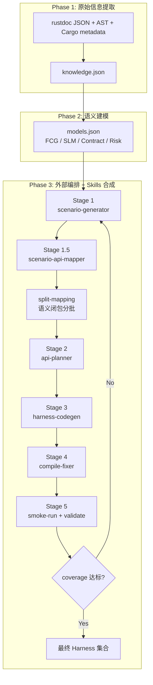

# SERAPH: SEmantic Rust Agent-driven Program Harness Synthesis

> 面向 Rust 库的语义感知 Fuzz Harness 自动合成系统设计方案（v5 — 一致性重构版）

## 0. v5 修订清单

本版不再在 v4 的基础上继续“局部打补丁”，而是围绕**阶段接口一致性**进行重构。核心修订如下：

1. **收敛 Stage 1 / Stage 1.5 职责边界**
   - Stage 1 只负责生成场景和选择 capability，不再在 Stage 1 内执行第二轮 capability→API 展开。
   - Stage 1.5 统一承担 capability→API 映射职责。

2. **删除主流程中的 `harness-router`**
   - `harness-router` 在 v4 中只存在于概念层，没有进入真实执行闭环。
   - v5 将主流程控制权明确交给外部编排脚本 `run.sh` 与 `coverage.json`。
   - `harness-router` 如需保留，仅作为未来扩展，不再是核心路径的一部分。

3. **澄清 `knowledge.json` 与 `models.json` 的数据边界**
   - `knowledge.json` 只保存 Phase 1 的**原始提取数据**。
   - `models.json` 只保存 Phase 2 的**语义建模结果**。
   - 风险摘要、能力摘要、契约、SLM、能力索引等均以 `models.json` 为准。

4. **引入稳定 ID 体系**
   - capability 使用 `cap_id`
   - type 使用 `type_id`
   - API 使用 `api_id`
   - trait 使用 `trait_id`
   - 所有阶段间 join 均基于 ID，而不是名字字符串。

5. **将 FCG 收敛为“类型中心 capability + 稳定映射索引”**
   - capability 不再默认等同于模块，而是以“类型 / 模块入口 + 角色”作为节点锚点。
   - 在 Phase 2 的 FCG 中显式建立 capability→API 的稳定映射。
   - Stage 1.5 不再只依赖“API 名称语义猜测”。

6. **统一中间产物 Schema**
   - `scenario.json`
   - `api_mapping.json`
   - `api_plan_XX.json`
   - `coverage.json`
   - 这些文件在文中仅保留一套权威格式。

7. **覆盖率状态简化为 3 态**
   - `targeted`
   - `attempted`
   - `validated`
   - 失败计数与状态分离维护，不再使用 `generated/compiled` 两个中间状态。

8. **补齐 Stage 3 / Stage 4 的语义护栏**
   - Stage 3 注入 SLM 简化版（`fuzzable_states` + `forbidden_transitions`）。
   - Stage 4 编译修复保留 `api_plan_XX.json` 与 SLM 约束，避免“修到能编译但破坏语义”。

9. **API 分批改为“语义闭包优先 + 数量上限约束”**
   - 每批目标 API 上限统一为 `<= 8`
   - 构造器、核心操作、必要清理 API 必须尽量保留在同一子映射中。

10. **补齐 fuzz workspace bootstrap**
    - 初始化 `cargo fuzz` 工程
    - 绑定目标 crate 的 path dependency
    - 记录目标 crate 的实际 import 名称
    - 生成 harness 时禁止再使用 `target_lib::...` 这类占位写法。

11. **统一命名和脚本行为**
    - `api_plan_{round}_{sub}.json` 按轮次与子映射独立命名，避免覆盖
    - `run.sh`、`s3-context`、`s3-coverage` 与 schema 保持一一对应。

12. **完善 crash 分类**
    - 主分类：`library_bug` / `misuse` / `resource` / `needs_review`
    - 推荐结合 Sanitizer 与 debug info 做辅助判断。

13. **补齐动态命中证明与统一终止判定**
    - Stage 3 生成 `SERAPH_STEP_ENTER/OK` 执行命中标记
    - Stage 5 基于命中标记做 per-API validate 与失败归因
    - 终止条件由 `s3-coverage --should-stop` 统一判定，而不是散落在 `run.sh` 内部

---

## 1. 问题本质分析

现有 harness 合成工作的核心缺陷不是“不能调用 API”，而是**缺乏使用意图（usage intent）**。

| 维度 | 现有方法（语法驱动） | 本方案（语义驱动） |
|------|----------------------|---------------------|
| 出发点 | API 签名类型匹配 | “我要用这个库完成什么任务” |
| API 选择 | 返回值→参数的类型链 | 围绕一个功能场景的 API 子集 |
| 状态构造 | 随机值 / 默认值 | 满足前置条件的有意义状态 |
| 错误处理 | `unwrap()` 一切 | 区分应处理错误与不应发生错误 |
| 维护者认可度 | “我们不会这样用” | “这确实是一个合理的使用场景” |

本方案的学术创新点仍然保持不变，但在 v5 中强调：**创新必须建立在实现闭环可落地的前提上**。

1. Functional Capability Graph (FCG)
2. State Lifecycle Model (SLM)
3. Contract-Guided Generation
4. Scenario-Driven Synthesis
5. Skills-Based Prompt Architecture
6. Deterministic Orchestration + External Validation（v5 新强调）

---

## 2. 设计约束与一致性原则

### 2.1 单一控制面原则

LLM 不负责维护全局状态。全局状态只能由外部编排层维护：

- `knowledge.json`
- `models.json`
- `coverage.json`
- `target_crate.json`
- `workspace/fuzz/`

LLM 的职责仅限于生成以下局部产物：

- `scenario.json`
- `api_mapping.json`
- `api_plan_XX.json`
- `harness_RRR_SS.rs`

### 2.2 单一职责阶段原则

每个 Stage 只做一件事：

1. Stage 1：定义“想做什么”
2. Stage 1.5：定义“涉及哪些 API”
3. Stage 2：定义“这些 API 应如何按语义顺序调用”
4. Stage 3：定义“如何把计划变成代码”
5. Stage 4：定义“如何修复编译错误且不破坏场景语义”
6. Stage 5：定义“外部验证结果如何反馈到覆盖率状态”

### 2.3 稳定 ID 原则

除展示字段外，所有跨阶段连接都必须使用稳定 ID：

- `cap_id`
- `type_id`
- `api_id`
- `trait_id`

名字字符串只用于：

- 给 LLM 阅读
- 生成日志
- 方便人工理解

### 2.4 原始数据 / 建模结果分离原则

- `knowledge.json` 是“砖块”
- `models.json` 是“建筑图纸”

任何“能力摘要”“风险摘要”“契约摘要”“SLM 摘要”都属于建模结果，不应混回原始抽取层。

### 2.5 覆盖率口径原则

一个 API 只有在以下条件满足时才可计入覆盖：

1. 它被某个已生成 harness 显式针对
2. harness 成功编译并进入 smoke run
3. 验证日志中出现该 API 的 `SERAPH_STEP_OK:<step_no>:<api_id>`，或它被定位为触发 `library_bug` 的当前活动 API
4. 本次结果不是因为日志缺失而进入 `needs_review`

因此，v5 的覆盖率口径为：

> **covered = validated dynamic use**

而不是“被某个 harness 提到过”。

---

## 3. 整体架构（Pipeline）



### 3.1 v5 的关键闭环

在 v5 中，闭环是：

`场景 → API 映射 → API 计划 → 代码 → 编译修复 → 外部验证 → 覆盖率状态`

而不是：

`Prompt → Prompt → Prompt`

这意味着：

- LLM 只负责生成中间产物
- 外部工具负责验证和推进状态
- 所有“是否继续”的判断均由外部编排决定

---

## 4. Phase 1：信息提取

### 4.1 提取手段

| 提取源 | 工具/方法 | 获取内容 |
|--------|-----------|----------|
| rustdoc JSON | `cargo +nightly doc --document-private-items` + `--output-format json` | public items、签名、文档、impl、trait |
| 源码 AST | `syn` / `ra_ap_syntax` | `unsafe`、`panic!`、`unwrap`、索引、`Drop`、`extern "C"` |
| `cargo metadata` | Cargo 官方元数据接口 | package 名、lib target 名、feature、依赖边界 |
| `Cargo.toml` | 直接解析 | feature gate、crate 类型、workspace 关系 |
| 文档示例 | rustdoc examples 提取 | examples 索引 |

### 4.2 需要提取的原始信息

Phase 1 只提取“事实”，不做语义推理。核心字段包括：

1. API 结构信息
   - 模块路径
   - item 类型
   - 完整签名
   - receiver 语义
   - 返回类型形态
   - 泛型参数与 where 子句

2. 类型系统信息
   - struct / enum / type alias
   - 字段 / 变体
   - private / public 构造限制
   - `#[non_exhaustive]`
   - `repr(...)`
   - builder / constructor / default

3. trait 定义与 impl surface
   - `trait_registry`：required / provided methods、associated types / constants、supertraits、unsafe trait 标记
   - `trait_impl_registry`：public trait impl surface、known implementors、条件 impl、associated type / const bindings

4. 文档语义原文
   - `# Panics`
   - `# Errors`
   - `# Safety`
   - `# Examples`
   - 第一段概述

5. 原始风险面
   - `unsafe` 块
   - FFI 边界
   - panic 点
   - `panic in Drop`
   - `repr(packed)`
   - 条件 impl
   - 生命周期敏感返回值

6. examples 索引
   - example ID
   - 涉及 API
   - 代码位置
   - 能力标签

### 4.3 `knowledge.json` 与上下文分层视图

说明：

- 仓库内**实际落地**的 Phase 1 权威原始 schema 应以 `seraph-types::Knowledge` 为准
- 其核心是归一化实体集合：`crate_meta`、`modules`、`types`、`apis`、`symbols`、`trait_registry`、`trait_impl_registry`、`examples`、`risk_facts`
- 下面的 `level_0/1/2/3` 示例是为了说明 Phase 3 如何被 `s3-context` 分层消费，可作为派生缓存 / 上下文视图，不要求与磁盘上的原始 JSON 一模一样

```json
{
  "crate_name": "serde_json",
  "crate_import_name": "serde_json",
  "crate_doc": "JSON serialization file format",
  "public_api_count": 47,
  "default_features": ["std"],
  "level_0_summary": {
    "one_line": "Rust 的 JSON 解析与序列化库",
    "key_types": ["Value", "Map", "Error"]
  },
  "level_1_type_surface": [
    {
      "anchor_kind": "module_entry",
      "anchor_module_id": "mod_001",
      "anchor_type_id": null,
      "path": "serde_json",
      "doc_summary": "顶层 JSON 解析与序列化入口",
      "api_ids": ["fn_001", "fn_002", "fn_003"],
      "api_names": ["from_str", "from_slice", "from_reader"]
    },
    {
      "anchor_kind": "type",
      "anchor_module_id": "mod_001",
      "anchor_type_id": "type_001",
      "path": "serde_json::Value",
      "doc_summary": "通用 JSON 值表示",
      "api_ids": ["fn_015", "fn_016"],
      "api_names": ["pointer", "pointer_mut"]
    }
  ],
  "level_2_types": [
    {
      "type_id": "type_001",
      "path": "serde_json::Value",
      "kind": "enum",
      "constructors": [],
      "method_ids": ["fn_015", "fn_016"],
      "trait_impls": ["Clone", "Debug"]
    }
  ],
  "level_3_apis": [
    {
      "api_id": "fn_003",
      "path": "serde_json::from_reader",
      "module_id": "mod_001",
      "signature": "pub fn from_reader<R, T>(rdr: R) -> Result<T, Error> where R: Read, T: DeserializeOwned",
      "receiver": null,
      "generic_params": ["R", "T"],
      "where_clauses": ["R: Read", "T: DeserializeOwned"],
      "doc_full": "Deserializes an instance of type T from an IO stream of JSON.",
      "related_example_ids": ["ex_001"],
      "risk_markers": ["external_input"]
    }
  ],
  "trait_registry": [
    {
      "trait_id": "trait_001",
      "path": "serde::de::DeserializeOwned",
      "is_unsafe": false,
      "required_methods": [],
      "provided_methods": [],
      "associated_types": []
    }
  ],
  "trait_impl_registry": [
    {
      "trait_impl_id": "trait_impl_001",
      "target_type_id": "type_001",
      "trait_id": "trait_001",
      "trait_ref_text": "serde::de::DeserializeOwned",
      "trait_canonical_path": "serde::de::DeserializeOwned"
    }
  ],
  "examples_index": [
    {
      "example_id": "ex_001",
      "source_api_id": "fn_003",
      "involved_api_ids": ["fn_003"],
      "code_ref": {"file": "src/de.rs", "start_line": 100, "end_line": 105}
    }
  ],
  "raw_risk_surface": {
    "unsafe_functions": [],
    "ffi_boundaries": [],
    "panic_points": [],
    "repr_packed_types": [],
    "panic_in_drop_types": []
  }
}
```

其中，`level_1_type_surface` 提供的是 **Phase 1 的锚点目录**。  
它的 `anchor_kind / anchor_module_id / anchor_type_id` 必须与 Phase 2 的 FCG capability 复用同一套坐标系，避免 Stage 1.5 在 capability 与锚点概览之间再次做名称猜测。
其中当 `anchor_kind = "type"` 时，`anchor_type_id` 就是该锚点对应的稳定 `type_id`。

### 4.4 Phase 1 输出边界

`knowledge.json` 中**不应**出现以下字段：

- `api_coverage_tracker`
- `capability_api_index`
- `type_synthesis_overview`
- `contract_summary`
- `risk_summary_oneliner`

这些都属于 Phase 2 的语义建模结果。

---

## 5. Phase 2：语义建模

Phase 2 读取 `knowledge.json`，产出唯一语义模型文件 `models.json`。

### 5.1 Functional Capability Graph (FCG)

FCG 的职责是把 API 从“签名空间”转换为“能力空间”。

在 v5 中，FCG 采用**类型中心 capability** 方案，而不是“模块 = capability”的旧方案。

#### 核心定义

一个 capability 节点由两部分组成：

1. **锚点（anchor）**
   - 优先使用 public nominal type
   - 若 API 没有 owner type，则使用 synthetic module entry 作为锚点

2. **角色（role）**
   - `construction`
   - `query`
   - `mutation`
   - `iteration`
   - `conversion`
   - `finalization`
   - `ffi`

因此，一个 capability 本质上是：

> **(type / module_entry) + role**

例如：

- `cap::serde_json::module_entry::construction`
- `cap::serde_json::Value::query`
- `cap::serde_json::Value::mutation`
- `cap::hashbrown::map::HashMap::iteration`

#### 为什么采用类型中心 capability

因为对 Rust 库而言，真实使用语义通常由以下因素决定：

- API 的 owner type
- receiver 语义（`&self` / `&mut self` / `self`）
- 对象生命周期与状态机
- 类型之间的构造 / 返回 / 转换关系

模块更多反映“代码放在哪里”，而类型更能反映“调用时手里拿着什么对象”。  
对于后续的 planner、codegen 与 SLM 对接，类型中心建模更贴近真实代码结构。

在 v5 中，FCG 产出四类关键信息：

1. capability 节点
2. capability 链
3. capability→API 稳定索引
4. Stage 1 使用的压缩摘要

```json
{
  "fcg": {
    "capabilities": [
      {
        "cap_id": "cap::serde_json::module_entry::construction",
        "anchor_kind": "module_entry",
        "anchor_module_id": "mod_001",
        "anchor_type_id": null,
        "role": "construction",
        "name": "serde_json 入口解析",
        "description": "从字符串、字节或 Reader 进入 JSON 值构造流程",
        "api_ids": ["fn_001", "fn_002", "fn_003"],
        "entry_api_ids": ["fn_001", "fn_002", "fn_003"],
        "connects_to": ["cap::serde_json::Value::query", "cap::serde_json::Value::mutation"]
      },
      {
        "cap_id": "cap::serde_json::Value::query",
        "anchor_kind": "type",
        "anchor_module_id": "mod_001",
        "anchor_type_id": "type_001",
        "role": "query",
        "name": "Value 查询",
        "description": "围绕 Value 的路径查询、索引访问与只读检查",
        "api_ids": ["fn_015"],
        "entry_api_ids": [],
        "connects_to": ["cap::serde_json::Value::mutation"]
      },
      {
        "cap_id": "cap::serde_json::Value::mutation",
        "anchor_kind": "type",
        "anchor_module_id": "mod_001",
        "anchor_type_id": "type_001",
        "role": "mutation",
        "name": "Value 修改",
        "description": "围绕 Value 的可变访问、路径写入与局部更新",
        "api_ids": ["fn_016"],
        "entry_api_ids": [],
        "connects_to": []
      }
    ],
    "capability_chains": [
      [
        "cap::serde_json::module_entry::construction",
        "cap::serde_json::Value::query",
        "cap::serde_json::Value::mutation"
      ]
    ],
    "capability_api_index": {
      "cap::serde_json::module_entry::construction": ["fn_001", "fn_002", "fn_003"],
      "cap::serde_json::Value::query": ["fn_015"],
      "cap::serde_json::Value::mutation": ["fn_016"]
    },
    "stage1_summary": {
      "capability_cards": [
        {
          "cap_id": "cap::serde_json::module_entry::construction",
          "name": "serde_json 入口解析",
          "anchor_path": "serde_json",
          "role": "construction",
          "description": "从字符串、字节或 Reader 进入 JSON 值构造流程"
        },
        {
          "cap_id": "cap::serde_json::Value::query",
          "name": "Value 查询",
          "anchor_path": "serde_json::Value",
          "role": "query",
          "description": "围绕 Value 的路径查询、索引访问与只读检查"
        },
        {
          "cap_id": "cap::serde_json::Value::mutation",
          "name": "Value 修改",
          "anchor_path": "serde_json::Value",
          "role": "mutation",
          "description": "围绕 Value 的可变访问、路径写入与局部更新"
        }
      ],
      "recommended_chains": [
        [
          "cap::serde_json::module_entry::construction",
          "cap::serde_json::Value::query",
          "cap::serde_json::Value::mutation"
        ]
      ],
      "one_liner": "本库提供 3 项核心能力：serde_json 入口解析、Value 查询、Value 修改。典型能力链：入口解析→Value 查询→Value 修改。"
    }
  }
}
```

`stage1_summary` 在 v5 中是**压缩结构化摘要**，不是单纯一段 prose。  
原因是 Stage 1 需要直接输出 `selected_capability_ids`，因此输入里必须显式携带 `cap_id`、简短说明和典型能力链。

#### capability 构建规则

1. **锚点选择**
   - 若 API 有 `owner_type_id`，则 capability 锚定到该 type
   - 若 API 没有 `owner_type_id`，则 capability 锚定到其 public anchor module 的 synthetic module entry

2. **角色归类**
   - `construction`：构造器、返回 `Self` / owner type 的入口 API、创建对象的 free function
   - `query`：只读访问、检查、getter、borrowed view
   - `mutation`：`&mut self` 修改器、entry editor、状态更新
   - `iteration`：返回 iterator / drain / cursor / view producer 的 API
   - `conversion`：`into_*` / `to_*` / `as_*` 中跨语义面转换的 API
   - `finalization`：`close` / `finish` / `shutdown` / 终态提交
   - `ffi`：显式 ABI 边界或 FFI 相关 public surface

3. **边构建**
   - 同一锚点内部：`construction` 可连向该锚点上的其他角色 capability
   - 跨锚点：若某个 capability 中的 API 返回了另一个 public type 的锚点，则连向目标 type 的相关 capability
   - 若目标类型文本存在歧义，则宁可不连，避免错误链路

4. **保守性原则**
   - FCG 允许漏连，不允许明显误连
   - 因此 capability 链是“可证据支持的使用流”，不是强行补全的全图

#### v5 对 FCG 渐进式加载的定义

v5 不再使用“Stage 1 内部的第二轮 LLM 交互”来展开 capability 详情。

改为：

1. Stage 1：只给压缩 capability 摘要
   - 至少包含 `cap_id`、`name`、`role`、`anchor_path`、`recommended_chains`
2. Stage 1.5：给 `capability_api_index` + Level 1 类型锚点概览，完成 API 映射
   - 其中 capability 锚点与 `knowledge.level_1_type_surface` 必须共用同一套 anchor 坐标

这样，渐进式加载仍然存在，但被**收敛到阶段边界**，不再与 Stage 1.5 重复。

### 5.2 State Lifecycle Model (SLM)

SLM 用来表达“某类对象在哪些状态下允许调用哪些方法”。

#### 核心类型判定

对类型 `T` 评分：

- `+3`：实现 `Drop`
- `+2`：有 `>= 3` 个 `&mut self` 方法
- `+2`：文档中出现 state / phase / lifecycle 等词
- `+1`：被多个 API 返回
- `+1`：存在 `# Panics` 与对象内部状态相关

判定规则：

- `>= 3`：构建完整 SLM
- `1-2`：构建简化 SLM
- `0`：标记为 stateless

#### Error 状态语义澄清

SLM 中的 `Error` 状态只在以下条件满足时存在：

1. 错误是对象内部的持久状态，而非 `Result<T, E>` 的返回值
2. 存在恢复 API（如 `reset()`、`retry()`、`reconnect()`）

如果没有恢复路径，则不应强行引入 `Error` 状态。

```json
{
  "slm": [
    {
      "type_id": "type_010",
      "path": "crate::Parser",
      "states": ["Uninitialized", "Configured", "Active", "Closed"],
      "transitions": [
        {"from": "Uninitialized", "to": "Configured", "via_api_id": "fn_021", "preconditions": []},
        {"from": "Configured", "to": "Active", "via_api_id": "fn_022", "preconditions": []},
        {"from": "Active", "to": "Closed", "via_api_id": "fn_030", "preconditions": []}
      ],
      "fuzzable_states": ["Active"],
      "forbidden_transitions": [
        {"from": "Closed", "via_api_id": "fn_026", "reason": "documented panic: parser already closed"}
      ]
    }
  ]
}
```

### 5.3 API Contract Table

Contract Table 将文档与类型系统中的隐式规则结构化：

- `preconditions`
- `postconditions`
- `panic_conditions`
- `error_conditions`
- `safety`
- `side_effects`
- `generic_constraints`

```json
{
  "api_contracts": [
    {
      "api_id": "fn_003",
      "path": "serde_json::from_reader",
      "preconditions": ["输入流必须提供有效字节序列"],
      "postconditions": ["返回 Ok(T) 或 Err(Error)"],
      "panic_conditions": [],
      "error_conditions": ["输入不是合法 JSON"],
      "safety": null,
      "generic_constraints": {
        "params": [
          {
            "name": "R",
            "direct_bounds": ["Read"],
            "strategy": "C",
            "bug_hunting_value": "HIGH",
            "synthesis_guidance": "可构造自定义 Read 实现测试短读、中断、重复错误"
          },
          {
            "name": "T",
            "direct_bounds": ["DeserializeOwned"],
            "strategy": "B",
            "bug_hunting_value": "MEDIUM",
            "synthesis_guidance": "优先使用已知类型，不默认自定义反序列化实现"
          }
        ]
      }
    }
  ]
}
```

### 5.4 Risk Surface Map

Risk Surface Map 是对原始风险面数据的语义化重排，供 Stage 1、Stage 3 与 coverage prioritization 使用。

```json
{
  "risk_surface_map": {
    "api_risks": [
      {
        "api_id": "fn_003",
        "risk_level": "HIGH",
        "reasons": ["外部输入入口", "解析逻辑复杂", "泛型边界涉及 Read"],
        "recommended_fuzz_strategy": "原始字节流 + 自定义 Reader"
      }
    ],
    "type_synthesis_overview": {
      "generic_api_count": 12,
      "strategy_distribution": {"A": 3, "B": 4, "C": 4, "D": 1},
      "one_liner": "12 个泛型 API，其中 4 个适合自定义类型合成"
    },
    "rust_feature_risks": [
      {
        "feature": "conditional_impl",
        "apis_affected": ["fn_020"],
        "risk": "某些泛型实例化下方法不可用"
      }
    ]
  }
}
```

### 5.5 Custom Type Synthesis Strategy (CTS)

CTS 在 v5 中仍然不是独立的顶层文件，而是：

- Phase 2 中的建模原则
- Phase 3 中的计划与代码生成策略

#### 策略分类

- `A`：直接使用库内已有类型
- `B`：使用标准库或已知实现者
- `C`：构造自定义安全类型 / wrapper / trait object / safe trait impl
- `D`：涉及 unsafe trait 或硬性安全边界，只使用现有实现，不自定义

#### 假设违反类型

- 行为假设
- 资源假设
- 一致性假设
- 控制流假设
- 生命周期 / 所有权假设

---

## 6. Phase 3：外部编排 + Skills 驱动合成

### 6.1 主流程职责表

| Stage | 组件 | 主要输入 | 主要输出 | 责任 |
|-------|------|----------|----------|------|
| 1 | `scenario-generator` | `models.fcg.stage1_summary`、风险摘要、`coverage.next_priority`、未覆盖 API 名称提示 | `scenario.json` | 定义场景与 capability 选择 |
| 1.5 | `scenario-api-mapper` | `scenario.json`、已选 capability 卡片详情、Level 1 类型锚点概览（与 FCG 共用 anchor 坐标）、`capability_api_index`、未覆盖 API 详情 | `api_mapping.json` | capability→API 映射 |
| split | `s3-context --split-mapping` | `api_mapping.json` | `sub_mapping_*.json` | 语义闭包分批 |
| 2 | `api-planner` | `sub_mapping`、Level 2/3、SLM、Contract、Trait 定义 | `api_plan_XX.json` | 有序调用计划 |
| 3 | `harness-codegen` | `api_plan_XX.json`、Level 3、examples、风险标注、SLM 简化版 | `harness_RRR_SS.rs` | 生成 harness |
| 4 | `compile-fixer` | harness、rustc 输出、`api_plan_XX.json`、相关签名、SLM 简化版 | 修复后的 harness | 修复编译错误但不破坏语义 |
| 5 | `s3-coverage --validate` | smoke run 输出 | `coverage.json` 更新 | 外部验证与反馈 |

### 6.2 Skill 1：`scenario-generator`

#### 输入

- crate 名称
- crate 一句话描述
- `models.fcg.stage1_summary`
  - 其中应包含压缩 capability 卡片、典型 capability 链、`one_liner`
- `models.risk_surface_map.type_synthesis_overview.one_liner`
- Rust 特性风险摘要
- `coverage.next_priority`
- 未覆盖 API 名称列表（仅作提示）

#### 输出格式：`scenario.json`

```json
{
  "scenario_id": "scn_003",
  "round": 3,
  "name": "流式 JSON 读取与路径查询",
  "description": "从 Reader 读取 JSON，按路径查询嵌套字段，修改后重新输出",
  "scenario_type": "functional",
  "selected_capability_ids": [
    "cap::serde_json::module_entry::construction",
    "cap::serde_json::Value::query",
    "cap::serde_json::Value::mutation"
  ],
  "fuzz_variation_points": ["输入字节流", "查询路径", "修改值"],
  "target_api_name_hints": ["from_reader", "Value::pointer", "Value::pointer_mut"],
  "semantic_constraints": [
    "场景必须是合理的库使用方式",
    "至少覆盖 1 个未验证 API"
  ]
}
```

#### 关键规则

- Stage 1 不输出 API ID
- Stage 1 不承担 API 精选职责
- `target_api_name_hints` 只是提示，不是权威映射

### 6.3 Skill 1.5：`scenario-api-mapper`

#### 输入

- `scenario.json`
- `models.fcg.capabilities` 中被 `selected_capability_ids` 选中的 capability 卡片
- `knowledge.level_1_type_surface`
- `models.fcg.capability_api_index`
- `coverage.json` 中未验证 / 未耗尽 API 详情

#### 输出格式：`api_mapping.json`

```json
{
  "mapping_id": "map_003_01",
  "scenario_id": "scn_003",
  "scenario_name": "流式 JSON 读取与路径查询",
  "scenario_description": "从 Reader 读取 JSON，按路径查询嵌套字段，修改后重新输出",
  "selected_capability_ids": [
    "cap::serde_json::module_entry::construction",
    "cap::serde_json::Value::query",
    "cap::serde_json::Value::mutation"
  ],
  "api_mapping": [
    {
      "api_id": "fn_003",
      "api_path": "serde_json::from_reader",
      "capability_id": "cap::serde_json::module_entry::construction",
      "role": "entry",
      "reason": "从 Reader 解析是该场景的入口"
    },
    {
      "api_id": "fn_015",
      "api_path": "serde_json::Value::pointer",
      "capability_id": "cap::serde_json::Value::query",
      "role": "core",
      "reason": "使用路径查询嵌套字段"
    },
    {
      "api_id": "fn_016",
      "api_path": "serde_json::Value::pointer_mut",
      "capability_id": "cap::serde_json::Value::mutation",
      "role": "core",
      "reason": "对目标路径执行可变访问并写入新值"
    }
  ],
  "types_needed": [
    {"type_id": "type_001", "path": "serde_json::Value"}
  ],
  "targeted_api_ids": ["fn_003", "fn_015", "fn_016"],
  "targeted_api_names": ["serde_json::from_reader", "serde_json::Value::pointer", "serde_json::Value::pointer_mut"],
  "capability_trace": {
    "cap::serde_json::module_entry::construction": ["fn_003"],
    "cap::serde_json::Value::query": ["fn_015"],
    "cap::serde_json::Value::mutation": ["fn_016"]
  }
}
```

#### v5 的关键修复

Stage 1.5 不再只拿“模块 + API 名称列表”去猜测映射，而是显式使用**类型中心 capability 索引**。

同时，`scenario-api-mapper` 不需要重新推断 capability 的锚点归属。  
它直接消费：

- `scenario.json` 中的 `selected_capability_ids`
- `models.fcg.capabilities` 中对应的 capability 语义卡片
- `models.fcg.capability_api_index`
- `knowledge.level_1_type_surface` 中与 capability 共享的 anchor 坐标

因此 Stage 1.5 做的是**索引展开与场景裁剪**，而不是二次 capability 建模。

#### 一致性规则

- `targeted_api_ids` 必须等于 `api_mapping[].api_id` 的有序投影
- `targeted_api_names` 只用于日志与展示，不能作为跨阶段 join key

### 6.4 `split-mapping`：语义闭包分批

如果 `targeted_api_ids.len() > 8`，则必须拆分。

#### 分批规则

1. 先按 capability trace 建图
2. 保持以下 API 尽量在同一批：
   - 构造器
   - 首个核心操作
   - 必要清理 API
3. 同一对象的状态迁移链不得被无意义切断
4. 辅助 API 优先被移动到下一批
5. 每批硬上限为 `8`

拆分后的每个 `sub_mapping_XX.json` 仍使用与 `api_mapping.json` 相同的 schema，但以下字段必须同步收缩为子集：

- `selected_capability_ids`
- `api_mapping`
- `targeted_api_ids`
- `targeted_api_names`
- `capability_trace`
- `types_needed`

也就是说，`sub_mapping_XX.json` 必须是一个**自洽的局部映射**，而不是“只删了部分 API、其余字段还保留全量场景信息”的半残缺对象。

### 6.5 Skill 2：`api-planner`

#### 输入

- `sub_mapping_XX.json`
- `knowledge.level_2_types`
- `knowledge.level_3_apis`
- `models.slm`
- `models.api_contracts`
- `knowledge.trait_registry`
- `knowledge.trait_impl_registry`（如需判断 public impl surface / known implementors）

#### 输出格式：`api_plan_XX.json`

```json
{
  "plan_id": "plan_003_01",
  "scenario_id": "scn_003",
  "mapping_id": "map_003_01",
  "api_ids": ["fn_003", "fn_015", "fn_016"],
  "types_needed": ["type_001"],
  "required_trait_ids": ["trait_001"],
  "stateful_type_ids": [],
  "ordered_steps": [
    {
      "step_no": 1,
      "api_id": "fn_003",
      "purpose": "从输入流解析 JSON",
      "state_before": null,
      "state_after": "ValueReady",
      "arg_sources": {"rdr": "fuzzer_input.reader"},
      "preconditions": [],
      "result_handling": "if Err(_) { return; }"
    },
    {
      "step_no": 2,
      "api_id": "fn_015",
      "purpose": "按路径查询字段",
      "state_before": "ValueReady",
      "state_after": "ValueReady",
      "arg_sources": {"pointer": "fuzzer_input.pointer"},
      "preconditions": ["pointer 必须是 UTF-8 字符串"],
      "result_handling": "if None { return; }"
    },
    {
      "step_no": 3,
      "api_id": "fn_016",
      "purpose": "按路径修改字段",
      "state_before": "ValueReady",
      "state_after": "ValueReady",
      "arg_sources": {
        "pointer": "fuzzer_input.pointer",
        "new_value": "fuzzer_input.replacement_value"
      },
      "preconditions": ["pointer 必须指向可写入位置"],
      "result_handling": "if None { return; }"
    }
  ],
  "type_synthesis": {
    "R": {
      "strategy": "C",
      "assumption_violated": "行为假设",
      "construction": "custom Read implementation with short-read and injected error"
    }
  },
  "invariants": [
    "禁止在解析前调用 Value 查询 API",
    "禁止把文档声明可能失败的 Result 直接 unwrap"
  ],
  "codegen_constraints": {
    "prefer_raw_bytes": false,
    "inject_simplified_slm": false,
    "disallow_unwrap_on_option": true
  }
}
```

#### 一致性规则

- `api_ids` 必须等于 `ordered_steps[].api_id` 去重后的有序投影
- `types_needed`、`required_trait_ids` 只保留 Stage 3 真正需要的最小集合

### 6.6 Skill 3：`harness-codegen`

#### 输入

- `api_plan_XX.json`
- 涉及 API 的 Level 3 详情
- top-3 相关 doc examples
- `models.risk_surface_map.api_risks`
- 如涉及有状态类型，则注入 SLM 简化版：
  - `fuzzable_states`
  - `forbidden_transitions`
- `crate_import_name`

#### 生成规则

1. 默认使用 `Arbitrary` 生成结构化输入
2. 对解析器入口 API，可直接使用 `&[u8]`
3. 禁止默认 `unwrap()` / `expect()` 处理可恢复失败
4. 生成代码必须使用真实 crate import 名称，不得使用 `target_lib`
5. 如果 `type_synthesis.strategy == "C"`，则生成自定义类型
6. 如果 `stateful_type_ids` 非空，则必须遵守 SLM 简化版约束
7. 每个 `ordered_step` 在调用前向 `stderr` 输出 `SERAPH_STEP_ENTER:<step_no>:<api_id>`，在成功返回后输出 `SERAPH_STEP_OK:<step_no>:<api_id>`

#### 输出

- `workspace/fuzz/fuzz_targets/harness_RRR_SS.rs`

### 6.7 Skill 4：`compile-fixer`

#### 输入

- 失败的 harness 源码
- 完整 rustc 错误输出
- `api_plan_XX.json`
- 相关 API 的正确签名
- SLM 简化版（如果有）
- 当前修复轮次

#### 修复约束

1. 修复不能删除 `api_plan_XX.json.api_ids` 中的核心 API
2. 修复不能破坏 `api_plan_XX.json` 中的调用顺序语义
3. 修复不能删除或打乱 `SERAPH_STEP_ENTER/OK` 轨迹标记
4. 如果某个错误只能通过移除核心 API 才能修复，则本轮失败，交回外部编排重新生成

#### 修复策略

- 第 1-2 轮：精确修复
- 第 3-4 轮：局部结构调整
- 第 5 轮：保留核心路径的降级修复

### 6.8 Stage 5：Smoke Run 与 Crash 分类

Smoke run 使用：

```bash
cargo +nightly fuzz run <target> -- -max_total_time=10
```

推荐同时开启：

- `RUSTFLAGS="-C debuginfo=2"`
- Sanitizer 输出保留

此外，Stage 3 生成的 harness 必须把 `SERAPH_STEP_ENTER/OK` 标记写入 `stderr`，以便 `s3-coverage --validate` 从 `smoke_err.log` 中恢复真实执行轨迹。

#### 分类规则

| 类别 | 判断依据 | 处理 |
|------|----------|------|
| `library_bug` | crash / sanitizer 指向目标库，且不是文档声明的预期 panic | 记入 `found_bugs`，对应 API 计入 `validated` |
| `misuse` | crash 指向 harness 代码，或触发了文档声明的前置条件 panic | `misuse_fails += 1` |
| `resource` | OOM / timeout | `misuse_fails += 1` |
| `needs_review` | 归属模糊 | 放入 review 队列，不计入 validated |

为保持 v5 状态机简洁，`resource` 暂时并入退避计数 `misuse_fails`；如果后续实验表明资源类失败需要单独建模，再拆分出 `resource_fails`。

---

## 7. 覆盖率状态机与 `coverage.json`

### 7.1 三态定义

v5 中每个 API 只维护以下三种主状态：

1. `targeted`
   - 在 Stage 1.5 被映射到某个场景中

2. `attempted`
   - 在 harness 进入编译 / 运行路径前登记
   - 无论编译失败、误用失败还是运行失败，状态都保留为 `attempted`

3. `validated`
   - smoke run 成功
   - 或发现真实 `library_bug`

失败计数单独维护：

- `compile_fails`
- `misuse_fails`

### 7.2 状态转移

```text
Stage 1.5 完成映射           -> targeted
进入 build / fix / smoke 流程 -> attempted
smoke 成功或真实库 bug        -> validated
```

#### 动态命中证明与失败归因

`harness-codegen` 必须在 `stderr` 输出两类标记：

- `SERAPH_STEP_ENTER:<step_no>:<api_id>`
- `SERAPH_STEP_OK:<step_no>:<api_id>`

`s3-coverage --validate` 按以下规则处理：

1. 出现 `STEP_OK` 的 API，说明该 API 已被动态执行且成功返回，可升级为 `validated`
2. 若分类为 `library_bug`，则最后一个 `STEP_ENTER` 且没有对应 `STEP_OK` 的活动 API 也记为 `validated`，并关联到 `found_bugs`
3. 若分类为 `misuse` / `resource`，则只给当前活动 API 增加 `misuse_fails`；此前已经 `STEP_OK` 的 API 不回退
4. `mark-compile-fail` 无法细分到单步时，对该 harness 中尚未 `validated` 的 API 统一增加 `compile_fails`

### 7.3 覆盖率计算

```text
covered_api_ids   = { api | status == validated }
exhausted_api_ids = { api | compile_fails >= 3 or misuse_fails >= 5 }
uncovered_api_ids = total_api_ids - covered_api_ids - exhausted_api_ids
coverage_rate     = |covered_api_ids| / |total_api_ids|
```

### 7.4 权威格式：`coverage.json`

说明：

- `api_status` 是稀疏映射，只记录已经进入三态机的 API；缺失条目表示该 API 尚未被 `targeted`

```json
{
  "total_api_ids": ["fn_001", "fn_002", "fn_003", "fn_015", "fn_016", "fn_020"],
  "api_status": {
    "fn_003": "validated",
    "fn_015": "attempted",
    "fn_016": "targeted",
    "fn_020": "targeted"
  },
  "failed_attempts": {
    "fn_015": {
      "compile_fails": 0,
      "misuse_fails": 2,
      "last_reason": "documented panic triggered by invalid path"
    }
  },
  "covered_api_ids": ["fn_003"],
  "exhausted_api_ids": [],
  "uncovered_api_ids": ["fn_001", "fn_002", "fn_015", "fn_016", "fn_020"],
  "harnesses": {
    "harness_003_01": {
      "round": 3,
      "sub_index": 1,
      "scenario_id": "scn_003",
      "mapping_id": "map_003_01",
      "plan_id": "plan_003_01",
      "api_ids": ["fn_003", "fn_015", "fn_016"],
      "status": "attempted"
    }
  },
  "found_bugs": [],
  "needs_review": [],
  "next_priority": [
    {"api_id": "fn_015", "reason": "高风险查询路径，尚未验证"}
  ],
  "coverage_rate": 0.17
}
```

### 7.5 终止条件

- 覆盖率 `>= 95%`
- 或连续 `N` 轮没有新增 validated API，其中 `N = max(3, ceil(log2(total_api_count)))`
- 或 harness 总数达到 `min(50, total_api_count * 2)`

以上条件不应在 `run.sh` 中手写多套判断，而应统一由 `s3-coverage --should-stop` 基于 `coverage.json` 与当前轮次做判定。

---

## 8. 实现架构

### 8.1 技术选型

- Phase 1-2：Rust CLI
- Phase 3：外部 shell 编排 + OpenHarness 单轮 Skill 调用
- 验证：`cargo fuzz`

### 8.2 组件边界

| 组件 | 责任 |
|------|------|
| `s3-extract` | 生成 `knowledge.json` |
| `s3-model` | 生成 `models.json` |
| `s3-context` | 为各 Stage 构建最小上下文；提供 `split-mapping` |
| `s3-coverage` | 覆盖率状态、harness 注册、结果验证、终止条件判定 |
| `run.sh` | 唯一主编排脚本 |
| OpenHarness Skills | 生成场景、映射、计划、代码、修复 |

### 8.3 目录结构

```text
SERAPH/
├── crates/
│   ├── s3-extract/
│   ├── s3-model/
│   ├── s3-context/
│   └── s3-coverage/
├── skills/
│   ├── scenario-generator/
│   ├── scenario-api-mapper/
│   ├── api-planner/
│   ├── harness-codegen/
│   ├── compile-fixer/
│   └── shared-references/
├── external-skills/
│   └── rust-skills/
├── scripts/
│   ├── run.sh
│   └── bootstrap-fuzz-target.sh
└── workspace/
    ├── knowledge.json
    ├── models.json
    ├── coverage.json
    ├── target_crate.json
    ├── contexts/
    ├── sub_mappings/
    ├── plans/
    └── fuzz/
```

### 8.4 `bootstrap-fuzz-target.sh`

这个脚本负责补齐 v4 缺失的 fuzz workspace 初始化：

1. 若 `workspace/fuzz/` 不存在，则执行 `cargo fuzz init`
2. 通过 `cargo metadata` 获取目标 crate：
   - package 名
   - lib target 名
   - Rust import 名
3. 将目标 crate 作为 path dependency 写入 `workspace/fuzz/Cargo.toml`
4. 生成 `workspace/target_crate.json`

示例：

```json
{
  "package_name": "serde-json-wrapper",
  "crate_import_name": "serde_json_wrapper",
  "path": "/abs/path/to/target-crate"
}
```

`harness-codegen` 必须读取该文件中的 `crate_import_name` 来生成 import。

### 8.5 `s3-context` 的阶段化输入

#### Stage 1

- `knowledge.level_0_summary`
- `models.fcg.stage1_summary`
- `models.risk_surface_map.type_synthesis_overview.one_liner`
- `models.risk_surface_map.rust_feature_risks`
- `coverage.next_priority`
- `coverage.uncovered_api_ids` 对应的 API 名称摘要

#### Stage 1.5

- `scenario.json`
- `models.fcg.capabilities` 中被选中的 capability 卡片
- `knowledge.level_1_type_surface`
- `models.fcg.capability_api_index`
- `coverage.uncovered_api_ids` 的详细项

#### Stage 2

- `sub_mapping_XX.json`
- `knowledge.level_2_types`
- `knowledge.level_3_apis`
- `models.slm`
- `models.api_contracts`
- `knowledge.trait_registry`
- `knowledge.trait_impl_registry`

#### Stage 3

- `api_plan_XX.json`
- `knowledge.level_3_apis`
- `knowledge.examples_index` 检索出的 top-3
- `models.risk_surface_map.api_risks`
- 如有状态类型，则附加 SLM 简化版
- `target_crate.json`

#### Stage 4

- harness 源码
- rustc 完整输出
- `api_plan_XX.json`
- 相关 API 正确签名
- 如有状态类型，则附加 SLM 简化版

### 8.6 OpenHarness 配置原则

v5 不再使用 `entry_skill = harness-router`。OpenHarness 在本方案中被当作：

> **单次 Skill 调用执行器**

而不是全局控制器。

因此：

- 是否进入下一阶段，由 `run.sh` 决定
- 是否重试编译修复，由 `run.sh` 决定
- 是否终止迭代，由 `s3-coverage` + `run.sh` 决定

### 8.7 `run.sh`（权威主流程）

```bash
#!/bin/bash
set -euo pipefail
shopt -s nullglob

TARGET_CRATE="$1"
MAX_ROUNDS=50
COVERAGE_TARGET=95

mkdir -p ./workspace/contexts ./workspace/sub_mappings ./workspace/plans

echo "=== Phase 1: extract ==="
s3-extract --crate "$TARGET_CRATE" --output ./workspace/knowledge.json

echo "=== Phase 2: model ==="
s3-model --input ./workspace/knowledge.json --output ./workspace/models.json

echo "=== Bootstrap fuzz workspace ==="
./scripts/bootstrap-fuzz-target.sh "$TARGET_CRATE" ./workspace/fuzz ./workspace/target_crate.json

echo "=== Init coverage ==="
s3-coverage --init --knowledge ./workspace/knowledge.json --output ./workspace/coverage.json

ROUND=0

while true; do
  ROUND=$((ROUND + 1))

  if s3-coverage --should-stop \
        --state ./workspace/coverage.json \
        --round "$ROUND" \
        --max-rounds "$MAX_ROUNDS" \
        --target-rate "$COVERAGE_TARGET"; then
    break
  fi

  s3-context --stage 1 --output ./workspace/contexts/current_context.md
  oh run --skill scenario-generator \
         --context ./workspace/contexts/current_context.md \
         --output ./workspace/scenario.json

  s3-context --stage 1.5 --input ./workspace/scenario.json \
             --output ./workspace/contexts/current_context.md
  oh run --skill scenario-api-mapper \
         --context ./workspace/contexts/current_context.md \
         --output ./workspace/api_mapping.json

  s3-coverage --mark-targeted ./workspace/api_mapping.json --state ./workspace/coverage.json

  rm -rf ./workspace/sub_mappings
  mkdir -p ./workspace/sub_mappings
  s3-context --split-mapping ./workspace/api_mapping.json \
             --max-apis 8 \
             --output-dir ./workspace/sub_mappings/

  SUB_MAPPINGS=(./workspace/sub_mappings/*.json)
  if [ ${#SUB_MAPPINGS[@]} -eq 0 ]; then
    continue
  fi

  SUB_IDX=0
  for SUB_MAPPING in "${SUB_MAPPINGS[@]}"; do
    SUB_IDX=$((SUB_IDX + 1))
    HARNESS_NAME="harness_$(printf "%03d_%02d" $ROUND $SUB_IDX)"
    PLAN_PATH="./workspace/plans/api_plan_$(printf "%03d_%02d" $ROUND $SUB_IDX).json"

    s3-context --stage 2 --input "$SUB_MAPPING" \
               --output ./workspace/contexts/current_context.md
    oh run --skill api-planner \
           --context ./workspace/contexts/current_context.md \
           --output "$PLAN_PATH"

    s3-context --stage 3 --input "$PLAN_PATH" \
               --output ./workspace/contexts/current_context.md
    oh run --skill harness-codegen \
           --context ./workspace/contexts/current_context.md \
           --output ./workspace/fuzz/fuzz_targets/${HARNESS_NAME}.rs

    s3-coverage --register-target "${HARNESS_NAME}" \
                --plan "$PLAN_PATH" \
                --state ./workspace/coverage.json \
                --fuzz-dir ./workspace/fuzz

    s3-coverage --mark-attempt "${HARNESS_NAME}" --state ./workspace/coverage.json

    COMPILE_OK=false
    for RETRY in $(seq 1 5); do
      if cargo +nightly fuzz build "${HARNESS_NAME}" \
            --manifest-path ./workspace/fuzz/Cargo.toml 2> compile_err.log; then
        COMPILE_OK=true
        break
      fi

      s3-context --stage fix \
                 --input ./workspace/fuzz/fuzz_targets/${HARNESS_NAME}.rs \
                 --plan "$PLAN_PATH" \
                 --errors compile_err.log \
                 --output ./workspace/contexts/current_context.md
      oh run --skill compile-fixer \
             --context ./workspace/contexts/current_context.md \
             --output ./workspace/fuzz/fuzz_targets/${HARNESS_NAME}.rs
    done

    if [ "$COMPILE_OK" = false ]; then
      s3-coverage --mark-compile-fail "${HARNESS_NAME}" --state ./workspace/coverage.json
      continue
    fi

    if cargo +nightly fuzz run "${HARNESS_NAME}" \
          --manifest-path ./workspace/fuzz/Cargo.toml \
          -- -max_total_time=10 2> smoke_err.log; then
      SMOKE_EXIT=0
    else
      SMOKE_EXIT=$?
    fi

    s3-coverage --validate "${HARNESS_NAME}" \
                --exit-code "${SMOKE_EXIT}" \
                --smoke-log smoke_err.log \
                --state ./workspace/coverage.json
  done
done
```

#### `run.sh` 的一致性要求

1. `api_plan` 必须按 `round + sub_index` 独立命名，避免跨轮覆盖
2. `mark-targeted`、`mark-attempt`、`mark-compile-fail`、`validate` 必须对 `coverage.json` 写入一致的状态与计数
3. 所有停止条件必须通过 `s3-coverage --should-stop` 统一判断
4. `validate` 必须消费 `SERAPH_STEP_ENTER/OK` 标记，而不是只看进程退出码

---

## 9. 关键设计决策

### 9.1 为什么删除 `harness-router`

因为它在 v4 中只存在于：

- 目录结构
- 架构图
- OpenHarness 配置

但没有：

- 详细 schema
- 真实输入输出
- 与 `run.sh` 的对接

继续保留只会造成控制面重复。v5 因此将其从主路径剔除。

### 9.2 为什么保留 Stage 1.5

因为 capability 选择与 API 选择不是同一层级的问题：

- Stage 1 回答“我要做什么任务”
- Stage 1.5 回答“为了做这个任务，具体要用哪些 API”

v4 的问题不是 Stage 1.5 不合理，而是 Stage 1 内又额外设计了一次 capability→API 展开，造成重复。

### 9.3 为什么把覆盖率状态减到 3 态

因为 `generated` / `compiled` 两态在 v4 中没有真实进入主流程管理，属于“定义了但没有消费”的中间态。

三态足以表达：

- 是否已选中
- 是否已尝试
- 是否已验证

失败细节则由计数字段承载，更容易实现，也更不容易漂移。

### 9.4 为什么 Stage 4 也要看语义约束

单靠 rustc 错误修复会得到“语法正确但语义错误”的 harness。

例如：

- 提前 `return`
- 把 `Result` 改成 `unwrap`
- 删除关键 API
- 打乱对象生命周期

因此 v5 规定 `compile-fixer` 不能只看错误码，还必须参考 `api_plan` 与简化版 SLM。

---

## 10. 可能挑战与应对

| 挑战 | 风险 | v5 应对 |
|------|------|---------|
| 大型 crate API 数量过多 | 上下文爆炸 | Stage 1 类型中心 capability 摘要 + Stage 1.5 能力索引 + Stage 2 语义闭包分批 |
| crash 归属不清 | 误判真实 bug | `needs_review` 队列 + Sanitizer + debug info |
| 泛型 API 难以实例化 | planner/codegen 漂移 | `generic_constraints` + CTS A/B/C/D |
| 状态型 API 容易误用 | 假阳性高 | SLM + Stage 3/4 语义护栏 |
| fuzz workspace 与目标 crate 绑定复杂 | 代码无法编译 | `bootstrap-fuzz-target.sh` + `target_crate.json` |

---

## 11. 评估方案建议

### 11.1 评估指标

1. API 覆盖率
   - validated API ratio

2. 有效 harness 比率
   - 编译通过并能完成 smoke run 的 harness 比例

3. 真实 bug 发现数
   - `library_bug` 数量

4. 误用率
   - `misuse_fails / attempted`

5. 维护者认可度
   - 生成 harness 是否符合合理用法

### 11.2 基线对比

建议至少对比：

1. 语法驱动 API 链接式 harness 生成
2. 仅用 docs + 签名的直接代码生成
3. v4 版本设计
4. v5 一致性重构版

### 11.3 消融实验

建议做三类消融：

1. 去掉 Stage 1.5
2. 去掉 SLM
3. 去掉 CTS / `generic_constraints`

---

## 12. 学术定位总结

v5 相比 v4 的核心贡献，不是再增加一个概念，而是把以下内容真正收敛成了**可实现闭环**：

1. 能力层（FCG）
2. 生命周期层（SLM）
3. 契约层（Contract Table）
4. 风险层（Risk Surface Map）
5. 类型合成层（CTS）
6. 外部确定性编排层（coverage + run.sh + fuzz bootstrap）

因此，SERAPH 的定位可以准确表述为：

> 一个以 Rust 语义模型为中间表示、由外部确定性编排驱动、使用 LLM 生成局部中间产物并由真实工具链验证的 fuzz harness synthesis system。

这也是 v5 与 v4 的最大区别：

> **v4 更像概念完备的研究方案，v5 则是概念与实现接口对齐后的可落地方案。**
